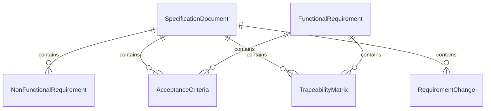
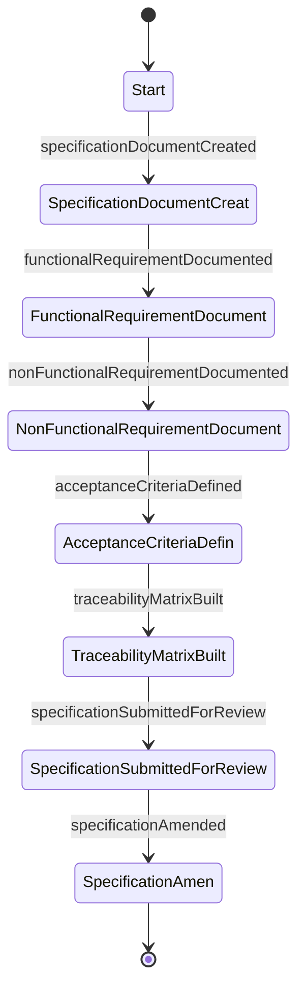
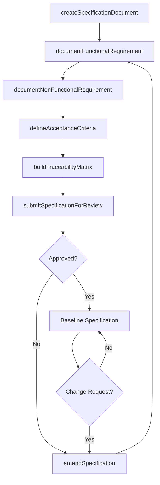
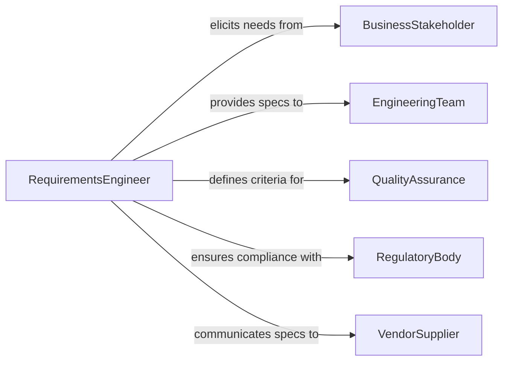

# Document Technical Specifications Requirements

> Business-as-Code definition for documenting technical specifications and requirements that define system capabilities, constraints, and acceptance criteria.

## Overview

Documenting technical specifications or requirements involves formally recording the functional, non-functional, and interface requirements that define what a system, product, or component must accomplish. This definition exposes actions for requirements documentation workflows, events for traceability automation, and searches for managing specifications across engineering projects.

## Actors

| Actor | Description |
|-------|-------------|
| BusinessStakeholder | Defines business needs that drive technical requirements |
| EngineeringTeam | Implements systems based on documented specifications |
| QualityAssurance | Validates deliverables against documented requirements |
| RegulatoryBody | Mandates technical standards that specifications must address |
| VendorSupplier | Builds or delivers components according to specifications |
| EndUser | Provides input on usability and functional expectations |

## Roles

| Role | Description |
|------|-------------|
| RequirementsEngineer | Elicits, analyzes, and documents technical requirements |
| SystemsArchitect | Defines system-level specifications and integration requirements |
| SpecificationReviewer | Validates completeness and feasibility of documented requirements |
| TraceabilityAnalyst | Maintains links between requirements, tests, and deliverables |

## Entities

| Entity | Description |
|--------|-------------|
| SpecificationDocument | Formal record of technical requirements for a system or component |
| FunctionalRequirement | Description of a specific capability the system must provide |
| NonFunctionalRequirement | Performance, security, or quality constraint on the system |
| AcceptanceCriteria | Conditions that must be met for a requirement to be satisfied |
| TraceabilityMatrix | Mapping between requirements, design elements, and test cases |
| RequirementChange | Tracked modification to an established specification |

## Actions

| Action | Description |
|--------|-------------|
| createSpecificationDocument | Initialize a new technical specification for a project |
| documentFunctionalRequirement | Record a specific capability requirement with acceptance criteria |
| documentNonFunctionalRequirement | Record performance, security, or quality constraints |
| defineAcceptanceCriteria | Specify measurable conditions for requirement satisfaction |
| buildTraceabilityMatrix | Link requirements to design elements and test cases |
| submitSpecificationForReview | Send specifications through the approval workflow |
| amendSpecification | Process a change request against established requirements |

## Events

| Event | Description |
|-------|-------------|
| specificationDocumentCreated | A new specification document has been initialized |
| functionalRequirementDocumented | A capability requirement has been recorded |
| nonFunctionalRequirementDocumented | A constraint requirement has been recorded |
| acceptanceCriteriaDefined | Measurable satisfaction conditions have been specified |
| traceabilityMatrixBuilt | Requirements have been linked to design and test artifacts |
| specificationSubmittedForReview | Specifications have entered the approval workflow |
| specificationAmended | An established requirement has been modified |

## Searches

| Search | Description |
|--------|-------------|
| findSpecifications | Retrieve specification documents by project, system, or status |
| findRequirementsByType | List functional or non-functional requirements for a specification |
| getTraceabilityLinks | Retrieve design and test linkages for a specific requirement |
| findUnlinkedRequirements | List requirements without traceability to tests or design |
| findAmendments | Retrieve change history for a specification document |

## Entity Relationships



## State Diagram



## Workflow



## Actor Relationships



## Usage

### Calling Actions

```typescript
import { documentTechnicalSpecificationsRequirements } from '@headlessly/document-technical-specifications-requirements'

const specs = documentTechnicalSpecificationsRequirements()

// Create a specification document
const doc = await specs.createSpecificationDocument({
  projectId: 'PROJ-2026-0287',
  title: 'Fleet Management IoT Sensor Platform',
  scope: 'Technical requirements for vehicle telemetry collection system',
  version: '1.0.0'
})

// Document functional requirements
await specs.documentFunctionalRequirement({
  documentId: doc.id,
  requirementId: 'FR-001',
  title: 'Real-time Vehicle Location Tracking',
  description: 'System shall report GPS coordinates at configurable intervals',
  priority: 'must-have'
})

// Define acceptance criteria
await specs.defineAcceptanceCriteria({
  requirementId: 'FR-001',
  criteria: [
    'GPS accuracy within 3 meters under open sky conditions',
    'Location updates delivered within 2 seconds of capture',
    'Support for reporting intervals from 1 second to 5 minutes'
  ]
})
```

### Event-Driven Automation

```typescript
// Auto-build traceability when criteria are defined
specs.acceptanceCriteriaDefined(async ({ requirementId, documentId }) => {
  await specs.buildTraceabilityMatrix({
    documentId,
    requirementIds: [requirementId]
  })
})

// Notify stakeholders on specification amendments
specs.specificationAmended(async ({ documentId, requirementId, changeReason }) => {
  await notify({
    to: 'project-stakeholders',
    message: `Requirement ${requirementId} has been amended: ${changeReason}`
  })
})
```
