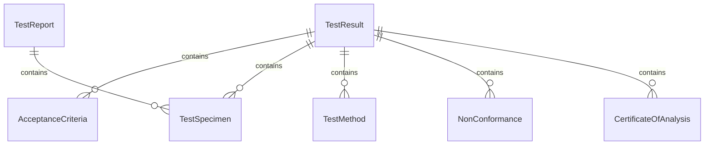
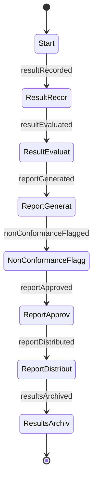
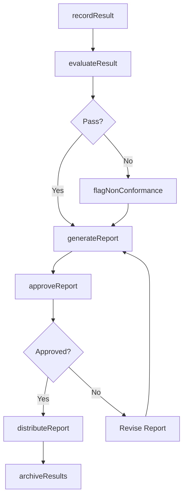
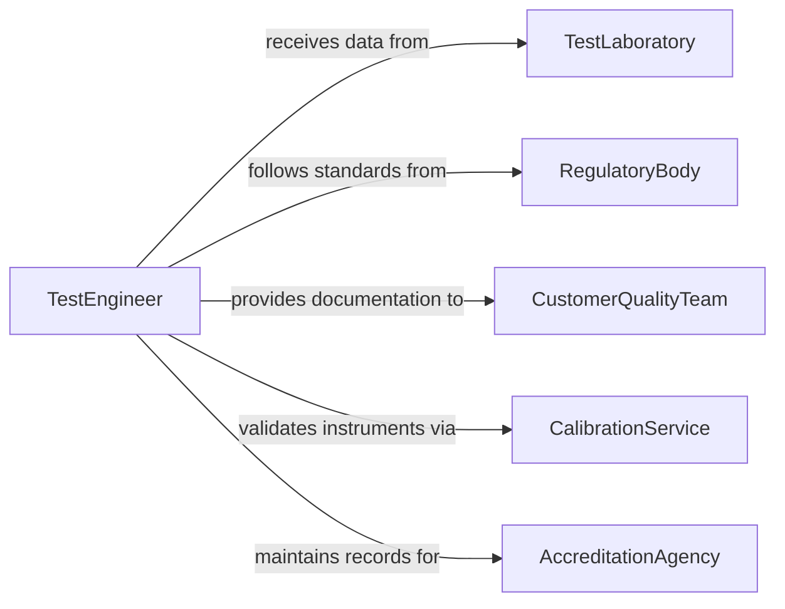

# Document Test Results

> Business-as-Code definition for test result documentation. Models the complete lifecycle from raw test data capture through analysis, formatting, review, distribution, and archival of testing outcomes across engineering, manufacturing, and quality assurance contexts.

## Overview

Documenting test results involves recording outcomes from inspections, laboratory analyses, performance evaluations, environmental tests, and quality checks. This includes capturing raw measurements, comparing results against acceptance criteria, annotating pass/fail determinations, generating structured reports, and distributing findings to stakeholders. This definition exposes actions for result recording and report generation, events for pass/fail notifications and compliance triggers, and searches for historical test data retrieval and trend analysis.

## Actors

| Actor | Description |
|-------|-------------|
| TestLaboratory | Performs analyses and provides raw measurement data |
| RegulatoryBody | Defines testing standards and requires documented evidence of compliance |
| CustomerQualityTeam | Reviews test documentation as part of supplier qualification |
| CalibrationService | Certifies instrument accuracy that underpins test validity |
| AccreditationAgency | Audits testing processes and documentation for laboratory accreditation |

## Roles

| Role | Description |
|------|-------------|
| TestEngineer | Executes tests and records raw data and observations |
| QualityAnalyst | Reviews test results against acceptance criteria and standards |
| ReportAuthor | Compiles test data into structured documentation and reports |
| QualityManager | Approves final test reports and authorizes release decisions |

## Entities

| Entity | Description |
|--------|-------------|
| TestResult | A recorded outcome from a specific test or measurement |
| TestReport | A structured document summarizing results, methods, and conclusions |
| AcceptanceCriteria | The defined thresholds that determine pass or fail status |
| TestSpecimen | The sample, component, or system subjected to testing |
| TestMethod | The standardized procedure followed to conduct the test |
| NonConformance | A documented deviation where results fall outside acceptance limits |
| CertificateOfAnalysis | A formal document attesting that test results meet specifications |

## Actions

| Action | Description |
|--------|-------------|
| recordResult | Capture raw test data including measurements, observations, and conditions |
| evaluateResult | Compare recorded data against acceptance criteria for pass/fail determination |
| generateReport | Compile test results into a formatted report with methods and conclusions |
| flagNonConformance | Document a result that falls outside acceptable limits |
| approveReport | Review and authorize the final test report for distribution |
| distributeReport | Send approved test documentation to designated stakeholders |
| archiveResults | Store completed test records for regulatory retention requirements |

## Events

| Event | Description |
|-------|-------------|
| resultRecorded | Raw test data has been captured in the system |
| resultEvaluated | Test data has been compared against acceptance criteria |
| reportGenerated | A formatted test report has been compiled |
| nonConformanceFlagged | A test result outside acceptance limits has been documented |
| reportApproved | A test report has been authorized for release |
| reportDistributed | Approved test documentation has been sent to stakeholders |
| resultsArchived | Test records have been stored for long-term retention |

## Searches

| Search | Description |
|--------|-------------|
| findTestResults | Query results by specimen, test method, date range, or status |
| getFailedTests | List results that did not meet acceptance criteria |
| getTestReports | Retrieve reports by project, product, or approval status |
| getNonConformances | Find documented deviations by severity, product, or period |
| getTestHistory | Retrieve the complete testing record for a specific specimen or lot |

## Entity Relationships



## State Diagram



## Workflow



## Actor Relationships



## Usage

### Calling Actions

```typescript
import { documentTestResults } from '@headlessly/document-test-results'

const testing = documentTestResults()

// Record a tensile strength test result
const result = await testing.recordResult({
  specimen: 'LOT-2026-0447-S03',
  testMethod: 'ASTM-E8',
  measurements: {
    tensileStrength: 520,
    yieldStrength: 345,
    elongation: 22.4,
    reductionOfArea: 58.1
  },
  units: 'MPa',
  testedBy: 'engineer-jkhan',
  date: '2026-02-05'
})

// Evaluate against acceptance criteria
const evaluation = await testing.evaluateResult({
  resultId: result.id,
  criteria: {
    tensileStrength: { min: 480, max: 620 },
    yieldStrength: { min: 310 },
    elongation: { min: 18 }
  }
})

// Generate a certificate of analysis report
await testing.generateReport({
  resultIds: [result.id],
  format: 'certificate-of-analysis',
  project: 'PRJ-2026-BRIDGE-041',
  includeRawData: true
})
```

### Event-Driven Automation

```typescript
// Alert on non-conforming results
testing.nonConformanceFlagged(async ({ specimen, testMethod, deviation }) => {
  await notify({
    to: 'quality-manager',
    message: `Non-conformance on ${specimen} (${testMethod}): ${deviation.metric} at ${deviation.value} vs limit ${deviation.limit}`
  })
})

// Auto-distribute approved reports
testing.reportApproved(async ({ reportId, stakeholders }) => {
  await testing.distributeReport({
    reportId,
    recipients: stakeholders,
    format: 'pdf'
  })
})
```
