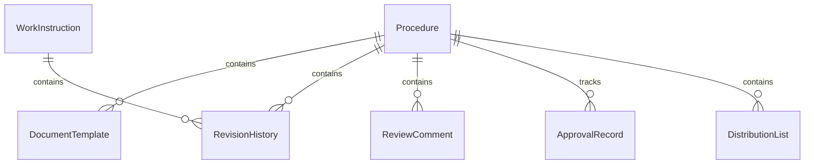
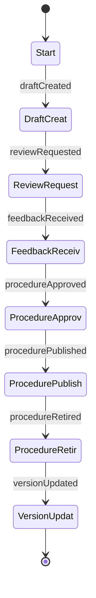
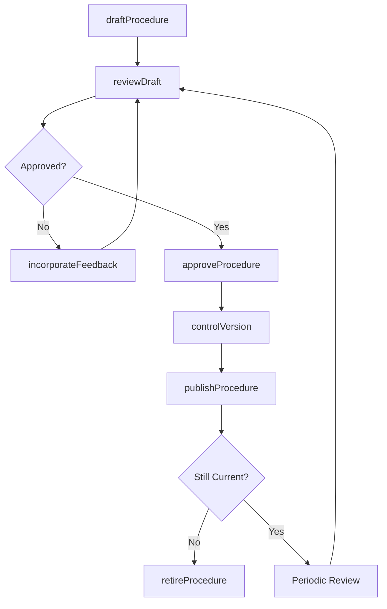
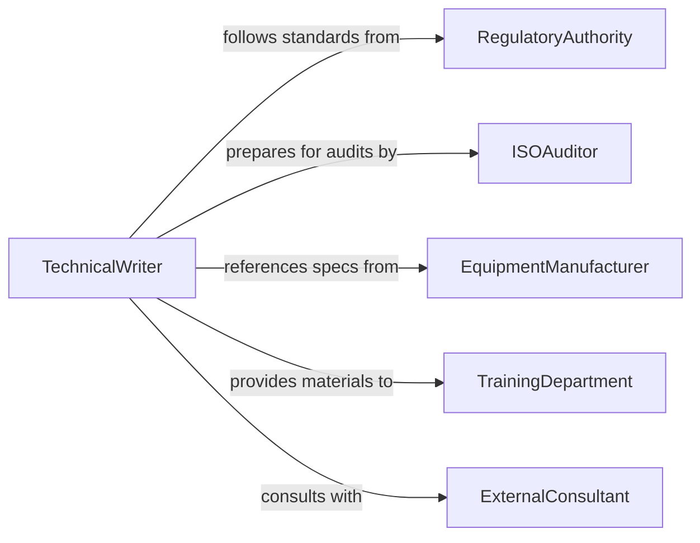

# Prepare Procedural Documents

> Business-as-Code definition for procedural document preparation. Models the lifecycle from procedure identification through drafting, review, approval, version control, and distribution of standard operating procedures, work instructions, and technical manuals.

## Overview

Preparing procedural documents involves identifying process steps, drafting clear instructions, incorporating safety and compliance requirements, formatting documents to organizational standards, routing for technical review and approval, and managing version control. This definition exposes actions for document creation and lifecycle management, events for review workflow automation, and searches for document retrieval and compliance tracking.

## Actors

| Actor | Description |
|-------|-------------|
| RegulatoryAuthority | Mandates procedural documentation for industry compliance |
| ISOAuditor | Reviews procedural documents during quality management audits |
| EquipmentManufacturer | Provides technical specifications referenced in procedures |
| TrainingDepartment | Uses approved procedures as the basis for employee training materials |
| ExternalConsultant | Provides subject matter expertise for specialized procedures |

## Roles

| Role | Description |
|------|-------------|
| TechnicalWriter | Drafts and formats procedural documents following style guidelines |
| SubjectMatterExpert | Provides process knowledge and validates technical accuracy |
| DocumentController | Manages version control, numbering, and distribution of procedures |
| QualityAssuranceReviewer | Ensures procedures meet regulatory and quality management requirements |

## Entities

| Entity | Description |
|--------|-------------|
| Procedure | A step-by-step document describing how to perform a specific process |
| WorkInstruction | A detailed task-level guide supporting a broader procedure |
| DocumentTemplate | A standardized format used to maintain consistency across procedures |
| RevisionHistory | A log tracking changes, approvals, and version numbers over time |
| ReviewComment | Feedback provided by a reviewer on a draft procedure |
| ApprovalRecord | A formal sign-off authorizing a procedure for operational use |
| DistributionList | The set of recipients who receive copies of approved procedures |

## Actions

| Action | Description |
|--------|-------------|
| draftProcedure | Create an initial version of a procedural document from process inputs |
| reviewDraft | Submit a draft for technical and compliance review |
| incorporateFeedback | Revise the document based on reviewer comments |
| approveProcedure | Authorize a procedure for operational use |
| publishProcedure | Release the approved procedure to the distribution list |
| retireProcedure | Remove an obsolete procedure from active use |
| controlVersion | Assign version numbers and maintain revision history |

## Events

| Event | Description |
|-------|-------------|
| draftCreated | An initial version of a procedure has been authored |
| reviewRequested | A draft has been submitted for technical review |
| feedbackReceived | A reviewer has provided comments on a draft |
| procedureApproved | A procedure has been formally authorized for use |
| procedurePublished | An approved procedure has been distributed to recipients |
| procedureRetired | An obsolete procedure has been removed from active circulation |
| versionUpdated | A new version of an existing procedure has been created |

## Searches

| Search | Description |
|--------|-------------|
| findProcedures | Search procedures by title, department, status, or effective date |
| getPendingReviews | List draft procedures awaiting reviewer feedback |
| getRevisionHistory | Retrieve the change log for a specific procedure |
| findExpiredProcedures | List procedures past their scheduled review date |
| getDistributionRecords | Query who received a specific version of a procedure |

## Entity Relationships



## State Diagram



## Workflow



## Actor Relationships



## Usage

### Calling Actions

```typescript
import { prepareProceduralDocuments } from '@headlessly/prepare-procedural-documents'

const procedures = prepareProceduralDocuments()

// Draft a new standard operating procedure
const draft = await procedures.draftProcedure({
  title: 'Cleanroom Gowning Procedure',
  number: 'SOP-MFG-042',
  department: 'manufacturing',
  template: 'standard-operating-procedure',
  sections: [
    { heading: 'Purpose', content: 'Define gowning requirements for ISO Class 5 cleanroom entry.' },
    { heading: 'Scope', content: 'Applies to all personnel entering Cleanroom A and B.' },
    { heading: 'Procedure', content: 'Step 1: Enter anteroom...' }
  ],
  author: 'tech-writer-mbrown'
})

// Submit for review
await procedures.reviewDraft({
  procedureId: draft.id,
  reviewers: ['sme-cleanroom', 'qa-reviewer-jlee'],
  dueDate: '2026-02-12'
})

// Publish after approval
await procedures.publishProcedure({
  procedureId: draft.id,
  effectiveDate: '2026-03-01',
  distributionList: ['manufacturing-all', 'quality-assurance']
})
```

### Event-Driven Automation

```typescript
// Notify reviewers when a draft is ready
procedures.reviewRequested(async ({ procedureId, title, reviewers, dueDate }) => {
  for (const reviewer of reviewers) {
    await notify({
      to: reviewer,
      message: `Review requested for "${title}" (${procedureId}) - due ${dueDate}`
    })
  }
})

// Alert document controller when procedures expire
procedures.procedureRetired(async ({ procedureId, title }) => {
  await notify({
    to: 'document-controller',
    message: `Procedure "${title}" (${procedureId}) has been retired - update distribution records`
  })
})
```
