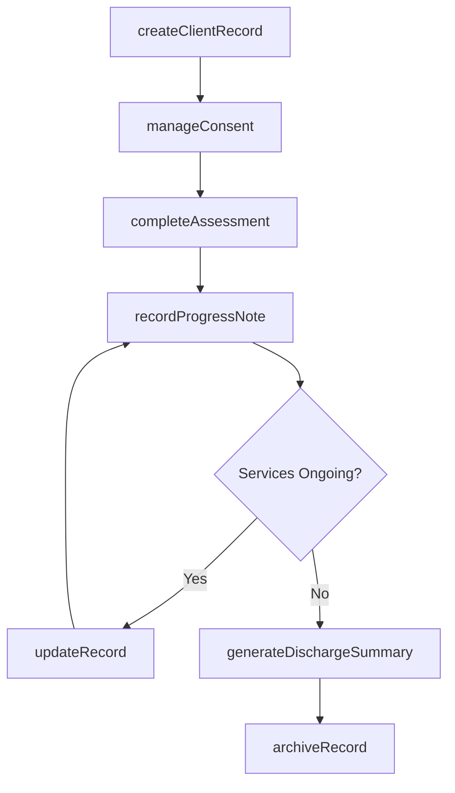
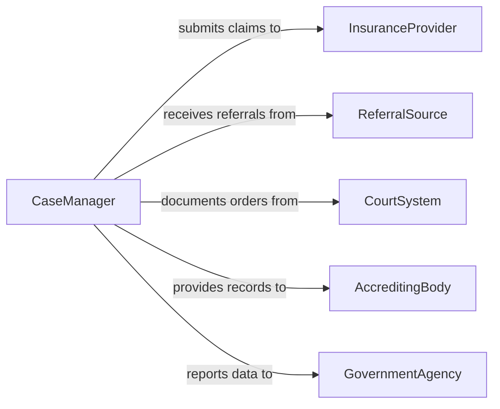

# Maintain Client Records

> Business-as-Code definition for client record maintenance in health and human services settings. Models the lifecycle from intake documentation through ongoing updates, consent management, progress tracking, and secure archival of client case files.

## Overview

Maintaining client records involves creating and updating intake documents, tracking service history, recording progress notes and assessment outcomes, managing consent and authorization forms, and ensuring compliance with confidentiality regulations such as HIPAA and state privacy laws. This definition exposes actions for record creation and updates, events for compliance monitoring and case milestones, and searches for client history and caseload management.

## Actors

| Actor | Description |
|-------|-------------|
| InsuranceProvider | Requires client documentation for service authorization and reimbursement |
| ReferralSource | Provides initial client information and referral documentation |
| CourtSystem | Issues orders that affect client records and mandate documentation |
| AccreditingBody | Audits client record practices for organizational accreditation |
| GovernmentAgency | Requires aggregate reporting on client demographics and outcomes |

## Roles

| Role | Description |
|------|-------------|
| CaseManager | Maintains comprehensive client files and coordinates service documentation |
| IntakeCoordinator | Creates initial client records and collects demographic information |
| ClinicalCounselor | Records progress notes, treatment plans, and assessment outcomes |
| RecordsAdministrator | Ensures record retention compliance and manages archival processes |

## Entities

| Entity | Description |
|--------|-------------|
| ClientRecord | The comprehensive file containing all documentation for an individual client |
| IntakeForm | The initial documentation capturing demographics, needs, and referral details |
| ProgressNote | A dated entry describing client interactions, interventions, and outcomes |
| ConsentForm | A signed authorization for treatment, information release, or service participation |
| ServicePlan | A documented plan outlining goals, interventions, and expected outcomes |
| AssessmentReport | A formal evaluation of client needs, risks, or functional status |
| DischargeSum | A summary document prepared when a client completes or exits services |

## Actions

| Action | Description |
|--------|-------------|
| createClientRecord | Initialize a new client file with intake and demographic information |
| updateRecord | Add or modify information in an existing client record |
| recordProgressNote | Document a client interaction, intervention, or session outcome |
| manageConsent | Record, renew, or revoke consent and authorization forms |
| completeAssessment | Document the results of a client needs or risk assessment |
| generateDischargeSummary | Compile a summary upon client completion or exit from services |
| archiveRecord | Transfer a closed client record to secure long-term storage |

## Events

| Event | Description |
|-------|-------------|
| clientRecordCreated | A new client file has been initialized in the system |
| recordUpdated | Client information has been added or modified |
| progressNoteRecorded | A session or interaction note has been documented |
| consentExpiring | A client consent form is approaching its expiration date |
| assessmentCompleted | A client evaluation has been documented |
| clientDischarged | A discharge summary has been finalized |
| recordArchived | A client record has been moved to long-term storage |

## Searches

| Search | Description |
|--------|-------------|
| findClientRecords | Search records by client name, ID, status, or assigned case manager |
| getProgressNotes | Retrieve session notes by client, date range, or note type |
| findExpiringConsents | List consent forms approaching their renewal date |
| getCaseload | Query active client records by assigned staff member |
| getServiceHistory | Retrieve the complete service timeline for a specific client |

## Workflow



## Actor Relationships



## Usage

### Calling Actions

```typescript
import { maintainClientRecords } from '@headlessly/maintain-client-records'

const records = maintainClientRecords()

// Create a new client record at intake
const client = await records.createClientRecord({
  firstName: 'Maria',
  lastName: 'Gonzalez',
  dateOfBirth: '1988-04-12',
  referralSource: 'county-behavioral-health',
  primaryNeed: 'substance-use-treatment',
  assignedTo: 'case-manager-tsmith',
  intakeDate: '2026-02-05'
})

// Record a progress note after a session
await records.recordProgressNote({
  clientId: client.id,
  date: '2026-02-05',
  type: 'individual-session',
  duration: 50,
  content: 'Client reported reduced cravings. Reviewed relapse prevention strategies.',
  goals: ['goal-sobriety-90-day'],
  author: 'counselor-jpatel'
})

// Manage consent renewal
await records.manageConsent({
  clientId: client.id,
  consentType: 'treatment-authorization',
  status: 'renewed',
  effectiveDate: '2026-02-05',
  expirationDate: '2027-02-05'
})
```

### Event-Driven Automation

```typescript
// Alert case managers about expiring consents
records.consentExpiring(async ({ clientId, clientName, consentType, expirationDate }) => {
  await notify({
    to: 'case-manager',
    message: `Consent for ${clientName} (${consentType}) expires ${expirationDate} - renewal required`
  })
})

// Trigger archival workflow on discharge
records.clientDischarged(async ({ clientId, dischargeDate }) => {
  await records.archiveRecord({
    clientId,
    retentionPeriod: '7-years',
    archiveDate: dischargeDate
  })
})
```
