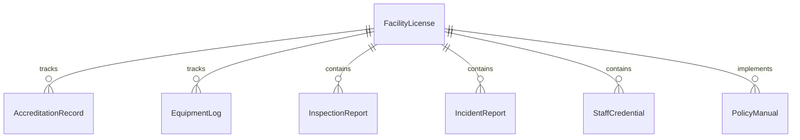
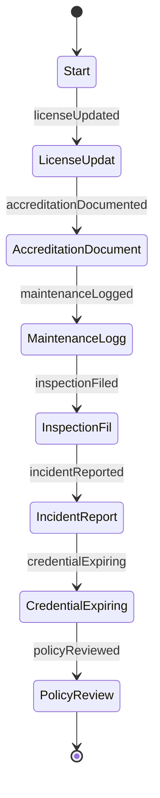
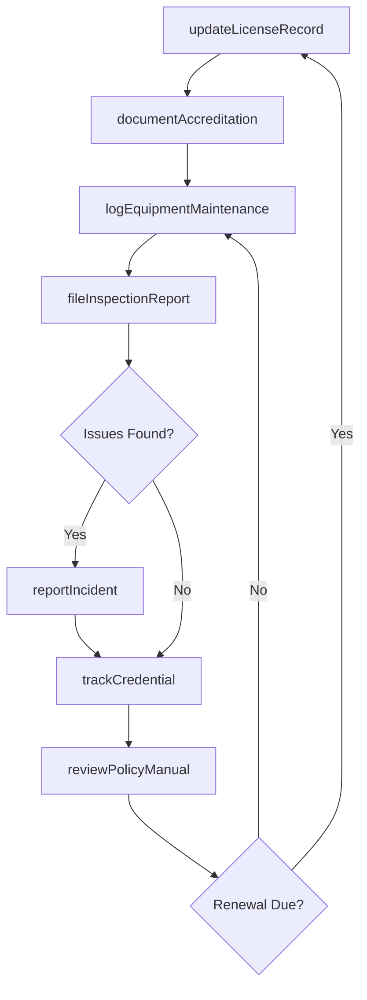
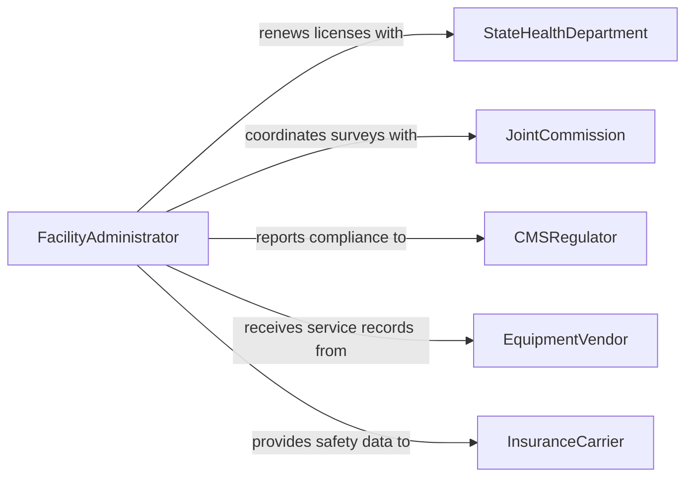

# Maintain Medical Facility Records

> Business-as-Code definition for medical facility record maintenance. Models the lifecycle from facility licensing through accreditation documentation, equipment logs, incident reporting, staffing records, and regulatory compliance tracking.

## Overview

Maintaining medical facility records involves managing documentation for licensing and accreditation, tracking equipment maintenance and calibration logs, recording facility inspections, documenting staffing credentials and certifications, maintaining incident and safety reports, and ensuring compliance with healthcare regulations. This definition exposes actions for facility documentation management, events for compliance deadline monitoring, and searches for audit readiness and facility performance tracking.

## Actors

| Actor | Description |
|-------|-------------|
| StateHealthDepartment | Issues facility licenses and conducts regulatory inspections |
| JointCommission | Evaluates facilities for healthcare accreditation standards |
| CMSRegulator | Enforces Medicare and Medicaid conditions of participation |
| EquipmentVendor | Provides maintenance documentation and calibration certificates |
| InsuranceCarrier | Requires facility safety records for liability coverage determinations |

## Roles

| Role | Description |
|------|-------------|
| FacilityAdministrator | Oversees all facility documentation and compliance submissions |
| BiomedicalEngineer | Maintains medical equipment records and calibration schedules |
| ComplianceOfficer | Monitors regulatory requirements and coordinates audit preparation |
| CredentialingCoordinator | Tracks staff licenses, certifications, and privileging documentation |

## Entities

| Entity | Description |
|--------|-------------|
| FacilityLicense | The state-issued authorization to operate a medical facility |
| AccreditationRecord | Documentation of accreditation status, surveys, and corrective actions |
| EquipmentLog | A maintenance and calibration history for a piece of medical equipment |
| InspectionReport | A record of a facility safety or regulatory inspection |
| IncidentReport | A documented account of a safety event, near miss, or adverse occurrence |
| StaffCredential | A record of a healthcare worker's license, certification, or privilege |
| PolicyManual | The collection of facility policies and procedures governing operations |

## Actions

| Action | Description |
|--------|-------------|
| updateLicenseRecord | Record license renewals, amendments, or status changes |
| documentAccreditation | Log accreditation survey results, findings, and corrective actions |
| logEquipmentMaintenance | Record preventive maintenance, repairs, and calibration for medical devices |
| fileInspectionReport | Document the results of a facility safety or regulatory inspection |
| reportIncident | Create a formal record of a safety event or adverse occurrence |
| trackCredential | Record and monitor staff license expirations and renewal status |
| reviewPolicyManual | Document periodic reviews and updates to facility policies |

## Events

| Event | Description |
|-------|-------------|
| licenseUpdated | A facility license record has been modified or renewed |
| accreditationDocumented | Survey results or corrective actions have been recorded |
| maintenanceLogged | An equipment service record has been created |
| inspectionFiled | A facility inspection report has been documented |
| incidentReported | A safety event has been formally recorded |
| credentialExpiring | A staff member's license or certification is approaching expiration |
| policyReviewed | A facility policy has been reviewed and updated |

## Searches

| Search | Description |
|--------|-------------|
| findLicenses | Query facility licenses by type, status, or expiration date |
| getEquipmentLogs | Retrieve maintenance history by device, department, or date range |
| findOpenIncidents | List incident reports pending investigation or resolution |
| getExpiringCredentials | List staff credentials approaching their renewal deadlines |
| getAccreditationStatus | Retrieve current accreditation standing and outstanding corrective actions |

## Entity Relationships



## State Diagram



## Workflow



## Actor Relationships



## Usage

### Calling Actions

```typescript
import { maintainMedicalFacilityRecords } from '@headlessly/maintain-medical-facility-records'

const facility = maintainMedicalFacilityRecords()

// Log equipment preventive maintenance
await facility.logEquipmentMaintenance({
  deviceId: 'MRI-SCANNER-001',
  deviceName: 'Siemens Magnetom Aera 1.5T',
  maintenanceType: 'preventive',
  serviceDate: '2026-02-05',
  technician: 'biomed-eng-rkapoor',
  findings: 'Coils within specification. Helium level at 68%. Gradient performance nominal.',
  nextServiceDue: '2026-05-05'
})

// File a regulatory inspection report
await facility.fileInspectionReport({
  inspector: 'state-health-dept',
  inspectionDate: '2026-01-28',
  areas: ['emergency-department', 'pharmacy', 'infection-control'],
  findings: [
    { area: 'pharmacy', severity: 'minor', description: 'Temperature log missing 2 entries' }
  ],
  correctiveActionDue: '2026-02-28'
})

// Track an expiring staff credential
await facility.trackCredential({
  staffId: 'RN-0412',
  credentialType: 'registered-nurse-license',
  state: 'CA',
  licenseNumber: 'RN-887412',
  expirationDate: '2026-04-30',
  status: 'active'
})
```

### Event-Driven Automation

```typescript
// Alert on expiring staff credentials
facility.credentialExpiring(async ({ staffId, credentialType, expirationDate }) => {
  await notify({
    to: 'credentialing-coordinator',
    message: `${credentialType} for staff ${staffId} expires ${expirationDate} - initiate renewal`
  })
})

// Escalate unresolved incidents
facility.incidentReported(async ({ incidentId, severity, department }) => {
  if (severity === 'critical') {
    await notify({
      to: 'facility-administrator',
      message: `Critical incident ${incidentId} reported in ${department} - immediate review required`
    })
  }
})
```
