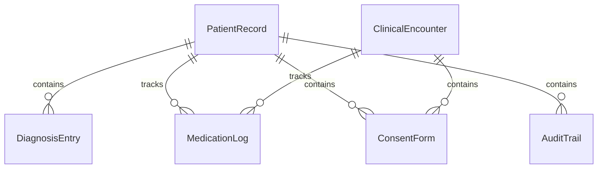
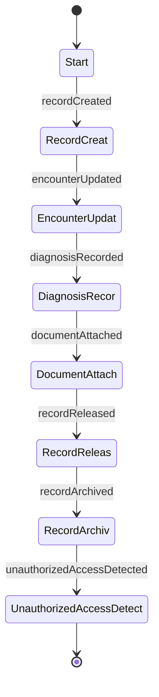
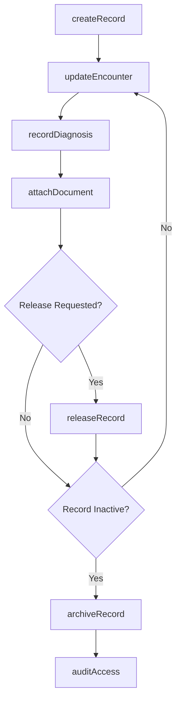
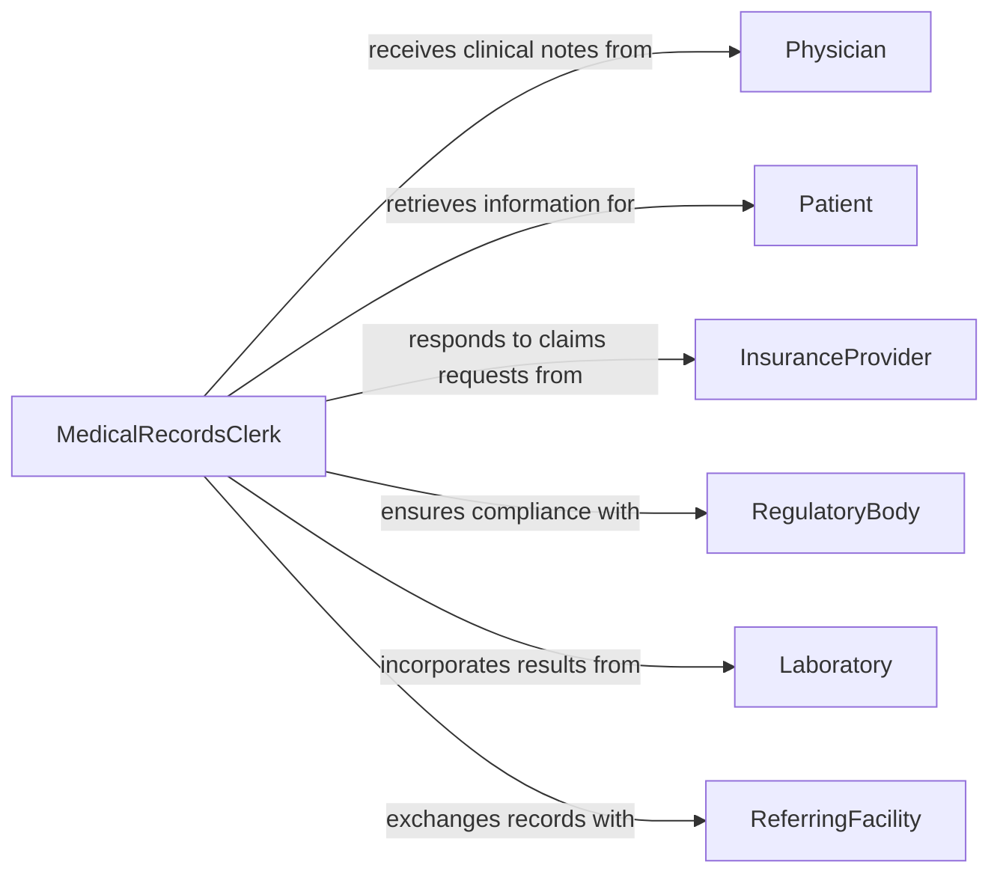

# Maintain Medical Records

> Business-as-Code definition for maintaining medical records. Models the lifecycle of patient health documentation from creation through updates, retention, and compliant archival.

## Overview

Maintaining medical records encompasses the systematic creation, updating, storage, and retrieval of patient health information across clinical encounters. This definition exposes actions for record management, events for compliance automation, and searches for efficient patient data retrieval. It supports regulatory requirements including HIPAA and standard medical coding systems.

## Actors

| Actor | Description |
|-------|-------------|
| Patient | The individual whose health information is documented |
| Physician | Provides clinical notes, diagnoses, and treatment orders |
| InsuranceProvider | Requests records for claims processing and authorization |
| RegulatoryBody | Establishes record retention and privacy requirements |
| Laboratory | Submits test results and diagnostic reports |
| ReferringFacility | Sends or receives records during patient transfers |

## Roles

| Role | Description |
|------|-------------|
| MedicalRecordsClerk | Manages day-to-day record creation, filing, and retrieval |
| HealthInformationManager | Oversees record policies, compliance, and quality |
| ClinicalDocumentationSpecialist | Ensures accuracy and completeness of clinical entries |
| PrivacyOfficer | Monitors access controls and regulatory compliance |

## Entities

| Entity | Description |
|--------|-------------|
| PatientRecord | The comprehensive medical file for an individual patient |
| ClinicalEncounter | A documented interaction between patient and provider |
| DiagnosisEntry | A coded diagnosis associated with a patient visit |
| MedicationLog | Record of prescribed and administered medications |
| ConsentForm | Patient authorization for treatment or information release |
| AuditTrail | Log of all access and modifications to a patient record |

## Actions

| Action | Description |
|--------|-------------|
| createRecord | Initialize a new patient medical record |
| updateEncounter | Add or modify clinical encounter documentation |
| recordDiagnosis | Enter a coded diagnosis into the patient record |
| attachDocument | Associate lab results, imaging, or external documents |
| releaseRecord | Authorize and transmit records to a requesting party |
| archiveRecord | Move inactive records to long-term compliant storage |
| auditAccess | Review who has accessed or modified a record |

## Events

| Event | Description |
|-------|-------------|
| recordCreated | A new patient medical record has been initialized |
| encounterUpdated | Clinical encounter documentation has been modified |
| diagnosisRecorded | A diagnosis entry has been added to the record |
| documentAttached | An external document has been linked to the record |
| recordReleased | A patient record has been transmitted to a requesting party |
| recordArchived | An inactive record has been moved to archival storage |
| unauthorizedAccessDetected | An access attempt has violated privacy controls |

## Searches

| Search | Description |
|--------|-------------|
| findPatientRecords | Locate records by patient name, identifier, or date of birth |
| getEncounterHistory | Retrieve all clinical encounters for a patient within a date range |
| getAuditLog | List all access and modification events for a specific record |
| findRecordsByDiagnosis | Search records by diagnosis code or condition |
| getPendingReleases | Retrieve record release requests awaiting authorization |

## Entity Relationships



## State Diagram



## Workflow



## Actor Relationships



## Usage

### Calling Actions

```typescript
import { maintainMedicalRecords } from '@headlessly/maintain-medical-records'

const records = maintainMedicalRecords()

// Create a new patient record
const record = await records.createRecord({
  patientId: 'PAT-2026-00451',
  fullName: 'Jane Doe',
  dateOfBirth: '1985-03-14',
  insuranceId: 'INS-882341'
})

// Update a clinical encounter
await records.updateEncounter({
  recordId: record.id,
  encounterId: 'ENC-20260205',
  notes: 'Patient presents with acute bronchitis. Prescribed amoxicillin.',
  providerId: 'DR-1122'
})

// Attach lab results
await records.attachDocument({
  recordId: record.id,
  documentType: 'LabResult',
  source: 'CityLab',
  fileRef: 'lab-results/CBC-20260205.pdf'
})
```

### Event-Driven Automation

```typescript
// Flag unauthorized access attempts
records.unauthorizedAccessDetected(async ({ recordId, userId, timestamp }) => {
  await notify({
    to: 'privacy-officer',
    message: `Unauthorized access to record ${recordId} by ${userId} at ${timestamp}`
  })
})

// Auto-archive inactive records after retention period
records.encounterUpdated(async ({ recordId, lastEncounterDate }) => {
  const inactiveYears = yearsSince(lastEncounterDate)
  if (inactiveYears >= 7) {
    await records.archiveRecord({ recordId, reason: 'Retention period exceeded' })
  }
})
```
