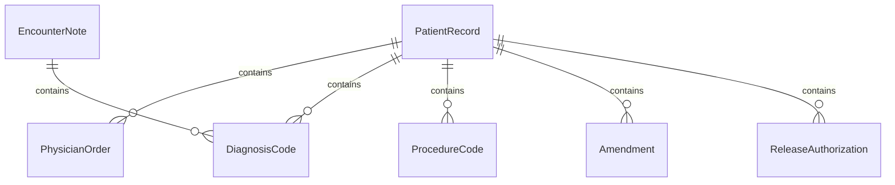
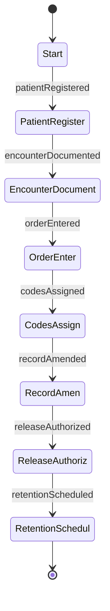
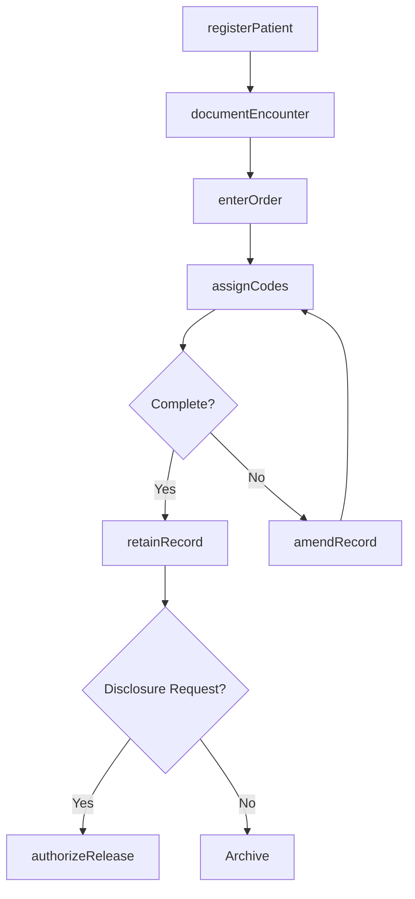
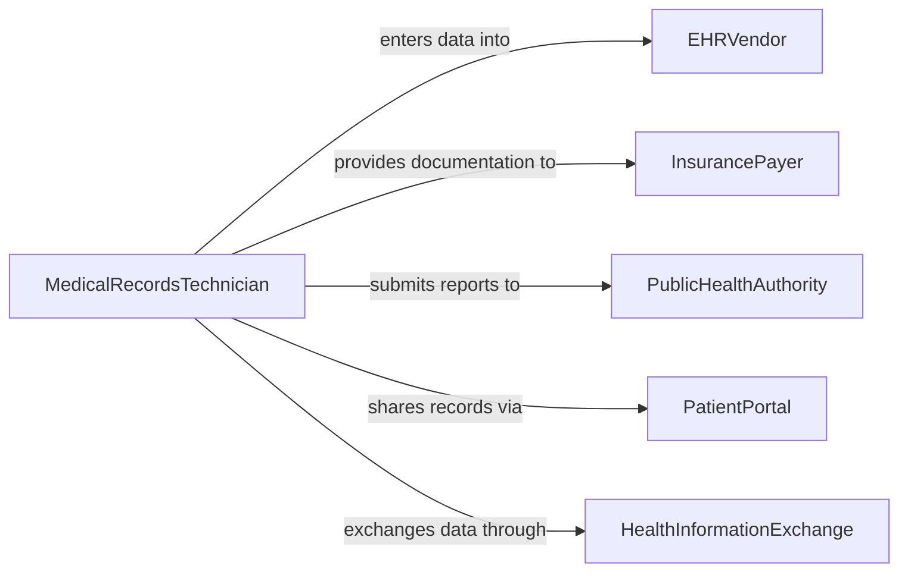

# Maintain Patient Records

> Business-as-Code definition for patient record maintenance. Models the complete lifecycle from registration through clinical documentation, order tracking, diagnosis coding, discharge planning, and long-term record retention within electronic health record systems.

## Overview

Maintaining patient records involves creating and updating demographic information, documenting clinical encounters and physician orders, recording diagnoses and procedure codes, tracking referrals and follow-up care, managing record amendments, and ensuring HIPAA-compliant storage and access controls. This definition exposes actions for clinical documentation and record management, events for care coordination triggers and compliance alerts, and searches for patient history retrieval and population health analytics.

## Actors

| Actor | Description |
|-------|-------------|
| EHRVendor | Provides the electronic health record platform for clinical documentation |
| InsurancePayer | Requires documented clinical encounters for claims adjudication |
| PublicHealthAuthority | Mandates reportable condition notifications and population data |
| PatientPortal | Enables patients to view records and submit information electronically |
| HealthInformationExchange | Facilitates interoperable sharing of patient data across providers |

## Roles

| Role | Description |
|------|-------------|
| MedicalRecordsTechnician | Manages record creation, amendments, and release of information |
| AttendingPhysician | Documents clinical findings, diagnoses, and treatment plans |
| NursingStaff | Records vital signs, assessments, medication administration, and care notes |
| MedicalCoder | Assigns ICD and CPT codes based on documented clinical information |

## Entities

| Entity | Description |
|--------|-------------|
| PatientRecord | The comprehensive electronic file for an individual patient |
| EncounterNote | A clinical documentation entry for a specific visit or interaction |
| PhysicianOrder | A documented directive for treatment, medication, or diagnostic test |
| DiagnosisCode | An ICD code assigned to a documented clinical condition |
| ProcedureCode | A CPT or HCPCS code assigned to a performed clinical service |
| Amendment | A formal correction or addendum to an existing record entry |
| ReleaseAuthorization | A patient-signed form permitting disclosure of protected health information |

## Actions

| Action | Description |
|--------|-------------|
| registerPatient | Create a new patient record with demographic and insurance information |
| documentEncounter | Record clinical findings from a patient visit or interaction |
| enterOrder | Document a physician directive for treatment, medication, or test |
| assignCodes | Apply diagnosis and procedure codes to a clinical encounter |
| amendRecord | Process a formal correction or addendum to an existing entry |
| authorizeRelease | Record patient consent for disclosure of health information |
| retainRecord | Manage long-term storage and retention scheduling for patient files |

## Events

| Event | Description |
|-------|-------------|
| patientRegistered | A new patient record has been created in the system |
| encounterDocumented | Clinical findings have been recorded for a patient visit |
| orderEntered | A physician directive has been documented |
| codesAssigned | Diagnosis and procedure codes have been applied to an encounter |
| recordAmended | A correction or addendum has been added to a patient record |
| releaseAuthorized | Patient consent for information disclosure has been recorded |
| retentionScheduled | A record has been assigned a long-term storage retention date |

## Searches

| Search | Description |
|--------|-------------|
| findPatientRecords | Search records by name, MRN, date of birth, or insurance ID |
| getEncounterHistory | Retrieve all clinical encounters for a specific patient |
| findOpenOrders | List physician orders pending completion or results |
| getCodedEncounters | Query encounters by diagnosis or procedure code |
| findPendingAmendments | List record amendment requests awaiting review |

## Entity Relationships



## State Diagram



## Workflow



## Actor Relationships



## Usage

### Calling Actions

```typescript
import { maintainPatientRecords } from '@headlessly/maintain-patient-records'

const records = maintainPatientRecords()

// Register a new patient
const patient = await records.registerPatient({
  firstName: 'James',
  lastName: 'Mitchell',
  dateOfBirth: '1972-09-14',
  mrn: 'MRN-0088214',
  insurance: {
    payer: 'Blue Cross',
    memberId: 'BC-7741228',
    groupNumber: 'GRP-5501'
  },
  registeredBy: 'registration-clerk-alee'
})

// Document a clinical encounter
await records.documentEncounter({
  patientId: patient.id,
  date: '2026-02-05',
  provider: 'dr-kwilson',
  type: 'office-visit',
  chiefComplaint: 'Persistent lower back pain for 3 weeks',
  findings: 'Tenderness at L4-L5. Limited range of motion. Straight leg raise negative.',
  plan: 'MRI lumbar spine, physical therapy referral, NSAIDs as needed'
})

// Assign diagnosis and procedure codes
await records.assignCodes({
  encounterId: 'ENC-2026-04421',
  diagnoses: [{ code: 'M54.5', description: 'Low back pain' }],
  procedures: [{ code: '99214', description: 'Office visit, moderate complexity' }],
  codedBy: 'coder-dpatel'
})
```

### Event-Driven Automation

```typescript
// Route new orders for processing
records.orderEntered(async ({ patientId, orderType, provider }) => {
  await notify({
    to: `${orderType}-department`,
    message: `New ${orderType} order for patient ${patientId} from ${provider}`
  })
})

// Alert on pending record amendments
records.recordAmended(async ({ patientId, amendmentType, requestedBy }) => {
  await notify({
    to: 'medical-records-supervisor',
    message: `Amendment (${amendmentType}) requested by ${requestedBy} for patient ${patientId}`
  })
})
```
