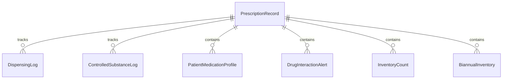
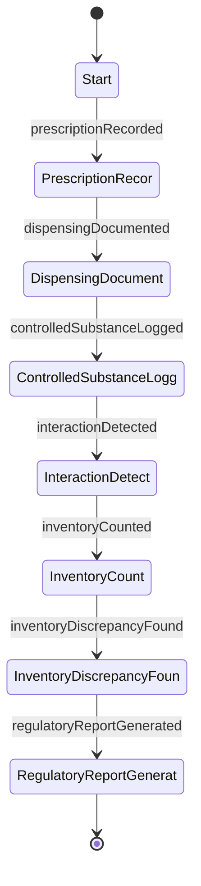
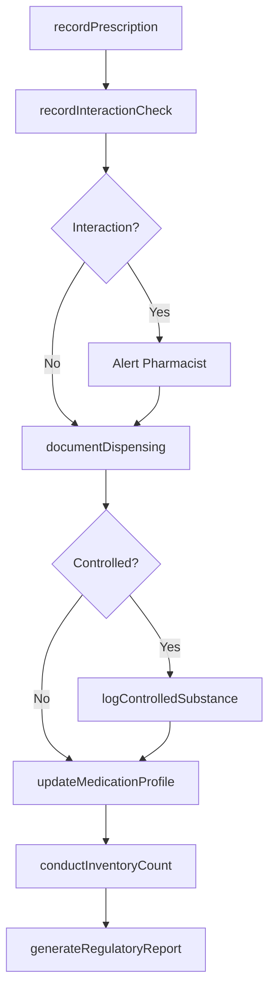
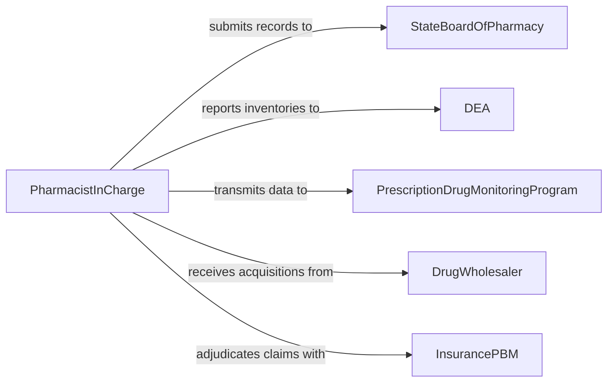

# Maintain Pharmacy Records

> Business-as-Code definition for pharmacy record maintenance. Models the lifecycle from prescription receipt through dispensing documentation, controlled substance logging, drug interaction tracking, inventory management, and regulatory reporting for pharmacy operations.

## Overview

Maintaining pharmacy records involves documenting prescription orders, recording dispensing activities, tracking controlled substance inventories, logging patient medication profiles, managing drug interaction alerts, and producing regulatory reports for state boards and the DEA. This definition exposes actions for dispensing documentation and inventory tracking, events for controlled substance monitoring and compliance alerts, and searches for prescription history and audit trail retrieval.

## Actors

| Actor | Description |
|-------|-------------|
| StateBoardOfPharmacy | Regulates pharmacy practice and audits controlled substance records |
| DEA | Enforces federal controlled substance documentation requirements |
| PrescriptionDrugMonitoringProgram | Collects dispensing data for controlled substance tracking across providers |
| DrugWholesaler | Supplies medications and provides acquisition records |
| InsurancePBM | Adjudicates prescription claims and requires dispensing documentation |

## Roles

| Role | Description |
|------|-------------|
| PharmacistInCharge | Oversees all pharmacy record-keeping and regulatory compliance |
| DispensingPharmacist | Documents prescription verification, clinical review, and dispensing |
| PharmacyTechnician | Records prescription intake, preparation details, and inventory counts |
| ComplianceSpecialist | Monitors controlled substance logs and prepares regulatory submissions |

## Entities

| Entity | Description |
|--------|-------------|
| PrescriptionRecord | A documented order for medication including prescriber, drug, and dosage |
| DispensingLog | A record of medication dispensed including quantity, date, and pharmacist |
| ControlledSubstanceLog | A perpetual inventory record for Schedule II through V medications |
| PatientMedicationProfile | A comprehensive list of current and historical medications for a patient |
| DrugInteractionAlert | A documented clinical alert triggered by potential medication conflicts |
| InventoryCount | A physical or electronic count of pharmacy stock levels |
| BiannualInventory | A DEA-required physical count of all controlled substances |

## Actions

| Action | Description |
|--------|-------------|
| recordPrescription | Log an incoming prescription order with prescriber and drug details |
| documentDispensing | Record the completion of a prescription fill including verification steps |
| logControlledSubstance | Update the perpetual inventory for a controlled substance transaction |
| updateMedicationProfile | Add or modify entries in a patient's medication history |
| recordInteractionCheck | Document the clinical review of drug interactions before dispensing |
| conductInventoryCount | Perform and document a physical count of pharmacy stock |
| generateRegulatoryReport | Produce required submissions for state board or DEA compliance |

## Events

| Event | Description |
|-------|-------------|
| prescriptionRecorded | An incoming prescription order has been logged |
| dispensingDocumented | A completed prescription fill has been recorded |
| controlledSubstanceLogged | A controlled substance transaction has been recorded |
| interactionDetected | A potential drug interaction has been flagged during clinical review |
| inventoryCounted | A physical stock count has been completed and documented |
| inventoryDiscrepancyFound | A controlled substance count does not match perpetual inventory records |
| regulatoryReportGenerated | A compliance submission has been prepared for a regulatory body |

## Searches

| Search | Description |
|--------|-------------|
| findPrescriptions | Search prescription records by patient, drug, prescriber, or date |
| getDispensingHistory | Retrieve dispensing records for a specific patient or medication |
| getControlledSubstanceLogs | Query perpetual inventory for a specific drug or schedule |
| findInteractionAlerts | List drug interaction alerts by patient, severity, or date range |
| getInventoryDiscrepancies | Retrieve unresolved controlled substance count variances |

## Entity Relationships



## State Diagram



## Workflow



## Actor Relationships



## Usage

### Calling Actions

```typescript
import { maintainPharmacyRecords } from '@headlessly/maintain-pharmacy-records'

const pharmacy = maintainPharmacyRecords()

// Record an incoming prescription
const rx = await pharmacy.recordPrescription({
  patientId: 'PAT-0071482',
  prescriber: 'Dr. Sarah Chen, MD',
  deaNumber: 'BC1234563',
  drug: 'Oxycodone 5mg',
  quantity: 60,
  refills: 0,
  schedule: 'II',
  directions: 'Take 1 tablet every 6 hours as needed for pain',
  receivedDate: '2026-02-05'
})

// Document dispensing and log controlled substance
await pharmacy.documentDispensing({
  prescriptionId: rx.id,
  dispensedQuantity: 60,
  verifiedBy: 'pharmacist-rgarcia',
  lotNumber: 'LOT-2025-8841',
  ndcCode: '00591-0442-01',
  dispensedDate: '2026-02-05'
})

await pharmacy.logControlledSubstance({
  drug: 'Oxycodone 5mg',
  ndcCode: '00591-0442-01',
  transactionType: 'dispensed',
  quantity: 60,
  prescriptionId: rx.id,
  perpetualBalance: 440
})
```

### Event-Driven Automation

```typescript
// Escalate controlled substance discrepancies
pharmacy.inventoryDiscrepancyFound(async ({ drug, expectedCount, actualCount, schedule }) => {
  await notify({
    to: 'pharmacist-in-charge',
    message: `Discrepancy: ${drug} (Schedule ${schedule}) - expected ${expectedCount}, counted ${actualCount}`
  })
})

// Alert on critical drug interactions
pharmacy.interactionDetected(async ({ patientId, drugs, severity }) => {
  if (severity === 'major') {
    await notify({
      to: 'dispensing-pharmacist',
      message: `Major interaction for patient ${patientId}: ${drugs.join(' + ')} - clinical review required`
    })
  }
})
```
