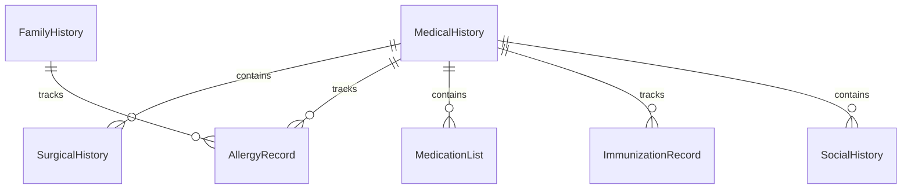
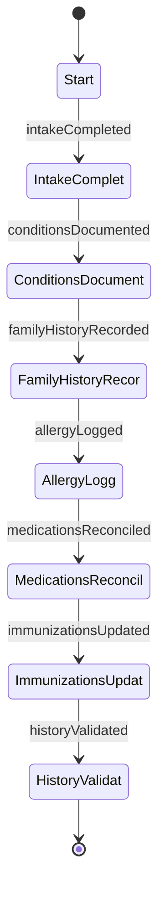
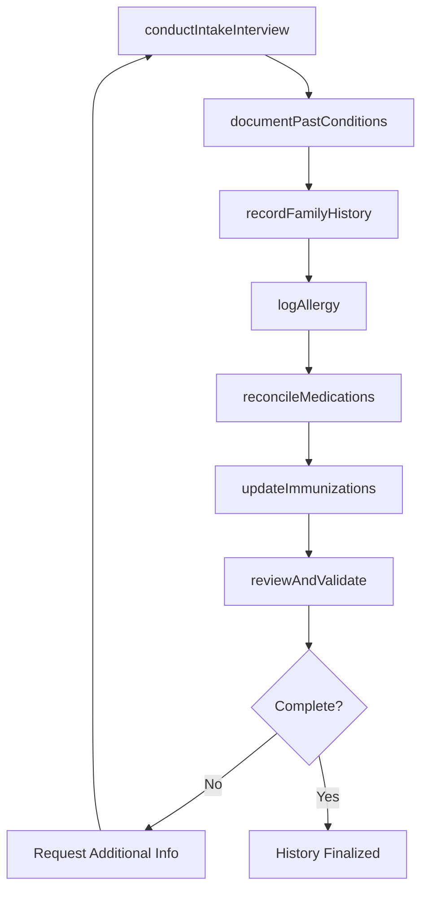
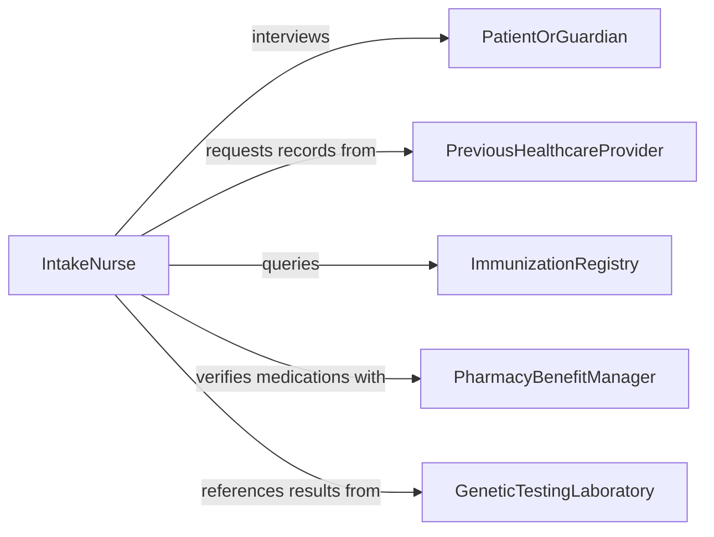

# Record Patient Medical Histories

> Business-as-Code definition for recording patient medical histories. Models the lifecycle from initial health questionnaire through family history documentation, surgical history, allergy recording, medication reconciliation, and ongoing history updates across clinical encounters.

## Overview

Recording patient medical histories involves collecting and documenting a patient's past medical conditions, surgical procedures, family health history, social habits, allergies, immunization records, and current medications. This information forms the foundation for clinical decision-making, risk assessment, and care planning. This definition exposes actions for history intake and updates, events for allergy alerts and reconciliation triggers, and searches for comprehensive history retrieval.

## Actors

| Actor | Description |
|-------|-------------|
| PatientOrGuardian | Provides personal health history and family medical information |
| PreviousHealthcareProvider | Supplies prior medical records and treatment summaries |
| ImmunizationRegistry | Maintains vaccination records accessible across healthcare settings |
| PharmacyBenefitManager | Provides medication fill history for reconciliation purposes |
| GeneticTestingLaboratory | Provides hereditary risk assessments that inform family history |

## Roles

| Role | Description |
|------|-------------|
| IntakeNurse | Conducts initial medical history interviews and documents findings |
| PrimaryCarePhysician | Reviews and validates patient medical history for clinical accuracy |
| MedicalAssistant | Records vital signs, allergies, and medication lists during visits |
| HealthInformationSpecialist | Integrates records from external providers into the patient history |

## Entities

| Entity | Description |
|--------|-------------|
| MedicalHistory | The comprehensive record of a patient's past health conditions and treatments |
| FamilyHistory | Documented health conditions affecting blood relatives with hereditary relevance |
| SurgicalHistory | A record of past surgical procedures including dates and outcomes |
| AllergyRecord | A documented sensitivity or adverse reaction to a substance |
| MedicationList | A current and historical inventory of prescribed and over-the-counter medications |
| ImmunizationRecord | A log of vaccinations received with dates and lot numbers |
| SocialHistory | Documented lifestyle factors including tobacco, alcohol, occupation, and exercise |

## Actions

| Action | Description |
|--------|-------------|
| conductIntakeInterview | Perform an initial medical history interview with the patient |
| documentPastConditions | Record previously diagnosed medical conditions and treatments |
| recordFamilyHistory | Document health conditions of immediate and extended family members |
| logAllergy | Add an allergy or adverse reaction to the patient's record |
| reconcileMedications | Compare and update the medication list against pharmacy and provider records |
| updateImmunizations | Add vaccination records from registries or administered doses |
| reviewAndValidate | Physician review and confirmation of documented medical history |

## Events

| Event | Description |
|-------|-------------|
| intakeCompleted | An initial medical history interview has been documented |
| conditionsDocumented | Past medical conditions have been recorded |
| familyHistoryRecorded | Family health information has been entered |
| allergyLogged | A new allergy or adverse reaction has been added to the record |
| medicationsReconciled | The medication list has been verified and updated |
| immunizationsUpdated | Vaccination records have been added or refreshed |
| historyValidated | A physician has reviewed and confirmed the documented history |

## Searches

| Search | Description |
|--------|-------------|
| getPatientHistory | Retrieve the complete medical history for a specific patient |
| findAllergies | List documented allergies by patient, substance, or reaction type |
| getMedicationList | Query current and historical medications for a patient |
| getFamilyHistory | Retrieve documented family health conditions for hereditary screening |
| getImmunizationRecord | List vaccinations by patient, vaccine type, or date range |

## Entity Relationships



## State Diagram



## Workflow



## Actor Relationships



## Usage

### Calling Actions

```typescript
import { recordPatientMedicalHistories } from '@headlessly/record-patient-medical-histories'

const histories = recordPatientMedicalHistories()

// Conduct an intake interview
const intake = await histories.conductIntakeInterview({
  patientId: 'PAT-0092417',
  interviewDate: '2026-02-05',
  conductedBy: 'intake-nurse-cwilliams',
  chiefComplaint: 'Routine annual physical',
  reviewOfSystems: {
    cardiovascular: 'Denies chest pain, palpitations',
    respiratory: 'Denies shortness of breath, wheezing',
    musculoskeletal: 'Reports occasional knee stiffness'
  }
})

// Document past medical conditions
await histories.documentPastConditions({
  patientId: 'PAT-0092417',
  conditions: [
    { name: 'Hypertension', diagnosedYear: 2018, status: 'managed', treatment: 'Lisinopril 10mg daily' },
    { name: 'Appendectomy', diagnosedYear: 2005, status: 'resolved', type: 'surgical' }
  ]
})

// Log an allergy
await histories.logAllergy({
  patientId: 'PAT-0092417',
  allergen: 'Penicillin',
  reactionType: 'drug',
  severity: 'moderate',
  reaction: 'Rash and hives',
  documentedBy: 'medical-assistant-jpark'
})
```

### Event-Driven Automation

```typescript
// Alert clinicians on new allergy documentation
histories.allergyLogged(async ({ patientId, allergen, severity }) => {
  if (severity === 'severe') {
    await notify({
      to: 'care-team',
      message: `Severe allergy to ${allergen} documented for patient ${patientId} - review medication orders`
    })
  }
})

// Trigger medication reconciliation at every encounter
histories.intakeCompleted(async ({ patientId }) => {
  await histories.reconcileMedications({
    patientId,
    sources: ['pharmacy-benefit-manager', 'previous-provider']
  })
})
```
