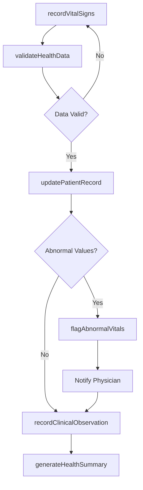
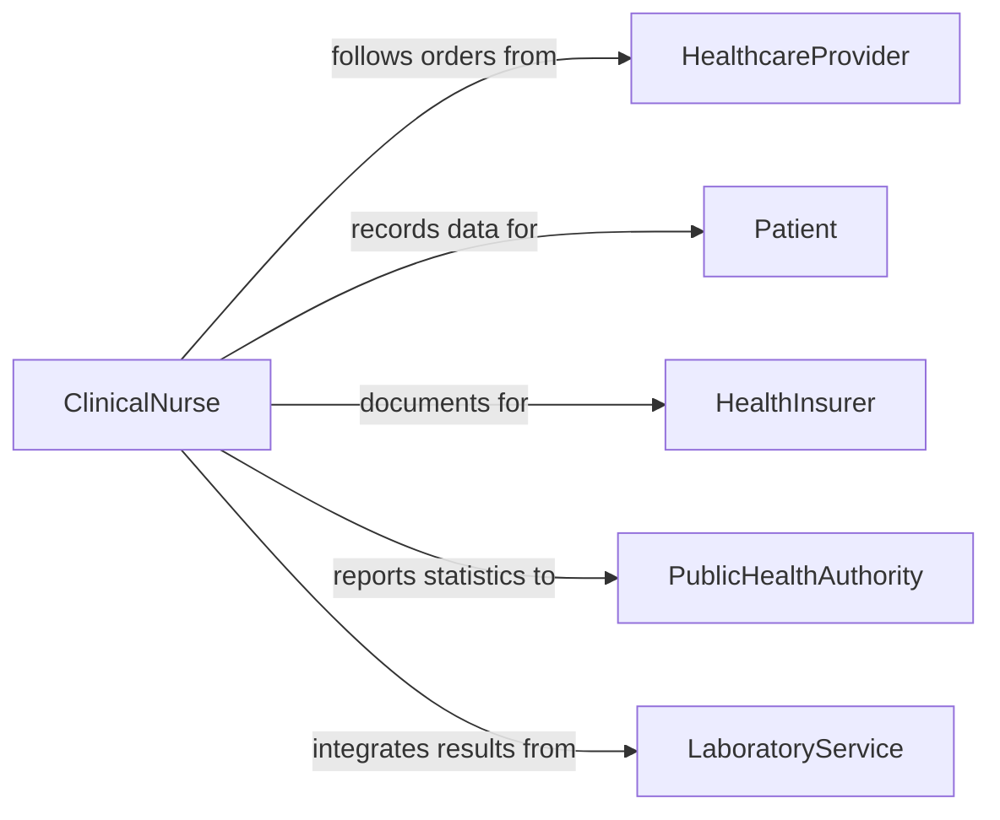

# Record Vital Statistics Health Information

> Business-as-Code definition for recording vital statistics and health information including patient vitals, biometric data, and clinical observations.

## Overview

Recording vital statistics or other health information involves capturing, validating, and storing patient biometric measurements, clinical observations, and health status data in medical records systems. This definition exposes actions for clinical data entry workflows, events for care coordination automation, and searches for retrieving patient health data across electronic health record systems.

## Actors

| Actor | Description |
|-------|-------------|
| HealthcareProvider | Physician or specialist ordering vital sign monitoring |
| Patient | Individual whose vital statistics and health data are recorded |
| HealthInsurer | Requires documented health data for claims and coverage decisions |
| PublicHealthAuthority | Collects aggregate vital statistics for population health reporting |
| LaboratoryService | Provides diagnostic results that supplement vital records |

## Roles

| Role | Description |
|------|-------------|
| ClinicalNurse | Captures vital signs and records health observations |
| MedicalRecordsTechnician | Validates and files health information in patient records |
| AttendingPhysician | Reviews vital statistics and makes clinical decisions |
| HealthInformationOfficer | Ensures health data meets privacy and quality standards |

## Entities

| Entity | Description |
|--------|-------------|
| VitalSignRecord | Documented measurement of a patient vital sign at a point in time |
| PatientHealthRecord | Comprehensive medical record for an individual patient |
| BiometricMeasurement | Quantitative health data such as blood pressure or temperature |
| ClinicalObservation | Qualitative health assessment noted by a clinician |
| AlertThreshold | Defined value range triggering clinical alerts for a vital sign |
| HealthDataAuditTrail | Tracked log of all modifications to health records |

## Actions

| Action | Description |
|--------|-------------|
| recordVitalSigns | Capture patient vital sign measurements |
| recordClinicalObservation | Document qualitative health assessments and findings |
| validateHealthData | Verify recorded data falls within plausible clinical ranges |
| flagAbnormalVitals | Mark vital signs that exceed defined alert thresholds |
| updatePatientRecord | Add validated health data to the patient medical record |
| generateHealthSummary | Produce a summary of vital statistics for a time period |
| auditHealthRecords | Review data integrity and access compliance for health records |

## Events

| Event | Description |
|-------|-------------|
| vitalSignsRecorded | Patient vital sign measurements have been captured |
| clinicalObservationRecorded | Qualitative health assessment has been documented |
| healthDataValidated | Recorded data has been verified for clinical plausibility |
| abnormalVitalsFlagged | Vital signs exceeding alert thresholds have been marked |
| patientRecordUpdated | Validated health data has been added to the medical record |
| healthSummaryGenerated | Vital statistics summary has been produced |
| healthRecordsAudited | Data integrity and access review has been completed |

## Searches

| Search | Description |
|--------|-------------|
| findVitalsByPatient | Retrieve vital sign history for a specific patient |
| findAbnormalVitals | List flagged vital signs requiring clinical attention |
| getHealthSummary | Retrieve health statistics summary for a patient and period |
| findRecentRecordings | List vital sign entries within a specified time range |
| auditAccessLog | Retrieve access history for a patient health record |

## Workflow



## Actor Relationships



## Usage

### Calling Actions

```typescript
import { recordVitalStatisticsHealthInformation } from '@headlessly/record-vital-statistics-health-information'

const vitals = recordVitalStatisticsHealthInformation()

// Record vital signs
const record = await vitals.recordVitalSigns({
  patientId: 'PAT-2026-08421',
  encounterId: 'ENC-2026-02-05-003',
  measurements: [
    { type: 'blood-pressure', systolic: 142, diastolic: 88, unit: 'mmHg' },
    { type: 'heart-rate', value: 92, unit: 'bpm' },
    { type: 'temperature', value: 37.2, unit: 'celsius' },
    { type: 'oxygen-saturation', value: 96, unit: 'percent' }
  ],
  recordedBy: 'RN-WILLIAMS'
})

// Validate health data
await vitals.validateHealthData({
  recordId: record.id,
  validationRules: 'adult-standard-ranges'
})

// Flag abnormal values
await vitals.flagAbnormalVitals({
  recordId: record.id,
  thresholdProfile: 'hypertension-monitoring'
})
```

### Event-Driven Automation

```typescript
// Alert physician on abnormal vitals
vitals.abnormalVitalsFlagged(async ({ patientId, flaggedMeasurements }) => {
  for (const measurement of flaggedMeasurements) {
    await notify({
      to: `attending-physician-${patientId}`,
      message: `Abnormal ${measurement.type}: ${measurement.value} ${measurement.unit}`,
      priority: 'urgent'
    })
  }
})

// Auto-generate summary after recording
vitals.patientRecordUpdated(async ({ patientId, encounterId }) => {
  await vitals.generateHealthSummary({
    patientId,
    period: 'current-encounter',
    encounterId
  })
})
```
