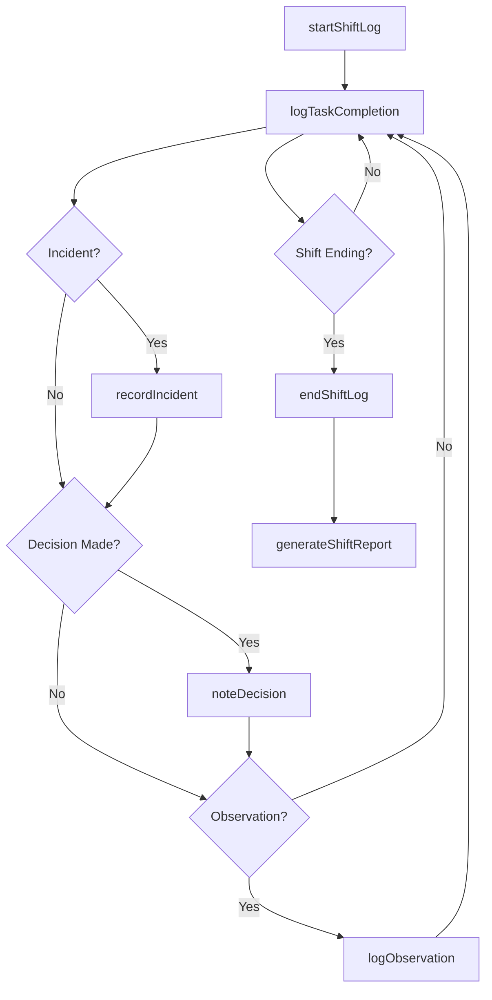
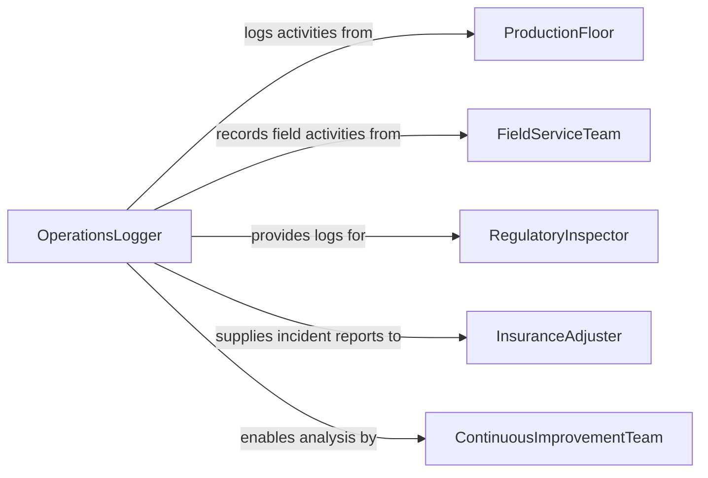

# Document Operational Activities

> Business-as-Code definition for operational activity documentation. Models the lifecycle from activity observation through logging, categorization, review, and reporting of day-to-day business operations.

## Overview

Documenting operational activities involves real-time logging of shift operations, work performed, incidents encountered, and decisions made during daily business execution. This definition focuses on capturing what actually happened rather than prescriptive instructions, creating an auditable timeline of operational events for compliance, continuous improvement, and historical reference.

## Actors

| Actor | Description |
|-------|-------------|
| ProductionFloor | The physical location where operational work is performed |
| FieldServiceTeam | Mobile workforce executing operations at customer sites |
| RegulatoryInspector | Reviews activity logs during compliance audits |
| InsuranceAdjuster | Examines incident reports for claims processing |
| ContinuousImprovementTeam | Analyzes activity patterns to identify process improvements |

## Roles

| Role | Description |
|------|-------------|
| ShiftSupervisor | Oversees operations and ensures shift logs are complete |
| OperationsLogger | Records activities, incidents, and decisions in real-time |
| IncidentResponder | Documents unplanned events and immediate corrective actions |
| ActivityReviewer | Validates logged activities for accuracy and completeness |

## Entities

| Entity | Description |
|--------|-------------|
| ShiftLog | A chronological record of all activities during a work shift |
| IncidentReport | Documentation of an unplanned event with root cause and response |
| ActivityEntry | A timestamped record of a specific task or event that occurred |
| DailyBriefing | End-of-shift summary of completed work and outstanding issues |
| DecisionJournal | A log of operational decisions made and their justifications |
| ProductionRunRecord | Detailed record of a manufacturing or service delivery run |
| ObservationNote | A logged observation about conditions, behaviors, or anomalies |

## Actions

| Action | Description |
|--------|-------------|
| startShiftLog | Begin a new shift log with team roster and planned activities |
| logTaskCompletion | Record the completion of a specific operational task |
| recordIncident | Document an unplanned event with immediate response actions |
| noteDecision | Log an operational decision made during the shift |
| logObservation | Record an observation about conditions or performance |
| endShiftLog | Close the shift log with handoff notes for next shift |
| generateShiftReport | Compile shift activities into a summary report |

## Events

| Event | Description |
|-------|-------------|
| shiftLogStarted | A new shift log has been opened |
| taskCompletionLogged | A completed task has been recorded |
| incidentRecorded | An unplanned event has been documented |
| decisionNoted | An operational decision has been logged |
| observationLogged | A noteworthy observation has been recorded |
| shiftLogEnded | The shift log has been closed and handed off |
| shiftReportGenerated | A shift summary report has been produced |

## Searches

| Search | Description |
|--------|-------------|
| findShiftLogs | Retrieve shift logs by date, team, or supervisor |
| getIncidentHistory | Search incident reports by type, severity, or date range |
| getDecisionLog | Retrieve operational decisions by date or decision-maker |
| getActivityTimeline | Generate a chronological timeline of logged activities |
| getObservationsByType | Search observation notes by category or keyword |

## Workflow



## Actor Relationships



## Usage

### Calling Actions

```typescript
import { documentOperationalActivities } from '@headlessly/document-operational-activities'

const activities = documentOperationalActivities()

// Start a new shift log
const shift = await activities.startShiftLog({
  shift: 'day-shift',
  date: '2026-02-05',
  supervisor: 'John Martinez',
  team: ['Alice Chen', 'Bob Williams', 'Carlos Rodriguez'],
  plannedActivities: ['line-1-production', 'preventive-maintenance-line-3']
})

// Log completion of a task
await activities.logTaskCompletion({
  shiftLogId: shift.id,
  task: 'Completed production run 2026-0205-A on line 1',
  completedBy: 'Alice Chen',
  timestamp: '2026-02-05T14:30:00Z',
  duration: 240,
  output: { units: 1200, quality: 'pass' }
})

// Record an incident that occurred
await activities.recordIncident({
  shiftLogId: shift.id,
  timestamp: '2026-02-05T10:45:00Z',
  type: 'equipment-malfunction',
  description: 'Hydraulic press lost pressure on station 4',
  impact: 'Production stopped for 35 minutes',
  immediateAction: 'Isolated hydraulic circuit, called maintenance',
  reportedBy: 'Bob Williams'
})

// Log a decision made during the shift
await activities.noteDecision({
  shiftLogId: shift.id,
  timestamp: '2026-02-05T15:00:00Z',
  decision: 'Extended shift by 1 hour to complete customer order 4521',
  rationale: 'Customer deadline is tomorrow, team agreed to overtime',
  madeBy: 'John Martinez'
})

// End shift with handoff notes
await activities.endShiftLog({
  shiftLogId: shift.id,
  endTime: '2026-02-05T17:00:00Z',
  handoffNotes: 'Line 3 maintenance ongoing, expect completion by 8pm. Order 4521 shipped.',
  outstandingIssues: ['Hydraulic system needs follow-up inspection']
})
```

### Event-Driven Automation

```typescript
// Immediately escalate critical incidents
activities.incidentRecorded(async ({ type, description, timestamp }) => {
  if (type === 'safety-incident' || type === 'environmental-release') {
    await notify({
      to: 'safety-director',
      priority: 'urgent',
      message: `CRITICAL INCIDENT at ${timestamp}: ${description}`
    })
  }
})

// Aggregate shift handoffs for management dashboard
activities.shiftLogEnded(async ({ shiftLogId, date, handoffNotes }) => {
  await updateDashboard({
    date,
    shiftLogId,
    handoffNotes
  })
})
```
