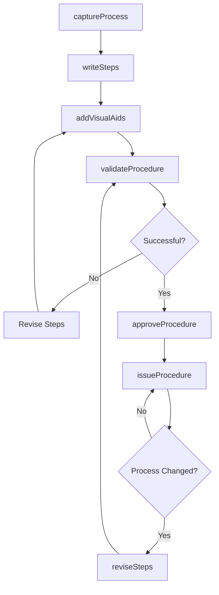
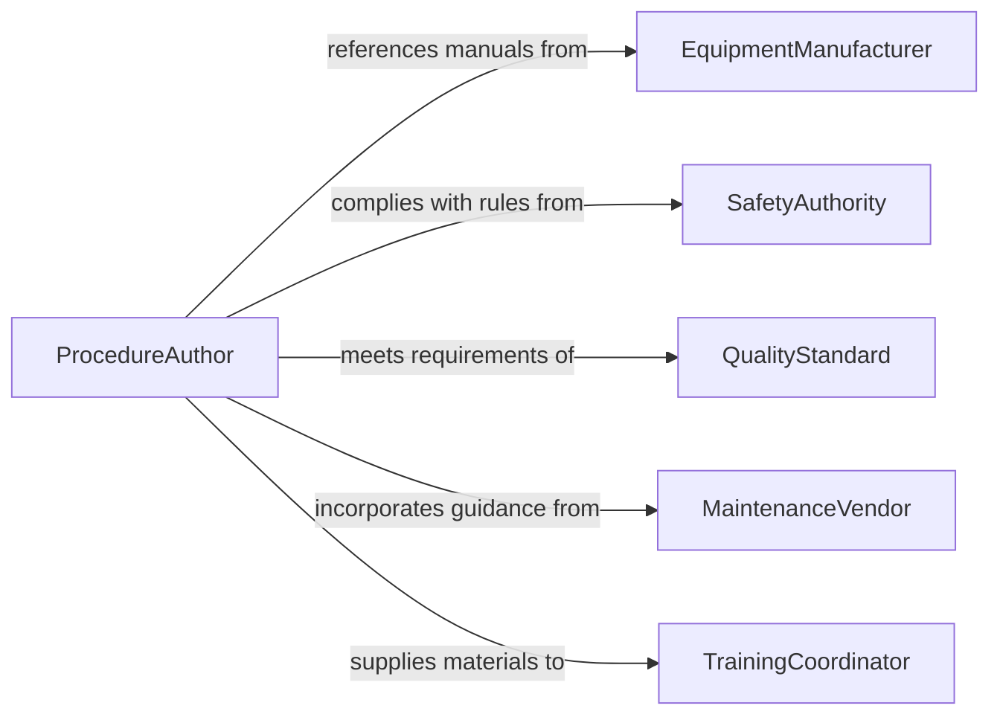

# Document Operational Procedures

> Business-as-Code definition for operational procedure documentation. Models the lifecycle from process observation through drafting, review, approval, distribution, and revision of standard operating procedures.

## Overview

Documenting operational procedures involves creating task-specific work instructions that tell employees exactly how to perform discrete operations. These are technical how-to guides for equipment operation, assembly processes, safety procedures, and quality checks. This definition focuses on authoring detailed, step-by-step instructions for hands-on work, not enterprise policies.

## Actors

| Actor | Description |
|-------|-------------|
| EquipmentManufacturer | Provides baseline operating instructions for machinery |
| SafetyAuthority | Mandates specific procedures for hazardous operations |
| QualityStandard | Defines process requirements that procedures must satisfy |
| MaintenanceVendor | Supplies service procedures for specialized equipment |
| TrainingCoordinator | Uses work instructions to onboard new operators |

## Roles

| Role | Description |
|------|-------------|
| ProcedureAuthor | Subject matter expert who writes task-specific instructions |
| ProcessEngineer | Validates that procedures match optimal process parameters |
| SafetyOfficer | Reviews procedures for hazard identification and controls |
| DocumentationSpecialist | Formats procedures with diagrams, photos, and clear steps |

## Entities

| Entity | Description |
|--------|-------------|
| WorkInstruction | Step-by-step guide for performing a specific task |
| OperatingProcedure | Detailed instructions for running a piece of equipment |
| SafetyProcedure | Mandatory steps for working with hazardous materials or conditions |
| ProcedureRevision | An updated version of an existing work instruction |
| StepDiagram | Visual aid showing hand positions, tool usage, or setup configuration |
| ReferenceDocument | Supporting material linked from the procedure (spec sheet, diagram) |
| TrainingCheckoff | Record that an employee has been trained on a specific procedure |

## Actions

| Action | Description |
|--------|-------------|
| captureProcess | Record current method by observing expert performing the task |
| writeSteps | Author numbered steps with action verbs and acceptance criteria |
| addVisualAids | Include photographs, diagrams, or videos in the procedure |
| validateProcedure | Test the procedure with a novice to confirm clarity |
| approveProcedure | Sign off that procedure meets technical and safety standards |
| issueProcedure | Release procedure to work area and add to training materials |
| reviseSteps | Update procedure based on process improvement or equipment change |

## Events

| Event | Description |
|-------|-------------|
| processCaptured | A task performance has been observed and documented |
| stepsWritten | Numbered instructions have been authored |
| visualAidsAdded | Diagrams or photos have been incorporated |
| procedureValidated | A novice successfully completed task using the procedure |
| procedureApproved | Technical and safety review has been completed |
| procedureIssued | Procedure has been released to the work area |
| stepsRevised | An existing procedure has been updated |

## Searches

| Search | Description |
|--------|-------------|
| findByEquipment | Retrieve all procedures related to a specific machine |
| findByTask | Search for procedures covering a particular operation |
| findBySafety | List all safety procedures for hazardous work |
| getPendingValidation | Retrieve procedures awaiting testing with operators |
| getRecentRevisions | List procedures recently updated |

## Workflow



## Actor Relationships



## Usage

### Calling Actions

```typescript
import { documentOperationalProcedures } from '@headlessly/document-operational-procedures'

const procedures = documentOperationalProcedures()

// Create a detailed work instruction
const workInstruction = await procedures.writeSteps({
  title: 'SOP-MFG-047: Hydraulic Press Operation',
  equipment: 'hydraulic-press-line-2',
  scope: 'Forming sheet metal brackets for product SKU-2847',
  steps: [
    {
      number: 1,
      action: 'Inspect die for cracks or debris',
      acceptance: 'Die surface is clean and undamaged',
      safety: 'Wear cut-resistant gloves'
    },
    {
      number: 2,
      action: 'Load blank into die alignment pins',
      acceptance: 'Blank is flush against rear stop',
      safety: 'Keep hands clear of press area'
    },
    {
      number: 3,
      action: 'Activate press using two-hand controls',
      acceptance: 'Press cycles completely and returns to top position'
    },
    {
      number: 4,
      action: 'Remove formed part and inspect for cracks',
      acceptance: 'No visible cracks, dimensions within +/- 0.5mm'
    }
  ]
})

// Add visual aids
await procedures.addVisualAids({
  procedureId: workInstruction.id,
  visuals: [
    { step: 1, type: 'photo', url: '/procedures/img/die-inspection.jpg' },
    { step: 2, type: 'diagram', url: '/procedures/img/blank-alignment.svg' },
    { step: 4, type: 'video', url: '/procedures/video/crack-inspection.mp4' }
  ]
})

// Validate with operator
await procedures.validateProcedure({
  procedureId: workInstruction.id,
  validator: 'supervisor-lopez',
  operator: 'trainee-chen',
  successful: true,
  notes: 'Completed task correctly on first attempt, no questions'
})

// Approve and issue
await procedures.approveProcedure({
  procedureId: workInstruction.id,
  technicalApprover: 'process-engineer-smith',
  safetyApprover: 'safety-officer-davis'
})

await procedures.issueProcedure({
  procedureId: workInstruction.id,
  locations: ['production-floor-line-2', 'training-room'],
  format: 'laminated-card'
})
```

### Event-Driven Automation

```typescript
// Auto-create training records when procedure is issued
procedures.procedureIssued(async ({ procedureId, locations }) => {
  const operators = await getOperatorsByLocation(locations)
  for (const operator of operators) {
    await createTrainingRequirement({
      operatorId: operator.id,
      procedureId,
      dueDate: addDays(new Date(), 30)
    })
  }
})

// Notify process engineer when validation fails
procedures.procedureValidated(async ({ procedureId, successful, notes }) => {
  if (!successful) {
    await notify({
      to: 'process-engineering-team',
      message: `Work instruction ${procedureId} failed validation: ${notes}`
    })
  }
})
```
