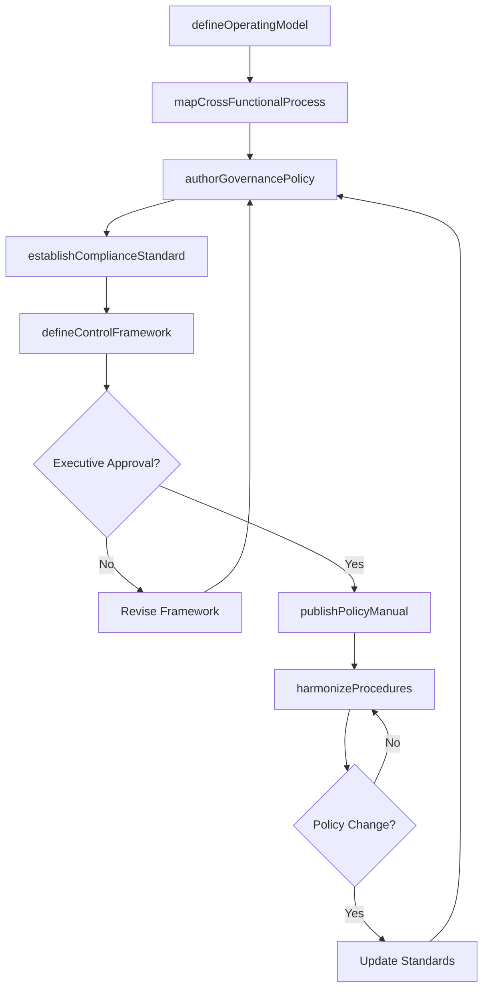
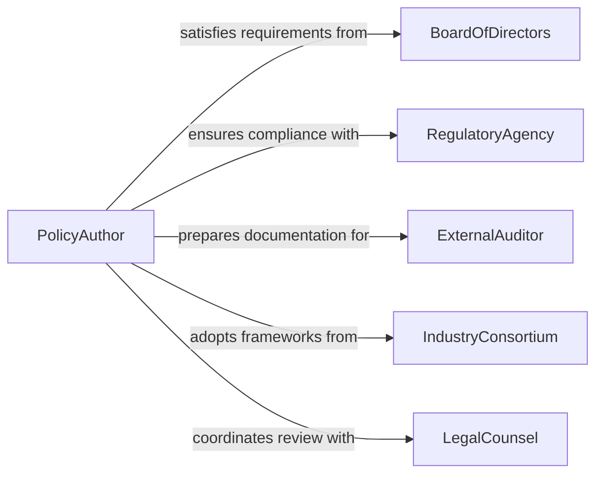

# Document Organizational Operational Procedures

> Business-as-Code definition for documenting organizational or operational procedures. Models the complete procedure documentation lifecycle from requirements gathering through drafting, review, approval, and version-controlled publication.

## Overview

Documenting organizational operational procedures involves creating enterprise-level process documentation that defines how the business operates across departments, functions, and systems. This focuses on policy manuals, governance frameworks, cross-functional process maps, and compliance standards that establish organizational operating models rather than task-specific instructions.

## Actors

| Actor | Description |
|-------|-------------|
| BoardOfDirectors | Establishes governance requirements for enterprise documentation |
| RegulatoryAgency | Mandates specific organizational policies and procedures for compliance |
| ExternalAuditor | Reviews organizational procedures during enterprise audits |
| IndustryConsortium | Provides best practice frameworks for organizational processes |
| LegalCounsel | Reviews procedures for legal compliance and liability protection |

## Roles

| Role | Description |
|------|-------------|
| ProcessArchitect | Designs enterprise-level process frameworks and standards |
| PolicyAuthor | Writes organizational policies and governance documents |
| ComplianceOfficer | Ensures procedures meet regulatory and legal requirements |
| EnterpriseDocumentManager | Maintains the organizational procedure library and taxonomy |

## Entities

| Entity | Description |
|--------|-------------|
| PolicyManual | Comprehensive document defining organizational policies and principles |
| ProcessMap | Visual representation of cross-departmental workflows and handoffs |
| GovernanceFramework | Structure defining decision rights, accountability, and controls |
| ComplianceStandard | Mandatory requirements derived from regulations and laws |
| OperatingModel | High-level definition of how the organization creates value |
| ControlsCatalog | Repository of internal controls and compliance checkpoints |
| ProcedureHierarchy | Taxonomy organizing procedures by function, risk, and authority |

## Actions

| Action | Description |
|--------|-------------|
| defineOperatingModel | Establish enterprise structure, roles, and value creation model |
| mapCrossFunctionalProcess | Document workflows spanning multiple departments |
| authorGovernancePolicy | Write policies defining decision rights and accountability |
| establishComplianceStandard | Create mandatory requirements based on regulations |
| defineControlFramework | Document internal controls and risk mitigation procedures |
| publishPolicyManual | Release comprehensive policy documentation to the organization |
| harmonizeProcedures | Align departmental procedures with enterprise standards |

## Events

| Event | Description |
|-------|-------------|
| operatingModelDefined | Enterprise structure and value model have been documented |
| crossFunctionalProcessMapped | Multi-department workflow has been documented |
| governancePolicyAuthored | Policy defining decision rights has been written |
| complianceStandardEstablished | Regulatory requirement has been codified |
| controlFrameworkDefined | Risk controls have been documented |
| policyManualPublished | Comprehensive policy documentation has been released |
| proceduresHarmonized | Departmental procedures have been aligned with standards |

## Searches

| Search | Description |
|--------|-------------|
| findByGovernanceArea | Retrieve policies by governance domain (finance, IT, HR, operations) |
| getProcessMaps | List process maps by function or business unit |
| getComplianceRequirements | Retrieve mandatory standards by regulation or jurisdiction |
| getControlsByRisk | List internal controls organized by risk category |
| getPolicyHierarchy | Retrieve the organizational policy taxonomy |

## Workflow



## Actor Relationships



## Usage

### Calling Actions

```typescript
import { documentOrganizationalOperationalProcedures } from '@headlessly/document-organizational-operational-procedures'

const orgProcedures = documentOrganizationalOperationalProcedures()

// Define the enterprise operating model
const operatingModel = await orgProcedures.defineOperatingModel({
  title: 'Global Manufacturing Operating Model',
  valueStreams: ['product-development', 'manufacturing', 'distribution', 'service'],
  organizationStructure: 'matrix',
  decisionFramework: 'delegated-authority-matrix',
  keyPolicies: ['capital-allocation', 'risk-management', 'quality-assurance']
})

// Map a cross-functional process
const processMap = await orgProcedures.mapCrossFunctionalProcess({
  processName: 'Order-to-Cash',
  departments: ['sales', 'credit', 'warehouse', 'logistics', 'finance'],
  handoffs: [
    { from: 'sales', to: 'credit', trigger: 'order-submitted', data: 'customer-order' },
    { from: 'credit', to: 'warehouse', trigger: 'credit-approved', data: 'pick-list' },
    { from: 'warehouse', to: 'logistics', trigger: 'order-packed', data: 'shipment' },
    { from: 'logistics', to: 'finance', trigger: 'delivered', data: 'proof-of-delivery' }
  ],
  controls: ['credit-limit-check', 'inventory-availability', 'shipping-verification']
})

// Author governance policy
const policy = await orgProcedures.authorGovernancePolicy({
  title: 'Capital Expenditure Authorization Policy',
  scope: 'All capital purchases exceeding $10,000',
  principles: [
    'All capex must align with strategic plan',
    'Multi-level approval based on amount',
    'ROI analysis required for investments > $100k'
  ],
  approvalMatrix: [
    { amount: '10k-50k', approver: 'department-head' },
    { amount: '50k-250k', approver: 'vice-president' },
    { amount: '250k+', approver: 'cfo-and-ceo' }
  ]
})

// Establish compliance standard
await orgProcedures.establishComplianceStandard({
  regulation: 'SOX Section 404',
  standard: 'Financial Reporting Controls',
  requirements: [
    'Segregation of duties for financial transactions',
    'Documented approval for journal entries',
    'Quarterly management certification of controls',
    'Annual independent audit of control effectiveness'
  ],
  applicableDepartments: ['finance', 'accounting', 'treasury', 'payroll']
})

// Publish comprehensive policy manual
await orgProcedures.publishPolicyManual({
  title: 'Enterprise Policy Manual - FY2026',
  sections: [
    { category: 'governance', policies: ['board-charter', 'delegation-of-authority'] },
    { category: 'finance', policies: ['capex-policy', 'expense-approval', 'budget-process'] },
    { category: 'operations', policies: ['quality-policy', 'supplier-management'] },
    { category: 'compliance', policies: ['sox-controls', 'data-privacy', 'anti-corruption'] }
  ],
  effectiveDate: '2026-01-01',
  audience: 'all-employees'
})
```

### Event-Driven Automation

```typescript
// Cascade policy updates to departmental procedures
orgProcedures.policyManualPublished(async ({ title, sections, effectiveDate }) => {
  for (const section of sections) {
    await notify({
      to: `${section.category}-department-heads`,
      message: `Updated ${section.category} policies effective ${effectiveDate}. Review and harmonize departmental procedures.`
    })
  }
})

// Trigger compliance training when new standards are established
orgProcedures.complianceStandardEstablished(async ({ regulation, applicableDepartments }) => {
  for (const dept of applicableDepartments) {
    await createTrainingCampaign({
      department: dept,
      topic: regulation,
      mandatory: true,
      dueDate: addDays(new Date(), 60)
    })
  }
})

// Alert board when governance framework changes
orgProcedures.governancePolicyAuthored(async ({ title, principles }) => {
  await notify({
    to: 'board-of-directors',
    priority: 'high',
    message: `Governance policy update for review: ${title}`
  })
})
```
