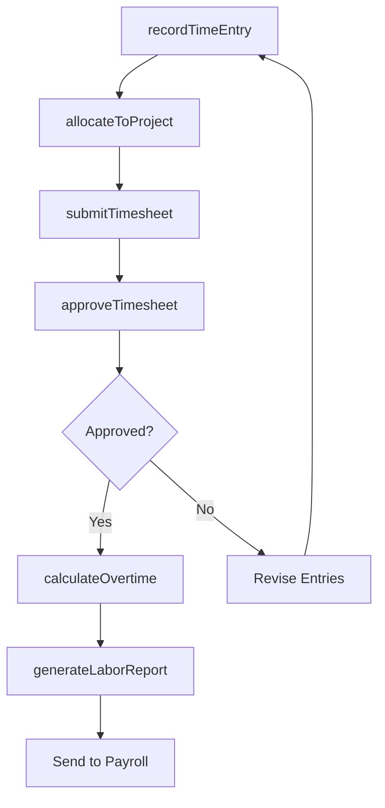
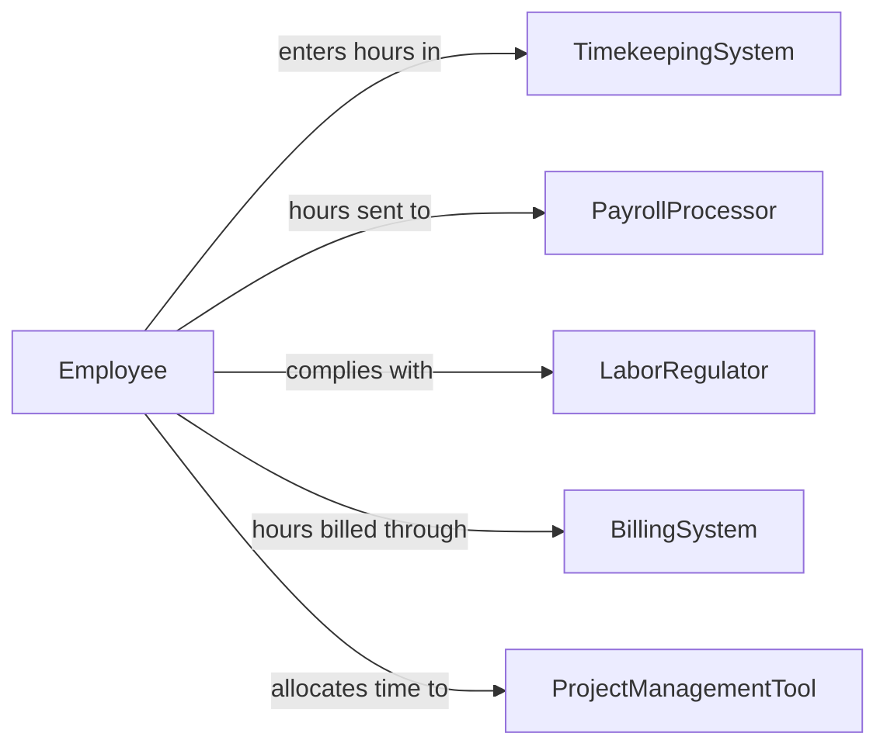

# Document Work Hours or Activities

> Business-as-Code definition for work hours and activity documentation. Models the lifecycle from time entry through approval, overtime calculation, project allocation, and payroll integration for workforce time tracking.

## Overview

Documenting work hours or activities involves recording employee time entries, tracking project allocations, calculating overtime, managing time-off requests, approving timesheets, and integrating hours data with payroll and billing systems. This definition exposes actions for time entry and approval, events for overtime alerts and deadline monitoring, and searches for timesheet retrieval and labor analytics.

## Actors

| Actor | Description |
|-------|-------------|
| TimekeepingSystem | Provides the platform for electronic time entry and tracking |
| PayrollProcessor | Receives approved hours data for compensation calculation |
| LaborRegulator | Enforces wage and hour laws including overtime and break requirements |
| BillingSystem | Consumes project hours for client invoicing and cost allocation |
| ProjectManagementTool | Provides project and task codes for time allocation |

## Roles

| Role | Description |
|------|-------------|
| Employee | Records daily work hours and activity details |
| TimesheetApprover | Reviews and approves submitted timesheets for accuracy |
| PayrollCoordinator | Processes approved hours and resolves discrepancies before payroll |
| ProjectAccountant | Allocates labor hours to projects and tracks budget consumption |

## Entities

| Entity | Description |
|--------|-------------|
| TimeEntry | A record of hours worked on a specific date, task, or project |
| Timesheet | A periodic summary of an employee's time entries for approval |
| OvertimeRecord | A documented calculation of hours exceeding standard thresholds |
| ProjectAllocation | The assignment of worked hours to a specific project or cost center |
| TimeOffRequest | A submitted request for paid or unpaid leave |
| BreakRecord | A documented rest or meal period as required by labor regulations |
| LaborCostReport | A summary of hours and associated costs by project, department, or period |

## Actions

| Action | Description |
|--------|-------------|
| recordTimeEntry | Log hours worked on a specific date with task and project details |
| submitTimesheet | Send a completed timesheet to the approver for review |
| approveTimesheet | Review and authorize submitted hours for payroll processing |
| calculateOvertime | Compute overtime hours based on work rules and regulatory thresholds |
| allocateToProject | Assign recorded hours to specific projects or cost centers |
| requestTimeOff | Submit a request for paid or unpaid leave |
| generateLaborReport | Produce a summary of hours, costs, and utilization by period |

## Events

| Event | Description |
|-------|-------------|
| timeEntryRecorded | An employee has logged hours for a work period |
| timesheetSubmitted | A timesheet has been sent for approval |
| timesheetApproved | Submitted hours have been authorized for payroll |
| timesheetRejected | Submitted hours have been returned for correction |
| overtimeCalculated | Hours exceeding standard thresholds have been computed |
| overtimeThresholdApproaching | An employee is nearing the weekly overtime limit |
| timeOffRequested | A leave request has been submitted |
| laborReportGenerated | A labor cost summary has been produced |

## Searches

| Search | Description |
|--------|-------------|
| findTimesheets | Search timesheets by employee, period, status, or department |
| getTimeEntries | Retrieve individual time entries by date, project, or task |
| getOvertimeReport | List overtime hours by employee, department, or pay period |
| getProjectHours | Query total hours allocated to a project by team member or period |
| findPendingApprovals | List timesheets awaiting manager review and approval |

## Workflow



## Actor Relationships



## Usage

### Calling Actions

```typescript
import { documentWorkHoursActivities } from '@headlessly/document-work-hours-activities'

const timekeeping = documentWorkHoursActivities()

// Record daily time entries
await timekeeping.recordTimeEntry({
  employeeId: 'EMP-0482',
  date: '2026-02-05',
  entries: [
    { project: 'PRJ-2026-018', task: 'design-review', hours: 3.5 },
    { project: 'PRJ-2026-022', task: 'client-meeting', hours: 2.0 },
    { project: 'ADMIN', task: 'team-standup', hours: 0.5 },
    { project: 'PRJ-2026-018', task: 'documentation', hours: 2.0 }
  ]
})

// Submit weekly timesheet
await timekeeping.submitTimesheet({
  employeeId: 'EMP-0482',
  period: { start: '2026-02-02', end: '2026-02-06' },
  totalHours: 42.5,
  approver: 'MGR-0115'
})

// Generate labor cost report
await timekeeping.generateLaborReport({
  period: 'January 2026',
  groupBy: 'project',
  includeOvertime: true,
  departments: ['engineering', 'design']
})
```

### Event-Driven Automation

```typescript
// Alert on approaching overtime
timekeeping.overtimeThresholdApproaching(async ({ employeeId, hoursWorked, threshold }) => {
  await notify({
    to: 'shift-manager',
    message: `Employee ${employeeId} at ${hoursWorked} hours (overtime threshold: ${threshold})`
  })
})

// Auto-route rejected timesheets
timekeeping.timesheetRejected(async ({ employeeId, period, reason }) => {
  await notify({
    to: employeeId,
    message: `Timesheet for ${period} returned: ${reason}. Please revise and resubmit.`
  })
})
```
