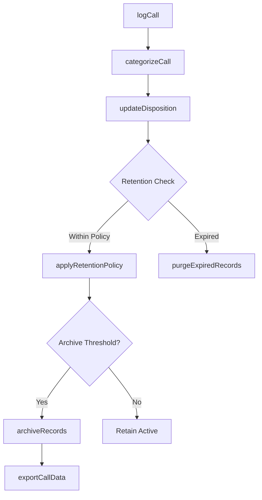
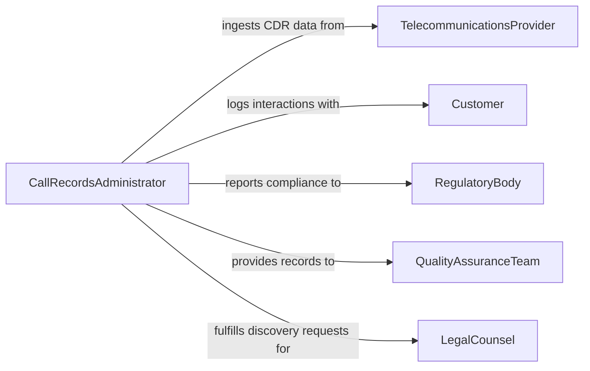

# Maintain Call Records

> Business-as-Code definition for maintaining call records, including logging, categorizing, and archiving inbound and outbound communication logs across telephony and digital channels.

## Overview

Maintaining call records involves systematically capturing, organizing, and preserving documentation of telephone and digital communications for operational continuity, compliance, and quality assurance. This definition exposes actions for recording call metadata, categorizing interactions by type and outcome, and archiving records per retention policies. It supports event-driven automation for compliance monitoring and search capabilities for audit and analytics.

## Actors

| Actor | Description |
|-------|-------------|
| TelecommunicationsProvider | Supplies telephony infrastructure and call detail records |
| Customer | External party whose inbound and outbound calls are logged |
| RegulatoryBody | Enforces record retention and privacy compliance requirements |
| QualityAssuranceTeam | Reviews call records for service quality and training purposes |
| LegalCounsel | Requests call records for litigation holds or legal discovery |

## Roles

| Role | Description |
|------|-------------|
| CallRecordsAdministrator | Manages the overall call records system and retention policies |
| ContactCenterAgent | Logs call outcomes and notes during or after each interaction |
| ComplianceOfficer | Ensures call records meet regulatory retention and privacy standards |
| DataAnalyst | Analyzes call record data for volume trends and performance metrics |

## Entities

| Entity | Description |
|--------|-------------|
| CallRecord | A log entry representing a single inbound or outbound call |
| CallCategory | Classification label applied to a call (e.g., inquiry, complaint, escalation) |
| RetentionPolicy | Rules governing how long call records are stored before disposal |
| CallDisposition | The outcome or resolution status assigned to a completed call |
| ArchiveBatch | A group of call records moved to long-term storage |

## Actions

| Action | Description |
|--------|-------------|
| logCall | Create a new call record with metadata and disposition |
| categorizeCall | Assign a category and subcategory to an existing call record |
| updateDisposition | Modify the outcome or resolution status of a call record |
| archiveRecords | Move aged call records to long-term storage per retention policy |
| purgeExpiredRecords | Delete call records that have exceeded their retention period |
| exportCallData | Generate an export of call records for reporting or legal review |
| applyRetentionPolicy | Associate a retention policy with a set of call records |

## Events

| Event | Description |
|-------|-------------|
| callLogged | A new call record has been created in the system |
| callCategorized | A category has been assigned to a call record |
| dispositionUpdated | The outcome status of a call record has been modified |
| recordsArchived | A batch of call records has been moved to long-term storage |
| expiredRecordsPurged | Call records past their retention period have been deleted |
| retentionPolicyApplied | A retention policy has been associated with call records |
| callDataExported | Call record data has been exported for external use |

## Searches

| Search | Description |
|--------|-------------|
| findCallRecords | Retrieve call records by date range, agent, category, or disposition |
| getCallVolume | Return aggregate call counts grouped by period, category, or agent |
| findExpiredRecords | Identify call records that have exceeded their retention period |
| getCallsByCustomer | Retrieve all call records associated with a specific customer |

## Workflow



## Actor Relationships



## Usage

### Calling Actions

```typescript
import { maintainCallRecords } from '@headlessly/maintain-call-records'

const calls = maintainCallRecords()

// Log a new inbound call
const record = await calls.logCall({
  direction: 'inbound',
  agentId: 'agent-042',
  customerId: 'cust-8891',
  startTime: '2026-02-05T09:15:00Z',
  duration: 342,
  disposition: 'resolved'
})

// Categorize the call
await calls.categorizeCall({
  callRecordId: record.id,
  category: 'billing-inquiry',
  subcategory: 'payment-dispute'
})

// Archive records older than 2 years
await calls.archiveRecords({
  olderThan: '2024-02-05',
  retentionPolicyId: 'policy-standard-2yr'
})
```

### Event-Driven Automation

```typescript
// Notify compliance when records are purged
calls.expiredRecordsPurged(async ({ batchId, count, policy }) => {
  await notify({
    to: 'compliance-team',
    message: `Purged ${count} call records under policy ${policy.name}`
  })
})

// Auto-archive when volume threshold is reached
calls.callLogged(async ({ callRecordId, createdAt }) => {
  const volume = await calls.getCallVolume({ period: 'current-month' })
  if (volume.total > 50000) {
    await calls.archiveRecords({
      olderThan: thirtyDaysAgo(),
      retentionPolicyId: 'policy-high-volume'
    })
  }
})
```
