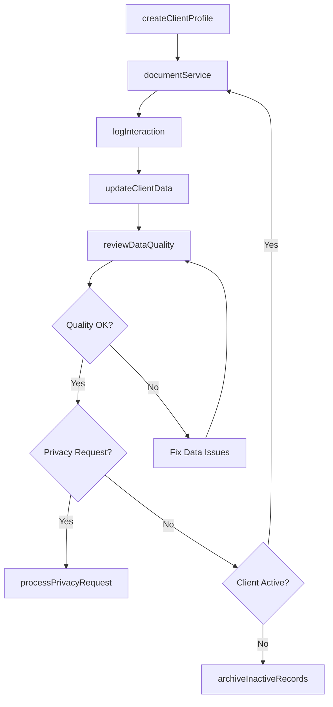
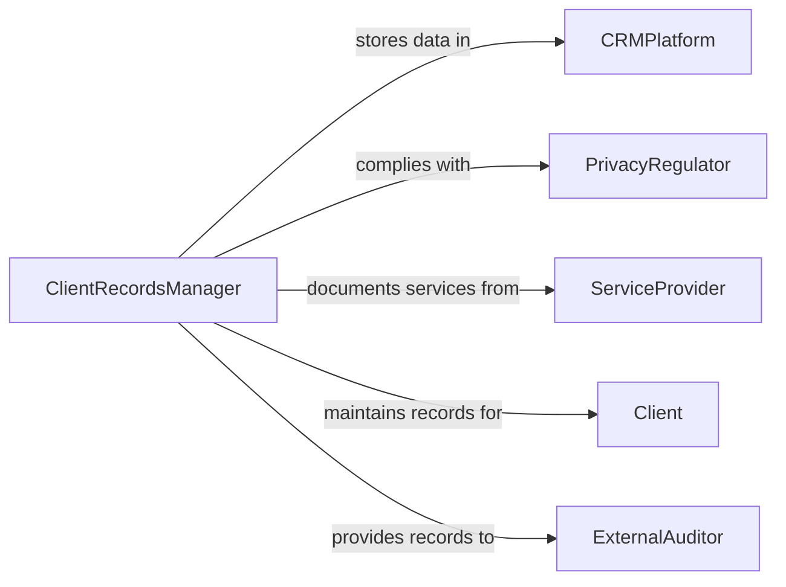

# Maintain Client Information or Service Records

> Business-as-Code definition for client information and service records management. Models the lifecycle from client onboarding through data maintenance, service documentation, privacy compliance, and records retention.

## Overview

Maintaining client information or service records involves collecting, organizing, updating, and securing data about clients and the services provided to them across CRM systems, case management platforms, and client portals. This definition exposes actions for client data management and service documentation, events for data quality and compliance monitoring, and searches for client history retrieval and relationship analytics.

## Actors

| Actor | Description |
|-------|-------------|
| CRMPlatform | Provides the client relationship management system for data storage |
| PrivacyRegulator | Enforces data protection requirements such as GDPR and CCPA |
| ServiceProvider | Delivers services that must be documented in client records |
| Client | The individual or organization whose information is maintained |
| ExternalAuditor | Reviews client records for compliance during assessments |

## Roles

| Role | Description |
|------|-------------|
| ClientRecordsManager | Oversees the accuracy and completeness of client data |
| AccountManager | Updates client records based on ongoing relationship activities |
| ServiceCoordinator | Documents services delivered to each client |
| DataPrivacyOfficer | Ensures client data handling complies with privacy regulations |

## Entities

| Entity | Description |
|--------|-------------|
| ClientProfile | The comprehensive record of a client including contact and demographic data |
| ServiceRecord | A documented account of a service delivered to a client |
| ContactLog | A chronological record of interactions with a client |
| ConsentRecord | A documented client authorization for data processing and communication |
| DataRetentionPolicy | The rules governing how long client records are preserved |
| PrivacyRequest | A client request to access, correct, or delete their personal data |
| ServiceAgreement | The terms and scope of services provided to a client |

## Actions

| Action | Description |
|--------|-------------|
| createClientProfile | Register a new client with demographic and contact information |
| updateClientData | Modify existing client information to reflect current details |
| documentService | Record a service delivered to a client with details and outcomes |
| logInteraction | Record a communication or meeting with a client |
| processPrivacyRequest | Handle a client request for data access, correction, or deletion |
| reviewDataQuality | Audit client records for accuracy, completeness, and duplication |
| archiveInactiveRecords | Move records of inactive clients to long-term storage |

## Events

| Event | Description |
|-------|-------------|
| clientProfileCreated | A new client has been registered in the system |
| clientDataUpdated | Client information has been modified |
| serviceDocumented | A service delivery has been recorded |
| interactionLogged | A client communication has been documented |
| privacyRequestReceived | A client has submitted a data privacy request |
| privacyRequestCompleted | A data privacy request has been fulfilled |
| dataQualityIssueDetected | An accuracy or completeness problem has been identified |

## Searches

| Search | Description |
|--------|-------------|
| findClients | Search client profiles by name, account number, or segment |
| getServiceHistory | Retrieve service records for a specific client by date or type |
| getInteractionLog | List communications with a client by date range or channel |
| findDuplicates | Identify potential duplicate client records |
| getPrivacyRequests | List pending or completed data privacy requests |

## Workflow



## Actor Relationships



## Usage

### Calling Actions

```typescript
import { maintainClientInformationServiceRecords } from '@headlessly/maintain-client-information-service-records'

const clients = maintainClientInformationServiceRecords()

// Create a new client profile
const profile = await clients.createClientProfile({
  name: 'Greenfield Manufacturing',
  type: 'corporate',
  industry: 'manufacturing',
  contacts: [
    { name: 'Jane Torres', role: 'VP Operations', email: 'jtorres@greenfield.com' }
  ],
  source: 'trade-show-2026'
})

// Document a service delivery
await clients.documentService({
  clientId: profile.id,
  service: 'equipment-installation',
  date: '2026-02-05',
  description: 'Installed conveyor system in Plant B',
  outcome: 'completed',
  technician: 'field-team-alpha'
})

// Process a GDPR data access request
await clients.processPrivacyRequest({
  clientId: profile.id,
  type: 'data-access',
  regulation: 'GDPR',
  deadline: '2026-03-05'
})
```

### Event-Driven Automation

```typescript
// Alert on data quality issues
clients.dataQualityIssueDetected(async ({ clientId, issue, field }) => {
  await notify({
    to: 'data-quality-team',
    message: `Data issue for client ${clientId}: ${issue} in field ${field}`
  })
})

// Track privacy request deadlines
clients.privacyRequestReceived(async ({ clientId, type, deadline }) => {
  await notify({
    to: 'privacy-officer',
    message: `${type} request from client ${clientId} due by ${deadline}`
  })
})
```
