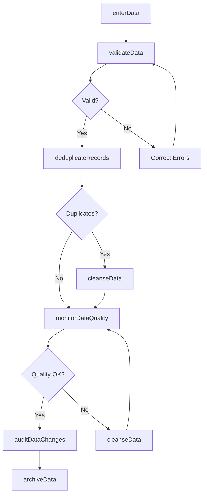
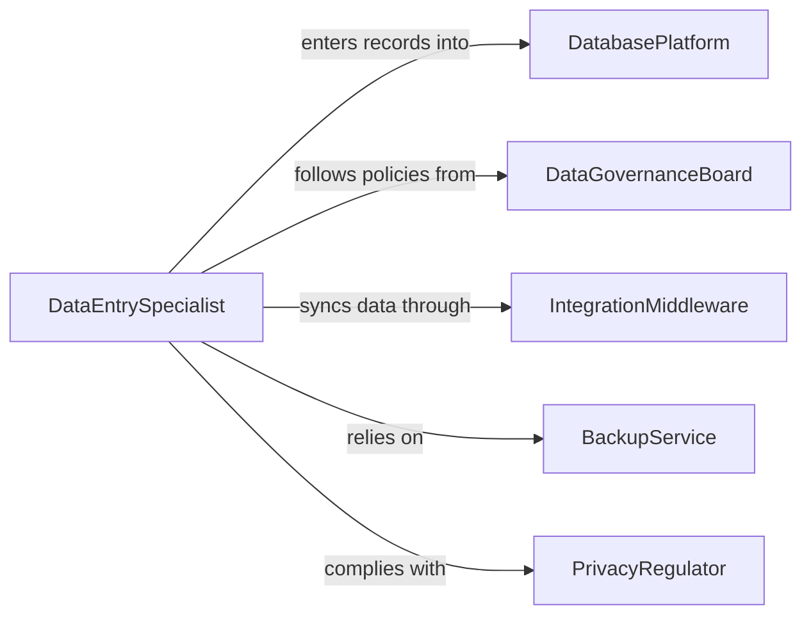

# Maintain Data in Information Systems or Databases

> Business-as-Code definition for data maintenance in information systems and databases. Models the lifecycle from data entry through validation, cleansing, deduplication, archival, and integrity monitoring across enterprise systems.

## Overview

Maintaining data in information systems or databases involves entering, validating, updating, cleansing, and archiving records to ensure accuracy, completeness, and accessibility across enterprise applications and data stores. This definition exposes actions for data entry and quality management, events for integrity monitoring and audit tracking, and searches for data retrieval and quality analytics.

## Actors

| Actor | Description |
|-------|-------------|
| DatabasePlatform | Provides the relational or document database for structured data storage |
| DataGovernanceBoard | Establishes policies and standards for data quality and ownership |
| IntegrationMiddleware | Facilitates data exchange between systems through ETL and API connections |
| BackupService | Provides automated data backup and disaster recovery capabilities |
| PrivacyRegulator | Enforces data retention and handling requirements such as GDPR |

## Roles

| Role | Description |
|------|-------------|
| DataEntrySpecialist | Enters and updates records in information systems and databases |
| DatabaseAdministrator | Manages database configuration, performance, and access controls |
| DataQualityAnalyst | Monitors and improves the accuracy and completeness of stored data |
| DataSteward | Owns data domain definitions and enforces governance policies |

## Entities

| Entity | Description |
|--------|-------------|
| DataRecord | A single entry or row within an information system or database |
| DataDictionary | A catalog defining the structure, type, and constraints for each data field |
| ValidationRule | A constraint that incoming or modified data must satisfy |
| DuplicateCluster | A group of records identified as potential duplicates requiring resolution |
| AuditTrail | A chronological log of data modifications including who, what, and when |
| ArchivePolicy | The rules governing when data is moved from active to archival storage |
| DataQualityScore | A metric measuring the accuracy, completeness, and consistency of a dataset |

## Actions

| Action | Description |
|--------|-------------|
| enterData | Add new records to an information system or database |
| updateRecord | Modify existing data to reflect current and accurate information |
| validateData | Check records against defined rules for format, range, and completeness |
| deduplicateRecords | Identify and merge or remove duplicate entries in a dataset |
| cleanseData | Correct, standardize, and normalize data values across records |
| archiveData | Move inactive records to long-term storage per retention policies |
| auditDataChanges | Review the modification history of records for compliance and accuracy |
| monitorDataQuality | Calculate and track data quality scores across datasets |

## Events

| Event | Description |
|-------|-------------|
| dataEntered | New records have been added to the system |
| recordUpdated | An existing record has been modified |
| dataValidated | Records have been checked against defined validation rules |
| duplicatesDetected | Potential duplicate records have been identified |
| dataCleansed | Records have been corrected and standardized |
| dataArchived | Inactive records have been moved to long-term storage |
| dataQualityDegraded | A dataset's quality score has fallen below the acceptable threshold |
| unauthorizedChangeDetected | A data modification outside normal governance has been flagged |

## Searches

| Search | Description |
|--------|-------------|
| findRecords | Search database records by field values, date range, or record type |
| getDuplicates | List potential duplicate record clusters for resolution |
| getAuditHistory | Retrieve the modification log for a specific record |
| getQualityScores | Query data quality metrics by dataset, table, or domain |
| findStaleRecords | Identify records that have not been updated within a defined period |

## Workflow



## Actor Relationships



## Usage

### Calling Actions

```typescript
import { maintainDataInformationSystemsDatabases } from '@headlessly/maintain-data-information-systems-databases'

const data = maintainDataInformationSystemsDatabases()

// Enter new records
await data.enterData({
  system: 'enterprise-crm',
  table: 'contacts',
  records: [
    { firstName: 'Priya', lastName: 'Sharma', email: 'psharma@acmecorp.com', company: 'Acme Corp', role: 'Procurement Manager' },
    { firstName: 'James', lastName: 'Owens', email: 'jowens@techstart.io', company: 'TechStart', role: 'CTO' }
  ]
})

// Validate and deduplicate
const validation = await data.validateData({
  system: 'enterprise-crm',
  table: 'contacts',
  rules: ['email-format', 'required-fields', 'phone-format']
})

const duplicates = await data.deduplicateRecords({
  system: 'enterprise-crm',
  table: 'contacts',
  matchFields: ['email', 'firstName', 'lastName'],
  threshold: 0.85
})

// Monitor quality across datasets
await data.monitorDataQuality({
  system: 'enterprise-crm',
  datasets: ['contacts', 'accounts', 'opportunities'],
  metrics: ['completeness', 'accuracy', 'consistency', 'timeliness']
})
```

### Event-Driven Automation

```typescript
// Alert on quality degradation
data.dataQualityDegraded(async ({ dataset, score, threshold }) => {
  await notify({
    to: 'data-steward',
    message: `Quality score for ${dataset} dropped to ${score}% (threshold: ${threshold}%)`
  })
})

// Flag unauthorized changes
data.unauthorizedChangeDetected(async ({ recordId, table, changedBy, changeType }) => {
  await notify({
    to: 'data-governance',
    message: `Unauthorized ${changeType} on ${table} record ${recordId} by ${changedBy}`
  })
})
```
