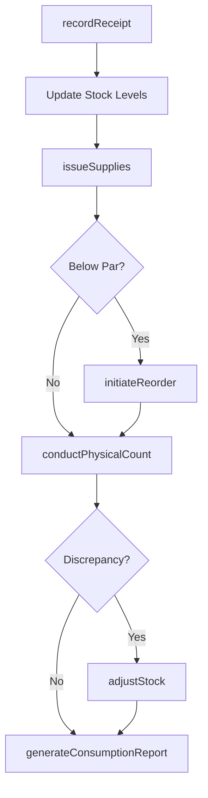
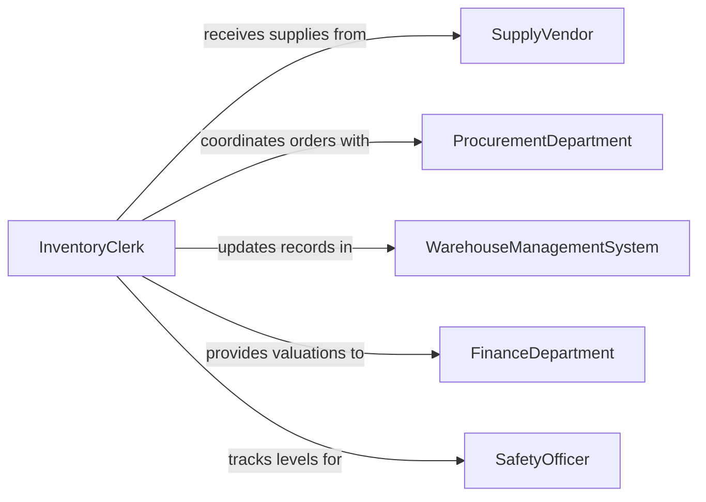

# Maintain Inventories of Supplies and Materials

> Business-as-Code definition for supplies and materials inventory maintenance. Models the lifecycle from requisition and receipt through stock level tracking, consumption recording, reorder management, and periodic physical verification of consumable supplies and raw materials.

## Overview

Maintaining inventories of supplies and materials involves tracking consumable goods, raw materials, office supplies, janitorial products, safety equipment, and operational consumables across storage locations. This includes recording receipts from vendors, documenting consumption and issuance, monitoring par levels, managing reorder points, and conducting periodic physical counts to ensure accuracy. This definition exposes actions for stock tracking and replenishment, events for low-stock alerts and count discrepancies, and searches for consumption analytics and vendor performance.

## Actors

| Actor | Description |
|-------|-------------|
| SupplyVendor | Provides consumable materials and fulfills purchase orders |
| ProcurementDepartment | Issues purchase orders and negotiates supply contracts |
| WarehouseManagementSystem | Tracks stock locations and movement within storage facilities |
| FinanceDepartment | Requires inventory valuations for cost accounting and budget tracking |
| SafetyOfficer | Monitors safety supply levels for regulatory compliance |

## Roles

| Role | Description |
|------|-------------|
| InventoryClerk | Records receipts, issues, and adjustments to supply levels |
| StockroomAttendant | Manages physical storage and fulfills internal supply requests |
| MaterialsPlanner | Forecasts demand and sets reorder points for critical supplies |
| PurchasingAgent | Initiates replenishment orders when stock reaches minimum levels |

## Entities

| Entity | Description |
|--------|-------------|
| SupplyItem | A tracked consumable product with a unique identifier and par level |
| StockReceipt | A record of supplies received from a vendor against a purchase order |
| IssuanceRecord | A log of supplies dispensed to a department or work area |
| ParLevel | The minimum and maximum stock quantities configured for an item |
| PhysicalCount | A verified count of actual stock compared to system records |
| ConsumptionReport | A summary of supply usage by department, category, or time period |
| ReorderRequest | A generated request to replenish stock that has fallen below par level |

## Actions

| Action | Description |
|--------|-------------|
| recordReceipt | Log incoming supplies from a vendor with quantities and lot details |
| issueSupplies | Document supplies dispensed to a requesting department or work area |
| adjustStock | Apply corrections for damaged, expired, or miscounted items |
| setParLevel | Configure minimum and maximum stock thresholds for an item |
| conductPhysicalCount | Perform and document a hands-on verification of stock quantities |
| generateConsumptionReport | Produce a summary of supply usage over a specified period |
| initiateReorder | Create a replenishment request when stock reaches minimum levels |

## Events

| Event | Description |
|-------|-------------|
| receiptRecorded | Incoming supplies have been logged in the inventory system |
| suppliesIssued | Materials have been dispensed and recorded against a department |
| stockAdjusted | An inventory correction has been applied for discrepancies |
| parLevelBreached | Stock has fallen below the configured minimum threshold |
| physicalCountCompleted | A verification count has been performed and documented |
| consumptionReportGenerated | A usage summary has been produced for the specified period |
| reorderInitiated | A replenishment request has been created for low-stock items |

## Searches

| Search | Description |
|--------|-------------|
| getStockLevels | Query current quantities by item, category, or storage location |
| findLowStock | List items at or below their configured par levels |
| getIssuanceHistory | Retrieve supply dispensing records by department or date range |
| getConsumptionTrends | Analyze usage patterns over time for demand forecasting |
| findExpiredItems | List supplies past their expiration or shelf-life dates |

## Workflow



## Actor Relationships



## Usage

### Calling Actions

```typescript
import { maintainInventoriesSuppliesMaterials } from '@headlessly/maintain-inventories-supplies-materials'

const supplies = maintainInventoriesSuppliesMaterials()

// Record incoming supply delivery
await supplies.recordReceipt({
  purchaseOrder: 'PO-2026-0341',
  vendor: 'MedSupply Co.',
  items: [
    { sku: 'GLOVE-NITRILE-M', quantity: 5000, lotNumber: 'LN-88421', expirationDate: '2028-01-15' },
    { sku: 'MASK-N95', quantity: 2000, lotNumber: 'LN-77102', expirationDate: '2027-06-30' }
  ],
  receivedBy: 'stock-clerk-mrodriguez',
  date: '2026-02-05'
})

// Issue supplies to a department
await supplies.issueSupplies({
  department: 'emergency-department',
  requestedBy: 'charge-nurse-bthompson',
  items: [
    { sku: 'GLOVE-NITRILE-M', quantity: 500 },
    { sku: 'MASK-N95', quantity: 200 }
  ],
  date: '2026-02-05'
})

// Generate monthly consumption report
await supplies.generateConsumptionReport({
  period: 'January 2026',
  groupBy: 'department',
  categories: ['personal-protective-equipment', 'cleaning-supplies']
})
```

### Event-Driven Automation

```typescript
// Auto-reorder when par levels are breached
supplies.parLevelBreached(async ({ sku, itemName, currentLevel, parLevel }) => {
  await supplies.initiateReorder({
    sku,
    quantity: parLevel.max - currentLevel,
    priority: currentLevel === 0 ? 'urgent' : 'standard'
  })
})

// Alert on expired inventory
supplies.physicalCountCompleted(async ({ expiredItems }) => {
  if (expiredItems.length > 0) {
    await notify({
      to: 'materials-planner',
      message: `${expiredItems.length} expired items found during count - disposal required`
    })
  }
})
```
