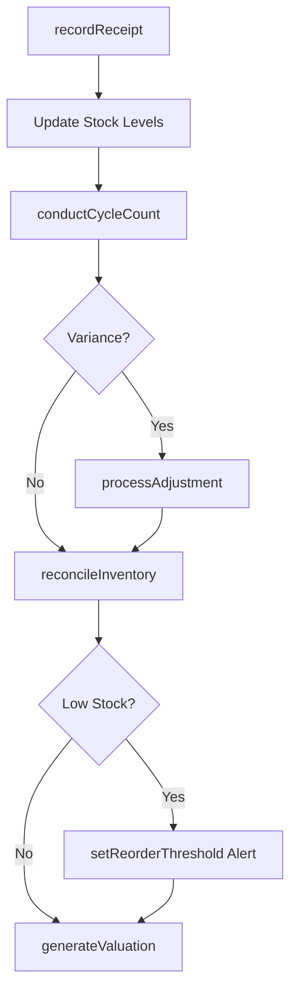
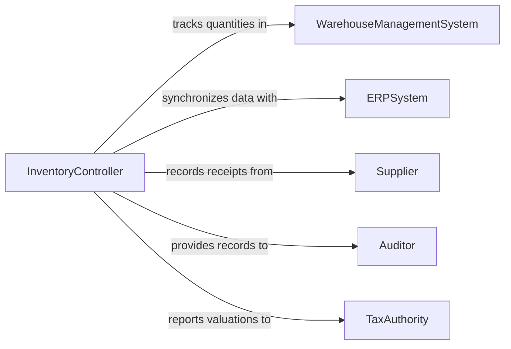

# Maintain Inventory Records

> Business-as-Code definition for inventory records management. Models the lifecycle from stock receipt through quantity tracking, cycle counting, adjustment processing, and inventory valuation reporting.

## Overview

Maintaining inventory records involves tracking stock levels, recording receipts and issues, conducting physical counts, reconciling discrepancies, and producing inventory valuation reports across warehouses and storage locations. This definition exposes actions for stock tracking and adjustment, events for threshold monitoring and count scheduling, and searches for inventory visibility and analytics.

## Actors

| Actor | Description |
|-------|-------------|
| WarehouseManagementSystem | Provides real-time inventory tracking and location management |
| ERPSystem | Integrates inventory data with purchasing, sales, and finance |
| Supplier | Ships goods that are recorded as inventory receipts |
| Auditor | Reviews inventory records for accuracy during financial audits |
| TaxAuthority | Requires inventory valuation for tax reporting purposes |

## Roles

| Role | Description |
|------|-------------|
| InventoryController | Manages stock level accuracy and inventory adjustments |
| WarehouseAssociate | Records physical movements of goods in and out of storage |
| CycleCountCoordinator | Schedules and oversees periodic inventory verification |
| InventoryAccountant | Maintains inventory valuation records for financial reporting |

## Entities

| Entity | Description |
|--------|-------------|
| InventoryItem | A tracked product or material with a unique SKU or part number |
| StockLevel | The current quantity of an item at a specific storage location |
| ReceiptRecord | A record of inventory added through purchase or production |
| IssueRecord | A record of inventory removed through sale, consumption, or transfer |
| CycleCount | A scheduled physical verification of inventory quantities |
| AdjustmentEntry | A correction to inventory records for discrepancies or write-offs |
| ValuationReport | A financial summary of inventory value by method such as FIFO or weighted average |

## Actions

| Action | Description |
|--------|-------------|
| recordReceipt | Log incoming inventory from a purchase order or production run |
| recordIssue | Document inventory removed for sale, consumption, or transfer |
| conductCycleCount | Perform a physical count of items at a location |
| processAdjustment | Apply corrections for discrepancies, damages, or write-offs |
| reconcileInventory | Compare physical counts to system records and resolve variances |
| generateValuation | Produce inventory valuation reports for financial periods |
| setReorderThreshold | Configure automatic alerts when stock drops below minimum levels |

## Events

| Event | Description |
|-------|-------------|
| receiptRecorded | Incoming inventory has been logged in the system |
| issueRecorded | Inventory has been documented as removed from stock |
| cycleCountCompleted | A physical count has been performed and results recorded |
| adjustmentProcessed | An inventory correction has been applied |
| inventoryReconciled | Physical and system counts have been compared and variances resolved |
| reorderPointReached | Stock has fallen below the configured minimum threshold |
| valuationGenerated | An inventory valuation report has been produced |

## Searches

| Search | Description |
|--------|-------------|
| getStockLevels | Query current quantities by item, location, or warehouse |
| findLowStock | List items at or below reorder thresholds |
| getMovementHistory | Retrieve receipt and issue records for a specific item |
| findDiscrepancies | List items with unresolved count variances |
| getValuation | Retrieve inventory value by category, location, or period |

## Workflow



## Actor Relationships



## Usage

### Calling Actions

```typescript
import { maintainInventoryRecords } from '@headlessly/maintain-inventory-records'

const inventory = maintainInventoryRecords()

// Record incoming stock
await inventory.recordReceipt({
  purchaseOrder: 'PO-2026-0892',
  items: [
    { sku: 'RAW-STEEL-10MM', quantity: 1000, location: 'warehouse-a-rack-12' },
    { sku: 'RAW-ALUM-5MM', quantity: 500, location: 'warehouse-a-rack-14' }
  ],
  receivedDate: '2026-02-05'
})

// Conduct a cycle count
const count = await inventory.conductCycleCount({
  location: 'warehouse-a-rack-12',
  items: ['RAW-STEEL-10MM'],
  countedBy: 'warehouse-associate-jsmith'
})

// Generate quarterly valuation
const valuation = await inventory.generateValuation({
  period: 'Q1-2026',
  method: 'weighted-average',
  categories: ['raw-materials', 'finished-goods']
})
```

### Event-Driven Automation

```typescript
// Alert on low stock
inventory.reorderPointReached(async ({ sku, currentLevel, reorderPoint }) => {
  await notify({
    to: 'purchasing',
    message: `Low stock: ${sku} at ${currentLevel} units (reorder point: ${reorderPoint})`
  })
})

// Auto-reconcile after cycle counts
inventory.cycleCountCompleted(async ({ location, varianceCount }) => {
  if (varianceCount > 0) {
    await notify({
      to: 'inventory-controller',
      message: `${varianceCount} variances found at ${location} - reconciliation needed`
    })
  }
})
```
