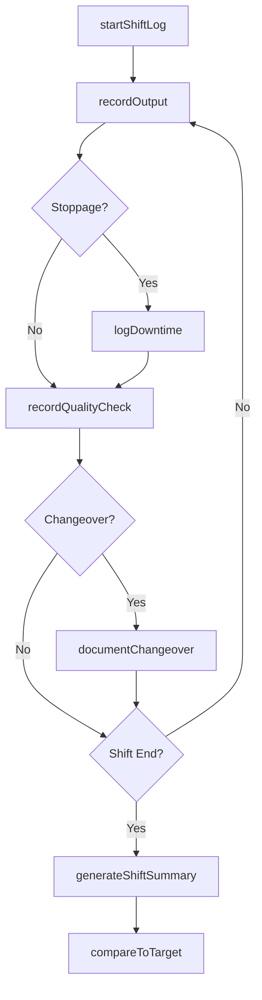
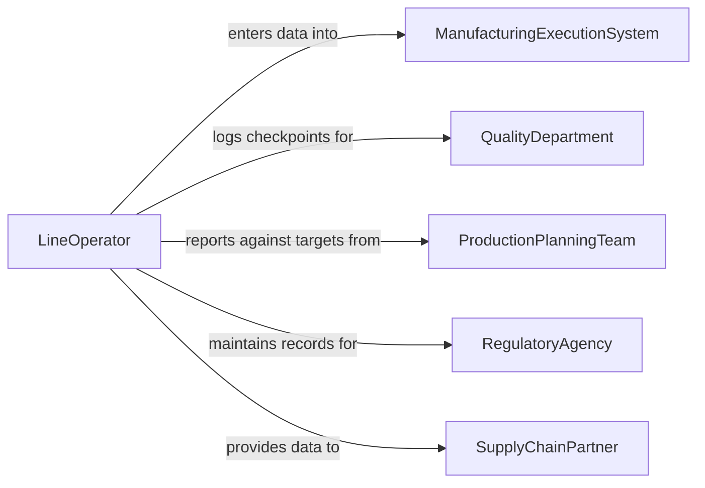

# Maintain Logs of Production Activities

> Business-as-Code definition for production activity log maintenance. Models the lifecycle from shift startup through output recording, downtime logging, quality checkpoint documentation, shift-end summarization, and historical production trend analysis.

## Overview

Maintaining logs of production activities involves recording shift-by-shift output quantities, documenting equipment run times and downtime events, logging quality checkpoints, noting material changeovers, tracking operator assignments, and generating production summaries for management review. This definition exposes actions for shift logging and output tracking, events for production target monitoring and downtime alerts, and searches for production history and efficiency analytics.

## Actors

| Actor | Description |
|-------|-------------|
| ManufacturingExecutionSystem | Captures automated production counts and machine state data |
| QualityDepartment | Reviews production logs for quality checkpoint compliance |
| ProductionPlanningTeam | Sets daily targets and schedules that production logs are measured against |
| RegulatoryAgency | Requires production documentation for compliance with manufacturing standards |
| SupplyChainPartner | Uses production data for delivery scheduling and demand coordination |

## Roles

| Role | Description |
|------|-------------|
| LineOperator | Records production counts, changeovers, and observations during shifts |
| ProductionSupervisor | Reviews shift logs and approves production summaries |
| ProcessEngineer | Analyzes production logs to identify inefficiencies and optimize throughput |
| ProductionPlanner | Compares actual output against scheduled targets using log data |

## Entities

| Entity | Description |
|--------|-------------|
| ProductionLog | A shift-level record of manufacturing activities, output, and events |
| OutputRecord | A documented count of units produced during a defined time period |
| DowntimeEntry | A log of a production stoppage with cause code, duration, and resolution |
| ChangeoverRecord | A documented switch between products, materials, or tooling on a line |
| QualityCheckpoint | A logged quality verification performed at a defined production interval |
| ShiftSummary | An aggregated report of production performance for a completed shift |
| ProductionTarget | A scheduled output goal for a production line during a specific period |

## Actions

| Action | Description |
|--------|-------------|
| startShiftLog | Initialize a production log for a new shift with line and crew assignments |
| recordOutput | Document units produced during a time interval or production run |
| logDowntime | Record a production stoppage with cause code and estimated duration |
| documentChangeover | Log a product or tooling changeover with setup time and parameters |
| recordQualityCheck | Document an in-line quality verification with results |
| generateShiftSummary | Compile shift production data into an end-of-shift report |
| compareToTarget | Evaluate actual output against the scheduled production target |

## Events

| Event | Description |
|-------|-------------|
| shiftLogStarted | A new production shift log has been initialized |
| outputRecorded | Production quantities have been documented for a time interval |
| downtimeLogged | A production stoppage has been recorded with cause details |
| changeoverDocumented | A product or tooling changeover has been logged |
| qualityCheckRecorded | An in-line quality verification has been documented |
| shiftSummaryGenerated | An end-of-shift production report has been compiled |
| targetMissed | Actual production output has fallen below the scheduled target |

## Searches

| Search | Description |
|--------|-------------|
| getProductionLogs | Retrieve shift logs by line, date range, product, or crew |
| findDowntimeEvents | List production stoppages by cause code, line, or duration |
| getOutputTrends | Analyze production quantities over time by product or line |
| getChangeoverHistory | Retrieve changeover records by line, product, or period |
| findTargetVariances | List shifts where output deviated from scheduled targets |

## Workflow



## Actor Relationships



## Usage

### Calling Actions

```typescript
import { maintainLogsProductionActivities } from '@headlessly/maintain-logs-production-activities'

const production = maintainLogsProductionActivities()

// Start a new shift log
const shiftLog = await production.startShiftLog({
  line: 'bottling-line-2',
  shift: 'day',
  date: '2026-02-05',
  crew: ['operator-jnguyen', 'operator-lchen', 'operator-mgarcia'],
  product: 'SKU-WATER-500ML',
  target: 48000
})

// Record hourly output
await production.recordOutput({
  logId: shiftLog.id,
  interval: '07:00-08:00',
  unitsProduced: 5840,
  scrapCount: 22,
  line: 'bottling-line-2'
})

// Log a downtime event
await production.logDowntime({
  logId: shiftLog.id,
  startTime: '2026-02-05T10:15:00Z',
  endTime: '2026-02-05T10:42:00Z',
  causeCode: 'label-jam',
  description: 'Label applicator jam on lane 2. Cleared obstruction and recalibrated.',
  reportedBy: 'operator-jnguyen'
})

// Generate end-of-shift summary
const summary = await production.generateShiftSummary({
  logId: shiftLog.id,
  totalOutput: 45200,
  totalScrap: 186,
  totalDowntimeMinutes: 47,
  oeePercentage: 89.2
})
```

### Event-Driven Automation

```typescript
// Alert on production target shortfall
production.targetMissed(async ({ line, product, target, actual, variance }) => {
  await notify({
    to: 'production-planner',
    message: `Target missed on ${line}: ${actual}/${target} units of ${product} (${variance}% below target)`
  })
})

// Notify maintenance on repeated downtime
production.downtimeLogged(async ({ line, causeCode, occurrencesThisWeek }) => {
  if (occurrencesThisWeek >= 3) {
    await notify({
      to: 'maintenance-supervisor',
      message: `Recurring downtime on ${line}: cause "${causeCode}" logged ${occurrencesThisWeek} times this week`
    })
  }
})
```
