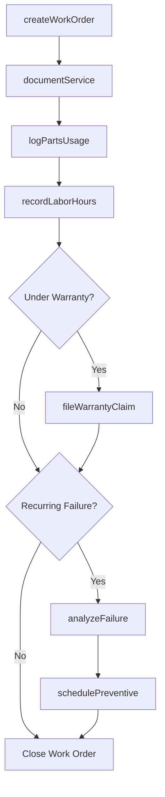
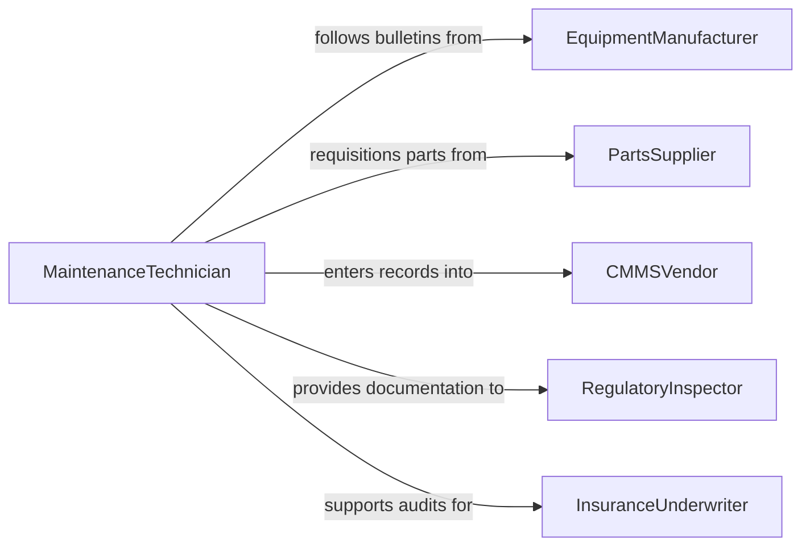

# Maintain Maintenance and Repair Records

> Business-as-Code definition for maintenance and repair record management. Models the lifecycle from work order creation through service documentation, parts usage tracking, labor hour recording, warranty management, and equipment reliability analysis.

## Overview

Maintaining maintenance and repair records involves documenting preventive maintenance schedules, recording corrective repair activities, tracking parts consumption and labor hours, managing warranty claims, maintaining equipment service histories, and producing reliability reports for asset management decisions. This definition exposes actions for work order documentation and service logging, events for maintenance scheduling and warranty triggers, and searches for equipment history and failure analysis.

## Actors

| Actor | Description |
|-------|-------------|
| EquipmentManufacturer | Provides service bulletins, warranty terms, and recommended maintenance intervals |
| PartsSupplier | Provides replacement components and records part warranties |
| CMMSVendor | Provides the computerized maintenance management system for record-keeping |
| RegulatoryInspector | Reviews maintenance documentation for safety and compliance audits |
| InsuranceUnderwriter | Evaluates maintenance history for equipment coverage and liability assessment |

## Roles

| Role | Description |
|------|-------------|
| MaintenanceTechnician | Performs service work and documents repair activities and findings |
| MaintenanceSupervisor | Reviews completed work orders and approves maintenance documentation |
| ReliabilityEngineer | Analyzes maintenance data to identify failure patterns and optimize schedules |
| MaintenancePlanner | Schedules preventive maintenance and manages work order backlogs |

## Entities

| Entity | Description |
|--------|-------------|
| WorkOrder | A documented request and record of maintenance or repair activity |
| ServiceLog | A chronological history of all maintenance performed on an asset |
| PartsUsageRecord | A log of replacement components consumed during a maintenance activity |
| LaborEntry | A record of technician time spent on a specific work order |
| WarrantyClaim | A documented request for manufacturer coverage on a failed component |
| PreventiveMaintenanceSchedule | A recurring plan defining maintenance intervals and tasks |
| FailureReport | A documented analysis of equipment breakdown cause and resolution |

## Actions

| Action | Description |
|--------|-------------|
| createWorkOrder | Initialize a maintenance or repair request with priority and scope |
| documentService | Record the details of completed maintenance or repair activities |
| logPartsUsage | Document replacement parts consumed during a service activity |
| recordLaborHours | Log technician time spent on a specific work order |
| fileWarrantyClaim | Submit documentation for manufacturer warranty coverage |
| schedulePreventive | Set up recurring preventive maintenance tasks with intervals |
| analyzeFailure | Document root cause analysis for equipment breakdowns |

## Events

| Event | Description |
|-------|-------------|
| workOrderCreated | A new maintenance request has been documented |
| serviceDocumented | Completed maintenance or repair details have been recorded |
| partsUsageLogged | Replacement components have been documented against a work order |
| laborRecorded | Technician hours have been logged for a service activity |
| warrantyClaimFiled | A warranty coverage request has been submitted |
| preventiveMaintenanceDue | A scheduled maintenance task is approaching its due date |
| failureAnalyzed | Root cause analysis for an equipment breakdown has been documented |

## Searches

| Search | Description |
|--------|-------------|
| getServiceHistory | Retrieve all maintenance records for a specific asset |
| findOpenWorkOrders | List work orders pending completion by priority or assignment |
| getPartsConsumption | Query parts usage by asset, part number, or time period |
| findOverduePreventive | List preventive maintenance tasks past their scheduled dates |
| getFailureHistory | Retrieve breakdown and root cause records by asset or failure mode |

## Workflow



## Actor Relationships



## Usage

### Calling Actions

```typescript
import { maintainMaintenanceRepairRecords } from '@headlessly/maintain-maintenance-repair-records'

const maintenance = maintainMaintenanceRepairRecords()

// Create a corrective work order
const workOrder = await maintenance.createWorkOrder({
  assetId: 'HVAC-AHU-03',
  assetName: 'Air Handling Unit 3 - Building B',
  type: 'corrective',
  priority: 'high',
  description: 'Unusual vibration and elevated discharge temperature. Belt inspection needed.',
  reportedBy: 'facilities-mgr-jcooper',
  date: '2026-02-05'
})

// Document completed repair
await maintenance.documentService({
  workOrderId: workOrder.id,
  serviceDate: '2026-02-05',
  technician: 'hvac-tech-dmartin',
  findings: 'Drive belt worn and misaligned. Bearing showing early wear.',
  actionsPerformed: 'Replaced drive belt, realigned pulleys, greased bearings.',
  equipmentStatus: 'operational'
})

// Log parts used
await maintenance.logPartsUsage({
  workOrderId: workOrder.id,
  parts: [
    { partNumber: 'BLT-V68-42', description: 'V-belt 4L420', quantity: 1, unitCost: 18.50 },
    { partNumber: 'GRS-LITHIUM-14', description: 'Lithium grease cartridge', quantity: 1, unitCost: 8.75 }
  ]
})
```

### Event-Driven Automation

```typescript
// Alert on overdue preventive maintenance
maintenance.preventiveMaintenanceDue(async ({ assetId, assetName, taskDescription, dueDate }) => {
  await notify({
    to: 'maintenance-planner',
    message: `PM due for ${assetName} (${assetId}): ${taskDescription} - scheduled ${dueDate}`
  })
})

// Trigger failure analysis on repeat breakdowns
maintenance.serviceDocumented(async ({ assetId, type, workOrderCount90Days }) => {
  if (type === 'corrective' && workOrderCount90Days >= 3) {
    await notify({
      to: 'reliability-engineer',
      message: `Asset ${assetId} has ${workOrderCount90Days} corrective work orders in 90 days - failure analysis recommended`
    })
  }
})
```
