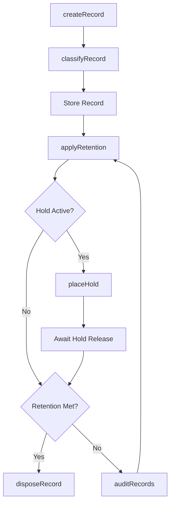
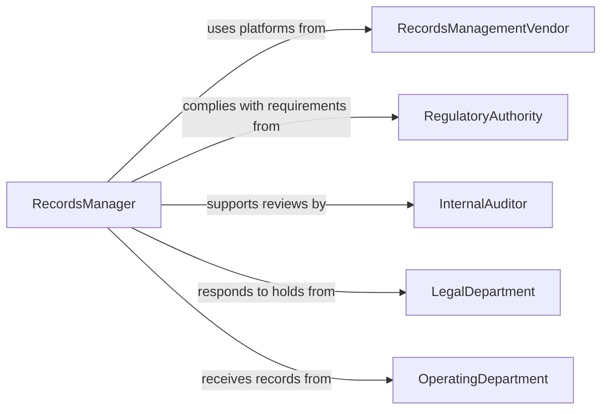

# Maintain Operational Records

> Business-as-Code definition for operational records management and maintenance. Models the lifecycle from record creation through classification, storage, retrieval, retention compliance, and disposition.

## Overview

Maintaining operational records involves creating, organizing, updating, and preserving business records that document daily operations, procedures, incidents, and transactions. This definition exposes actions for records lifecycle management, events for compliance and retention automation, and searches for record discovery and audit support.

## Actors

| Actor | Description |
|-------|-------------|
| RecordsManagementVendor | Provides document management and archival storage platforms |
| RegulatoryAuthority | Mandates record retention periods and access requirements |
| InternalAuditor | Reviews records for completeness and compliance |
| LegalDepartment | Issues litigation holds and discovery requests affecting records |
| OperatingDepartment | Generates and consumes operational records in daily workflows |

## Roles

| Role | Description |
|------|-------------|
| RecordsManager | Oversees the organization's records management policies and systems |
| OperationsCoordinator | Creates and updates records as part of daily business processes |
| ComplianceAnalyst | Monitors records against retention schedules and regulatory requirements |
| DataCustodian | Manages physical and digital storage infrastructure for records |

## Entities

| Entity | Description |
|--------|-------------|
| OperationalRecord | A document capturing a business transaction, event, or procedure |
| RecordCategory | A classification grouping records by type, department, or function |
| RetentionSchedule | A policy defining how long each record category must be preserved |
| LitigationHold | A legal directive suspending normal disposition of specified records |
| DispositionRequest | A request to destroy or archive records that have met retention requirements |
| AuditTrail | A chronological log of all access and modifications to a record |
| StorageLocation | The physical or digital repository where records are maintained |
| RecordIndex | A searchable catalog of all records with metadata and classifications |

## Actions

| Action | Description |
|--------|-------------|
| createRecord | Document a new operational event, transaction, or procedure |
| classifyRecord | Assign a record to the appropriate category and retention schedule |
| updateRecord | Modify an existing record with corrected or supplemental information |
| retrieveRecord | Locate and access a record from the storage system |
| applyRetention | Enforce retention policies and flag records approaching disposition |
| placeHold | Suspend disposition of records subject to legal or audit requirements |
| disposeRecord | Destroy or permanently archive records that have met retention requirements |
| auditRecords | Review a set of records for completeness, accuracy, and compliance |

## Events

| Event | Description |
|-------|-------------|
| recordCreated | A new operational record has been documented |
| recordClassified | A record has been assigned to a category and retention schedule |
| recordUpdated | An existing record has been modified |
| retentionExpiring | A record's retention period is approaching its end date |
| holdPlaced | A litigation or audit hold has been applied to records |
| holdReleased | A legal or audit hold has been lifted from records |
| recordDisposed | A record has been destroyed or permanently archived |
| complianceViolationDetected | A records management policy violation has been identified |

## Searches

| Search | Description |
|--------|-------------|
| findRecords | Search operational records by category, date, or keyword |
| getRetentionStatus | Query records by retention schedule and expiration date |
| findRecordsOnHold | List records subject to active litigation or audit holds |
| getAuditLog | Retrieve the access and modification history for a specific record |
| getStorageMetrics | Query storage utilization by category, department, or location |

## Workflow



## Actor Relationships



## Usage

### Calling Actions

```typescript
import { maintainOperationalRecords } from '@headlessly/maintain-operational-records'

const records = maintainOperationalRecords()

// Create a new operational record
const record = await records.createRecord({
  type: 'incident-report',
  department: 'manufacturing',
  title: 'Equipment malfunction - Line 3',
  description: 'Conveyor belt tension failure at 14:30, production halted for 45 minutes',
  severity: 'medium',
  date: '2026-02-05'
})

// Classify and apply retention
await records.classifyRecord({
  recordId: record.id,
  category: 'safety-incident',
  retentionSchedule: 'osha-5-year'
})

// Retrieve records for an audit
const auditRecords = await records.findRecords({
  category: 'safety-incident',
  dateRange: { start: '2025-01-01', end: '2025-12-31' },
  department: 'manufacturing'
})
```

### Event-Driven Automation

```typescript
// Alert compliance team on policy violations
records.complianceViolationDetected(async ({ recordId, violation, department }) => {
  await notify({
    to: 'compliance-team',
    message: `Records violation in ${department}: ${violation} (Record: ${recordId})`
  })
})

// Notify records manager before retention expires
records.retentionExpiring(async ({ recordId, category, expirationDate, daysRemaining }) => {
  await notify({
    to: 'records-manager',
    message: `Record ${recordId} (${category}) retention expires in ${daysRemaining} days`
  })
})
```
