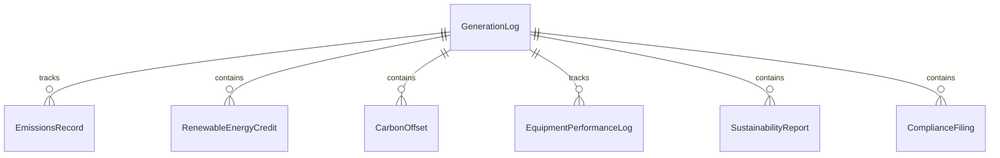
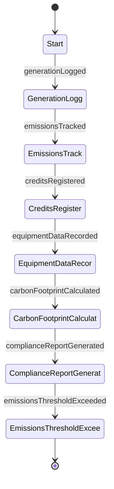
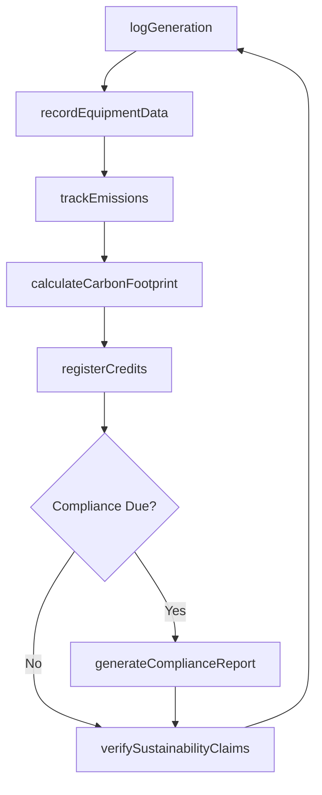
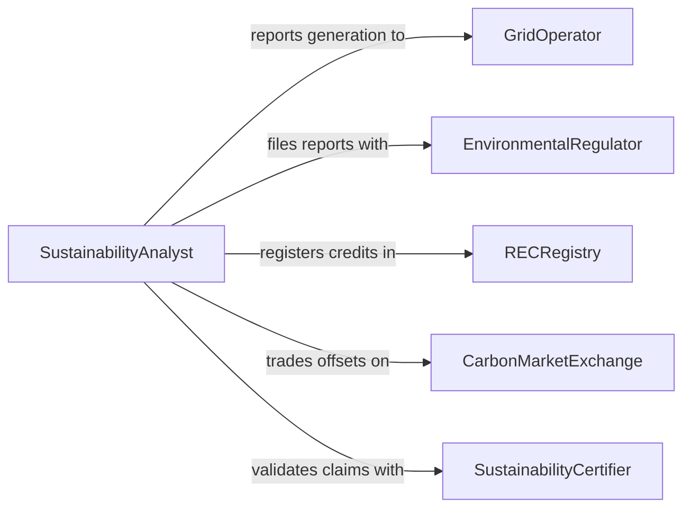

# Maintain Operational Records for Green Energy Processes

> Business-as-Code definition for green energy and sustainability operations recordkeeping. Models the lifecycle from energy generation logging through emissions tracking, renewable energy credit documentation, regulatory compliance, and sustainability reporting.

## Overview

Maintaining operational records for green energy processes involves logging power generation from renewable sources, tracking carbon emissions and offsets, documenting renewable energy credits, maintaining equipment performance data for wind, solar, and biomass installations, and producing sustainability compliance reports. This definition exposes actions for energy data capture and emissions tracking, events for generation milestones and compliance deadlines, and searches for sustainability analytics and regulatory reporting.

## Actors

| Actor | Description |
|-------|-------------|
| GridOperator | Manages the electrical grid and receives generation data from renewable facilities |
| EnvironmentalRegulator | Enforces emissions reporting requirements and sustainability standards |
| RECRegistry | Tracks and certifies renewable energy credits for trading and compliance |
| CarbonMarketExchange | Facilitates trading of carbon credits and emissions allowances |
| SustainabilityCertifier | Provides third-party verification of environmental claims and practices |

## Roles

| Role | Description |
|------|-------------|
| SustainabilityAnalyst | Tracks and reports on environmental metrics and green energy output |
| PlantOperator | Records generation data and equipment readings from renewable installations |
| EnvironmentalComplianceOfficer | Ensures all green energy records meet regulatory reporting requirements |
| EnergyAccountant | Manages renewable energy credit tracking and carbon offset documentation |

## Entities

| Entity | Description |
|--------|-------------|
| GenerationLog | A record of energy produced by a renewable source over a time period |
| EmissionsRecord | A documented measurement of greenhouse gas emissions or reductions |
| RenewableEnergyCredit | A certified tradable certificate representing one megawatt-hour of renewable generation |
| CarbonOffset | A documented reduction in emissions used to compensate for emissions elsewhere |
| EquipmentPerformanceLog | Operational readings from wind turbines, solar panels, or other green energy equipment |
| SustainabilityReport | A periodic summary of environmental performance and compliance status |
| ComplianceFiling | A regulatory submission documenting adherence to environmental standards |

## Actions

| Action | Description |
|--------|-------------|
| logGeneration | Record energy output from renewable sources by time period and facility |
| trackEmissions | Document greenhouse gas emissions and reduction measurements |
| registerCredits | Create and certify renewable energy credits for generated power |
| recordEquipmentData | Capture operational readings from green energy equipment |
| calculateCarbonFootprint | Compute total emissions and offsets for a facility or period |
| generateComplianceReport | Produce regulatory filings for environmental authorities |
| verifySustainabilityClaims | Validate recorded data against third-party certification standards |

## Events

| Event | Description |
|-------|-------------|
| generationLogged | Renewable energy output has been recorded |
| emissionsTracked | Greenhouse gas measurements have been documented |
| creditsRegistered | Renewable energy credits have been certified and registered |
| equipmentDataRecorded | Operational readings from green energy systems have been captured |
| carbonFootprintCalculated | Total emissions and offsets have been computed |
| complianceReportGenerated | A regulatory environmental filing has been produced |
| emissionsThresholdExceeded | Recorded emissions have surpassed a regulatory or internal limit |

## Searches

| Search | Description |
|--------|-------------|
| getGenerationHistory | Retrieve energy output data by facility, source type, or time period |
| getEmissionsData | Query emissions records by facility, pollutant, or reporting period |
| findCredits | List renewable energy credits by status, vintage, or facility |
| getComplianceStatus | Check regulatory filing deadlines and submission status |
| getCarbonFootprint | Retrieve computed emissions totals by facility or organizational unit |

## Entity Relationships



## State Diagram



## Workflow



## Actor Relationships



## Usage

### Calling Actions

```typescript
import { maintainOperationalRecordsGreenEnergy } from '@headlessly/maintain-operational-records-green-energy'

const greenEnergy = maintainOperationalRecordsGreenEnergy()

// Log solar generation data
await greenEnergy.logGeneration({
  facility: 'solar-farm-mojave-01',
  source: 'photovoltaic',
  period: { start: '2026-02-01', end: '2026-02-28' },
  outputMWh: 4280,
  capacityFactor: 0.27
})

// Track emissions reductions
await greenEnergy.trackEmissions({
  facility: 'solar-farm-mojave-01',
  period: 'February 2026',
  co2AvoidedTons: 1926,
  baselineSource: 'regional-grid-average'
})

// Register renewable energy credits
await greenEnergy.registerCredits({
  facility: 'solar-farm-mojave-01',
  quantity: 4280,
  vintage: '2026',
  registry: 'wregis',
  eligiblePrograms: ['california-rps', 'green-e']
})
```

### Event-Driven Automation

```typescript
// Alert on emissions threshold breach
greenEnergy.emissionsThresholdExceeded(async ({ facility, pollutant, recorded, threshold }) => {
  await notify({
    to: 'environmental-compliance',
    message: `${facility} ${pollutant} at ${recorded} tons exceeds limit of ${threshold} tons`
  })
})

// Auto-generate compliance reports on schedule
greenEnergy.generationLogged(async ({ facility, period }) => {
  if (isQuarterEnd(period)) {
    await greenEnergy.generateComplianceReport({ facility, period, standard: 'epa-ghg-reporting' })
  }
})
```
