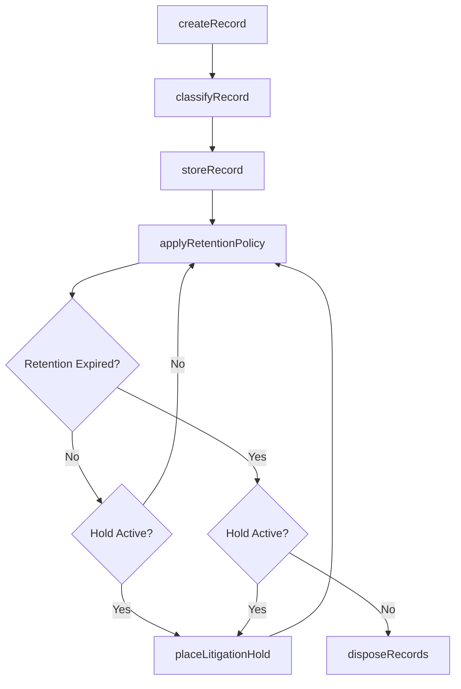
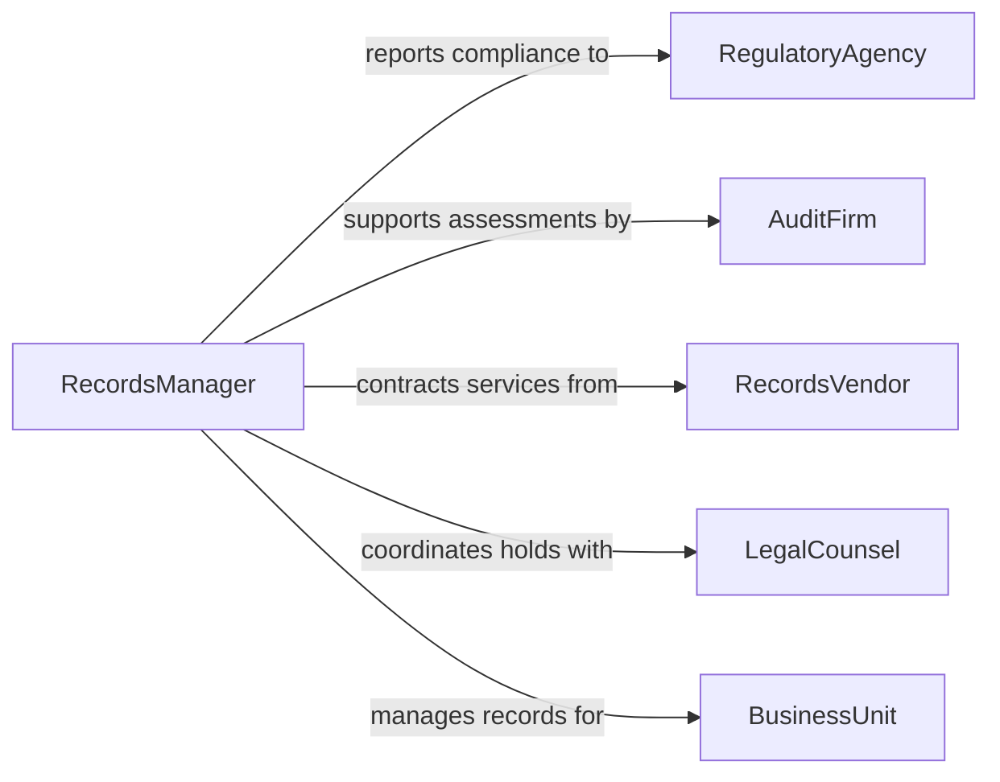

# Maintain Operational Records Records Systems

> Business-as-Code definition for maintaining operational records or records systems. Models the complete records management lifecycle from creation and classification through retention, retrieval, and compliant disposition.

## Overview

Maintaining operational records and records systems involves creating, classifying, storing, and disposing of business records in compliance with retention policies and regulatory requirements. This definition exposes actions for managing records throughout their lifecycle, events for triggering retention and compliance workflows, and searches for retrieving records across the organization.

## Actors

| Actor | Description |
|-------|-------------|
| RegulatoryAgency | Government body mandating records retention and reporting requirements |
| AuditFirm | External organization conducting compliance and records assessments |
| RecordsVendor | Third-party provider of records storage, scanning, or destruction services |
| LegalCounsel | Attorney advising on litigation holds and records preservation |
| BusinessUnit | Internal department generating and consuming operational records |

## Roles

| Role | Description |
|------|-------------|
| RecordsManager | Oversees the organization-wide records management program |
| RecordsClerk | Creates, classifies, and files operational records |
| SystemsAdministrator | Maintains the technical infrastructure for records systems |
| ComplianceAnalyst | Monitors adherence to retention policies and regulatory requirements |

## Entities

| Entity | Description |
|--------|-------------|
| Record | A documented piece of business information requiring managed retention |
| RecordClass | A category that determines retention rules and access controls |
| RetentionSchedule | A policy defining how long records must be kept by category |
| RecordsSystem | A physical or digital system used to store and manage records |
| LitigationHold | A directive to preserve records related to pending legal matters |
| DispositionCertificate | Documentation confirming authorized destruction of expired records |

## Actions

| Action | Description |
|--------|-------------|
| createRecord | Register a new operational record in the records system |
| classifyRecord | Assign a record to the appropriate category and retention schedule |
| storeRecord | Place a record in the designated storage location or system |
| retrieveRecord | Locate and access a specific record from storage |
| applyRetentionPolicy | Enforce retention schedules against stored records |
| placeLitigationHold | Preserve records subject to a legal hold directive |
| disposeRecords | Destroy or delete records that have exceeded their retention period |

## Events

| Event | Description |
|-------|-------------|
| recordCreated | A new operational record has been registered in the system |
| recordClassified | A record has been assigned to a category and retention schedule |
| recordStored | A record has been placed in its designated storage location |
| recordRetrieved | A record has been accessed from storage |
| retentionPolicyApplied | Retention schedules have been enforced against records |
| litigationHoldPlaced | Records have been preserved under a legal hold directive |
| recordsDisposed | Expired records have been destroyed per retention policy |

## Searches

| Search | Description |
|--------|-------------|
| findRecords | List records by class, department, date range, or keyword |
| getRetentionSchedule | Retrieve the retention policy for a specific record class |
| findRecordsDueForDisposition | Locate records that have exceeded their retention period |
| getRecordsUnderHold | List all records currently subject to a litigation hold |
| getSystemHealth | Retrieve storage utilization and system performance metrics |

## Workflow



## Actor Relationships



## Usage

### Calling Actions

```typescript
import { maintainOperationalRecordsRecordsSystems } from '@headlessly/maintain-operational-records-records-systems'

const records = maintainOperationalRecordsRecordsSystems()

// Create and classify a new operational record
const record = await records.createRecord({
  title: 'Monthly Production Report - January 2026',
  department: 'manufacturing',
  type: 'operational-report',
  sourceSystem: 'erp-production'
})

await records.classifyRecord({
  recordId: record.id,
  recordClass: 'operational-reports',
  retentionPeriod: '7-years'
})

await records.storeRecord({
  recordId: record.id,
  location: 'document-management-system',
  accessLevel: 'department-restricted'
})

// Retrieve a record for audit
const retrieved = await records.retrieveRecord({
  recordId: record.id,
  requestedBy: 'auditor-external-01',
  purpose: 'annual-compliance-review'
})
```

### Event-Driven Automation

```typescript
// Auto-classify records based on source system
records.recordCreated(async ({ recordId, sourceSystem, type }) => {
  const classification = await determineClass(sourceSystem, type)
  await records.classifyRecord({
    recordId,
    recordClass: classification.recordClass,
    retentionPeriod: classification.retentionPeriod
  })
})

// Notify records manager when disposition batch is ready
records.retentionPolicyApplied(async ({ recordsExpired }) => {
  if (recordsExpired.length > 0) {
    await notify({
      to: 'records-manager',
      message: `${recordsExpired.length} records eligible for disposition review`
    })
  }
})
```
