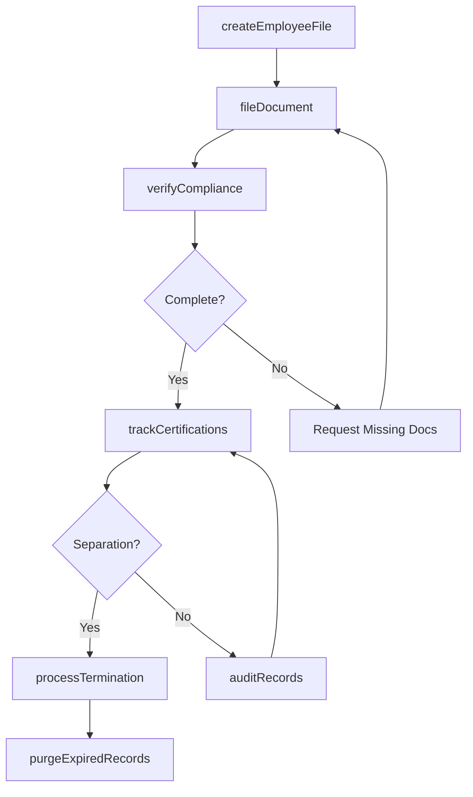
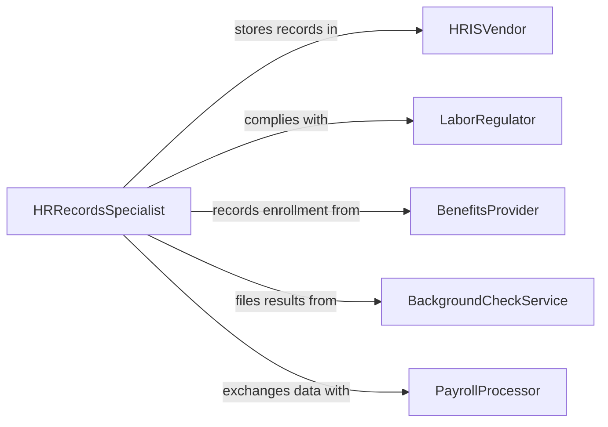

# Maintain Personnel Records

> Business-as-Code definition for employee personnel records management. Models the lifecycle from hire through ongoing record maintenance, compliance verification, and retention management for employee files.

## Overview

Maintaining personnel records involves creating, updating, securing, and retaining employee files that document employment history, compensation, performance, certifications, and compliance documentation. This definition exposes actions for employee record management and compliance verification, events for document expiration and audit tracking, and searches for employee data retrieval and workforce analytics.

## Actors

| Actor | Description |
|-------|-------------|
| HRISVendor | Provides the human resource information system for record storage |
| LaborRegulator | Mandates employee record-keeping requirements and retention periods |
| BenefitsProvider | Supplies enrollment and eligibility data for employee records |
| BackgroundCheckService | Delivers pre-employment screening results |
| PayrollProcessor | Exchanges compensation and tax withholding data |

## Roles

| Role | Description |
|------|-------------|
| HRRecordsSpecialist | Manages the creation and maintenance of employee files |
| HRManager | Oversees personnel record policies and compliance |
| PayrollAdministrator | Maintains compensation and tax document records |
| ComplianceCoordinator | Verifies employee records meet regulatory requirements |

## Entities

| Entity | Description |
|--------|-------------|
| EmployeeFile | The comprehensive personnel record for an individual employee |
| I9Verification | Employment eligibility verification documentation |
| PerformanceReview | A documented evaluation of employee performance |
| CertificationRecord | Documentation of professional licenses and certifications |
| DisciplinaryAction | A record of corrective or disciplinary measures |
| BenefitsEnrollment | Documentation of employee benefits selections |
| TerminationRecord | Documentation of employment separation details |
| RetentionSchedule | The policy governing how long personnel records are preserved |

## Actions

| Action | Description |
|--------|-------------|
| createEmployeeFile | Initialize a new personnel file for a hired employee |
| updateRecord | Modify employee information such as address, role, or compensation |
| fileDocument | Add a new document to an existing employee file |
| verifyCompliance | Check that all required documents are present and current |
| trackCertifications | Monitor expiration dates for professional licenses and certifications |
| processTermination | Document employment separation and update records accordingly |
| auditRecords | Review personnel files for completeness and regulatory compliance |
| purgeExpiredRecords | Remove records that have exceeded the required retention period |

## Events

| Event | Description |
|-------|-------------|
| employeeFileCreated | A new personnel record has been initialized |
| recordUpdated | Employee information has been modified |
| documentFiled | A new document has been added to an employee file |
| complianceVerified | All required personnel documents are confirmed current |
| certificationExpiring | A professional license or certification is approaching expiration |
| terminationProcessed | An employment separation has been documented |
| auditCompleted | A personnel records review has been finished |
| complianceGapDetected | A required document is missing or expired |

## Searches

| Search | Description |
|--------|-------------|
| findEmployees | Search personnel records by name, department, or role |
| getExpiringCertifications | List employees with certifications approaching expiration |
| findComplianceGaps | Identify employees with missing or expired required documents |
| getEmploymentHistory | Retrieve the position and compensation history for an employee |
| getAuditResults | Review findings from the most recent personnel records audit |

## Workflow



## Actor Relationships



## Usage

### Calling Actions

```typescript
import { maintainPersonnelRecords } from '@headlessly/maintain-personnel-records'

const personnel = maintainPersonnelRecords()

// Create a new employee file
const file = await personnel.createEmployeeFile({
  employeeId: 'EMP-2026-0384',
  name: 'Maria Gonzalez',
  department: 'engineering',
  startDate: '2026-02-10',
  role: 'Senior Software Engineer'
})

// File onboarding documents
await personnel.fileDocument({
  employeeId: file.employeeId,
  documentType: 'i9-verification',
  document: 'onboarding/gonzalez-i9-signed.pdf',
  expirationDate: null
})

// Verify compliance for new hire
await personnel.verifyCompliance({
  employeeId: file.employeeId,
  checklist: 'new-hire-onboarding',
  requiredDocuments: ['i9', 'w4', 'direct-deposit', 'handbook-acknowledgment']
})
```

### Event-Driven Automation

```typescript
// Alert HR on expiring certifications
personnel.certificationExpiring(async ({ employeeId, certification, expirationDate, daysRemaining }) => {
  await notify({
    to: 'hr-records',
    message: `${certification} for employee ${employeeId} expires in ${daysRemaining} days (${expirationDate})`
  })
})

// Flag compliance gaps
personnel.complianceGapDetected(async ({ employeeId, missingDocuments }) => {
  await notify({
    to: 'hr-compliance',
    message: `Employee ${employeeId} missing: ${missingDocuments.join(', ')}`
  })
})
```
