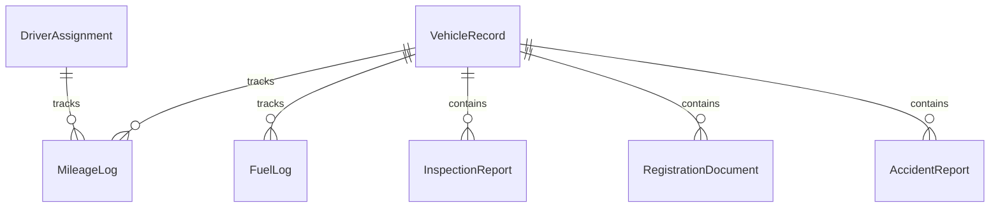
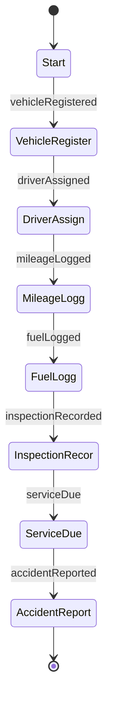
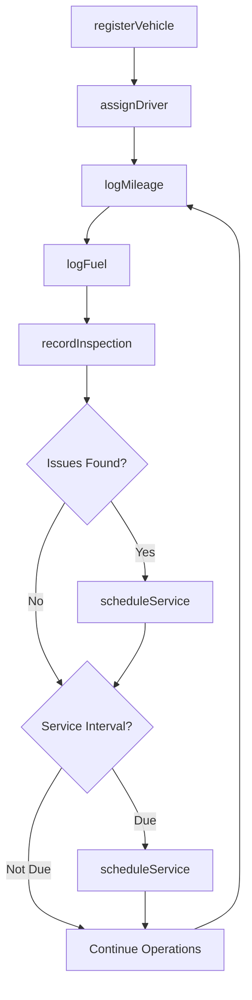
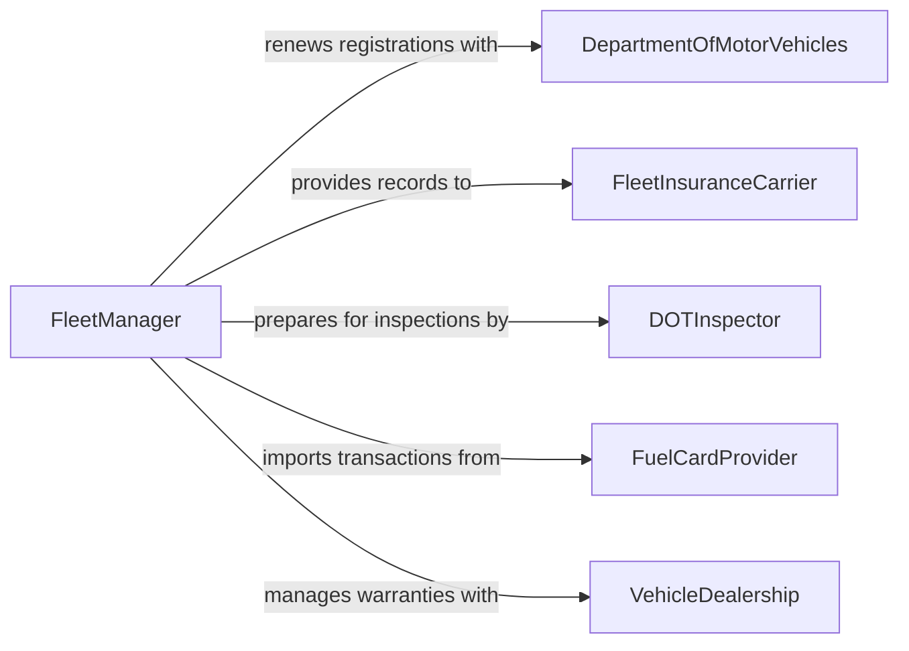

# Maintain Records of Assigned Vehicles

> Business-as-Code definition for assigned vehicle record maintenance. Models the lifecycle from vehicle acquisition through driver assignment, mileage tracking, fuel logging, maintenance scheduling, inspection documentation, and fleet disposition.

## Overview

Maintaining records of assigned vehicles involves documenting vehicle acquisitions, tracking driver assignments and authorizations, logging mileage and fuel consumption, recording maintenance and repair histories, documenting regulatory inspections, managing registration and insurance documentation, and producing fleet utilization reports. This definition exposes actions for vehicle documentation and fleet tracking, events for inspection deadlines and maintenance alerts, and searches for fleet performance and compliance status.

## Actors

| Actor | Description |
|-------|-------------|
| DepartmentOfMotorVehicles | Issues registrations, titles, and regulates vehicle operation |
| FleetInsuranceCarrier | Provides coverage and requires vehicle condition documentation |
| DOTInspector | Conducts regulatory inspections on commercial fleet vehicles |
| FuelCardProvider | Supplies fuel transaction data for consumption tracking |
| VehicleDealership | Provides acquisition documentation, warranty terms, and recall notices |

## Roles

| Role | Description |
|------|-------------|
| FleetManager | Oversees all vehicle records, assignments, and fleet utilization |
| DriverOperator | Records daily mileage, fuel usage, and pre-trip inspection findings |
| FleetMechanic | Documents maintenance and repair activities on fleet vehicles |
| ComplianceCoordinator | Tracks registration renewals, insurance certificates, and inspection schedules |

## Entities

| Entity | Description |
|--------|-------------|
| VehicleRecord | The comprehensive file for a fleet vehicle including specifications and history |
| DriverAssignment | A documented authorization linking a driver to a specific vehicle |
| MileageLog | A chronological record of odometer readings and trip distances |
| FuelLog | A record of fuel purchases including gallons, cost, and odometer reading |
| InspectionReport | A documented pre-trip, post-trip, or regulatory inspection of a vehicle |
| RegistrationDocument | The current registration certificate and renewal schedule for a vehicle |
| AccidentReport | A documented account of a vehicle incident including damage and circumstances |

## Actions

| Action | Description |
|--------|-------------|
| registerVehicle | Add a new vehicle to the fleet with acquisition details and specifications |
| assignDriver | Document the authorization of a driver to operate a specific vehicle |
| logMileage | Record odometer readings and trip distances for a vehicle |
| logFuel | Document fuel purchases with quantity, cost, and location |
| recordInspection | Document the results of a pre-trip, post-trip, or regulatory inspection |
| scheduleService | Set up maintenance appointments based on mileage or time intervals |
| fileAccidentReport | Document a vehicle incident with damage assessment and circumstances |

## Events

| Event | Description |
|-------|-------------|
| vehicleRegistered | A new vehicle has been added to the fleet records |
| driverAssigned | A driver has been authorized to operate a specific vehicle |
| mileageLogged | Odometer readings have been recorded for a vehicle |
| fuelLogged | A fuel purchase has been documented |
| inspectionRecorded | A vehicle inspection has been completed and documented |
| serviceDue | A vehicle is approaching a scheduled maintenance interval |
| accidentReported | A vehicle incident has been formally documented |

## Searches

| Search | Description |
|--------|-------------|
| findVehicles | Search fleet vehicles by type, status, assignment, or location |
| getMileageHistory | Retrieve odometer and trip records for a specific vehicle |
| getFuelEfficiency | Calculate fuel consumption rates by vehicle, route, or period |
| findOverdueInspections | List vehicles with expired or upcoming inspection deadlines |
| getServiceHistory | Retrieve maintenance and repair records for a specific vehicle |

## Entity Relationships



## State Diagram



## Workflow



## Actor Relationships



## Usage

### Calling Actions

```typescript
import { maintainRecordsAssignedVehicles } from '@headlessly/maintain-records-assigned-vehicles'

const fleet = maintainRecordsAssignedVehicles()

// Register a new fleet vehicle
const vehicle = await fleet.registerVehicle({
  vin: '1FTFW1E53MFA12345',
  make: 'Ford',
  model: 'F-150',
  year: 2026,
  type: 'pickup-truck',
  acquisitionDate: '2026-01-15',
  acquisitionCost: 48500,
  odometerAtAcquisition: 12,
  assignedDepot: 'north-operations'
})

// Assign a driver
await fleet.assignDriver({
  vehicleId: vehicle.id,
  driverId: 'DRV-0224',
  driverName: 'Tom Reeves',
  licenseNumber: 'D4412887',
  licenseClass: 'C',
  effectiveDate: '2026-02-01'
})

// Log daily mileage and fuel
await fleet.logMileage({
  vehicleId: vehicle.id,
  date: '2026-02-05',
  startOdometer: 1247,
  endOdometer: 1312,
  route: 'north-service-loop'
})

await fleet.logFuel({
  vehicleId: vehicle.id,
  date: '2026-02-05',
  gallons: 14.8,
  cost: 52.34,
  station: 'Fleet Fuels - Station 7',
  odometer: 1312
})
```

### Event-Driven Automation

```typescript
// Alert on upcoming service intervals
fleet.serviceDue(async ({ vehicleId, vehicleName, serviceType, dueOdometer }) => {
  await notify({
    to: 'fleet-mechanic',
    message: `${serviceType} due for ${vehicleName} (${vehicleId}) at ${dueOdometer} miles`
  })
})

// Notify compliance on expired inspections
fleet.inspectionRecorded(async ({ vehicleId, nextInspectionDue }) => {
  const daysUntilDue = daysBetween(new Date(), new Date(nextInspectionDue))
  if (daysUntilDue <= 30) {
    await notify({
      to: 'compliance-coordinator',
      message: `Vehicle ${vehicleId} inspection due in ${daysUntilDue} days - schedule renewal`
    })
  }
})
```
