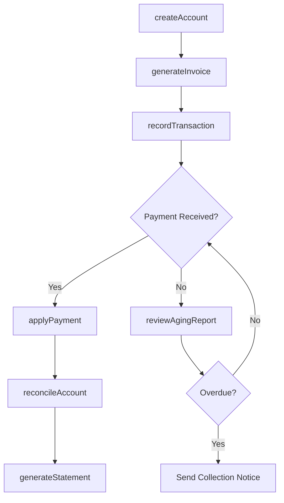
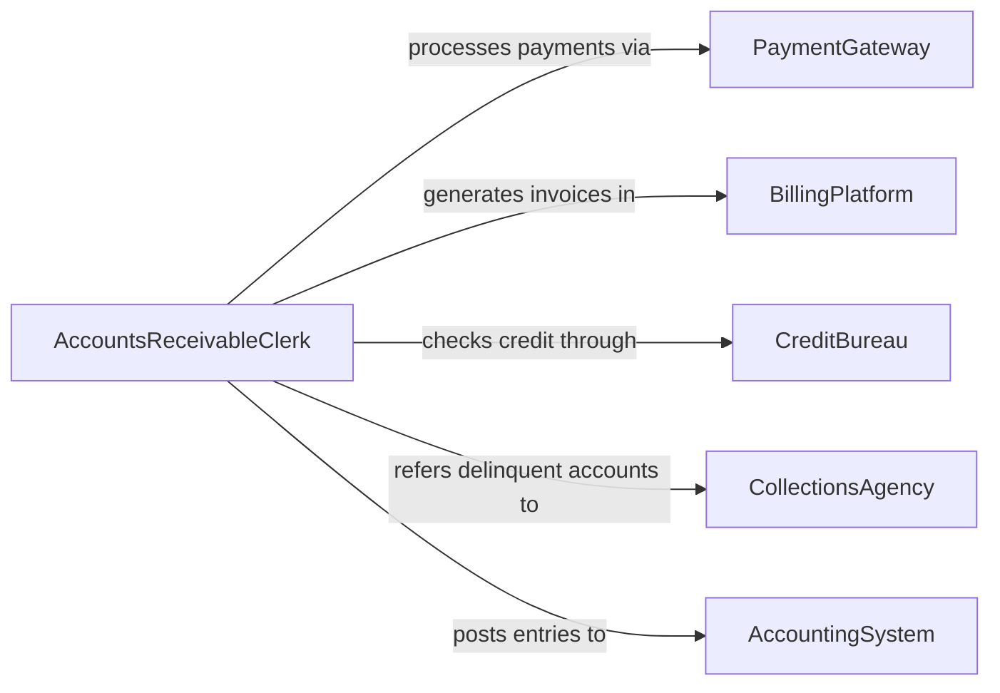

# Maintain Records of Customer Accounts

> Business-as-Code definition for customer account records management. Models the lifecycle from account creation through transaction tracking, balance reconciliation, credit management, and account archival.

## Overview

Maintaining records of customer accounts involves creating account profiles, logging transactions, tracking balances, managing credit terms, processing payments, and reconciling statements across billing and accounting systems. This definition exposes actions for account lifecycle management and financial tracking, events for payment monitoring and credit alerts, and searches for account analytics and aging analysis.

## Actors

| Actor | Description |
|-------|-------------|
| BillingPlatform | Provides the invoicing and payment processing infrastructure |
| CreditBureau | Supplies credit reports and scores for account evaluation |
| PaymentGateway | Processes electronic payments and transaction settlements |
| CollectionsAgency | Handles delinquent account recovery on behalf of the organization |
| AccountingSystem | Integrates customer account data with the general ledger |

## Roles

| Role | Description |
|------|-------------|
| AccountsReceivableClerk | Manages day-to-day customer account transactions and balances |
| CreditAnalyst | Evaluates customer creditworthiness and sets account terms |
| BillingManager | Oversees invoicing accuracy and payment collection processes |
| CustomerAccountSpecialist | Handles account inquiries, disputes, and adjustments |

## Entities

| Entity | Description |
|--------|-------------|
| CustomerAccount | A financial record linking a customer to their transactions and balance |
| Invoice | A billing document requesting payment for goods or services delivered |
| PaymentRecord | A record of a payment received against an outstanding balance |
| CreditMemo | A document reducing the amount a customer owes |
| AccountStatement | A periodic summary of transactions and balances for a customer |
| AgingBucket | A categorization of outstanding receivables by days past due |
| CreditTerms | The payment conditions and limits extended to a customer account |

## Actions

| Action | Description |
|--------|-------------|
| createAccount | Initialize a new customer account with contact and billing details |
| recordTransaction | Log a charge, payment, or adjustment against a customer account |
| generateInvoice | Create an invoice for goods or services delivered to a customer |
| applyPayment | Record a payment received and update the account balance |
| issueCreditMemo | Create a credit adjustment reducing the customer balance owed |
| reconcileAccount | Compare account records against bank deposits and resolve discrepancies |
| generateStatement | Produce a periodic account statement for the customer |
| reviewAgingReport | Analyze outstanding balances categorized by days past due |

## Events

| Event | Description |
|-------|-------------|
| accountCreated | A new customer account has been initialized |
| transactionRecorded | A charge, payment, or adjustment has been logged |
| invoiceGenerated | A billing invoice has been created and sent |
| paymentApplied | A customer payment has been recorded against their balance |
| creditMemoIssued | A credit adjustment has been applied to an account |
| accountReconciled | Account records have been verified against deposits |
| paymentOverdue | An invoice has passed its due date without payment |
| creditLimitExceeded | A customer account balance has surpassed approved credit terms |

## Searches

| Search | Description |
|--------|-------------|
| findAccounts | Search customer accounts by name, number, status, or balance range |
| getTransactionHistory | Retrieve transactions for an account by date range or type |
| getAgingReport | List outstanding receivables grouped by days past due |
| findOverdueInvoices | Identify unpaid invoices past their due date |
| getAccountBalance | Retrieve the current balance and credit available for an account |

## Workflow



## Actor Relationships



## Usage

### Calling Actions

```typescript
import { maintainRecordsCustomerAccounts } from '@headlessly/maintain-records-customer-accounts'

const accounts = maintainRecordsCustomerAccounts()

// Create a new customer account
const account = await accounts.createAccount({
  name: 'Pacific Coast Distributors',
  type: 'commercial',
  creditTerms: { limit: 50000, paymentDays: 30 },
  billingContact: { name: 'Sarah Chen', email: 'schen@paccoast.com' }
})

// Generate and send an invoice
await accounts.generateInvoice({
  accountId: account.id,
  items: [
    { description: 'Industrial Bearings - 500 units', amount: 12500 },
    { description: 'Shipping and handling', amount: 350 }
  ],
  dueDate: '2026-03-07'
})

// Apply a payment received
await accounts.applyPayment({
  accountId: account.id,
  amount: 12850,
  method: 'wire-transfer',
  reference: 'WT-2026-03-04-889',
  date: '2026-03-04'
})
```

### Event-Driven Automation

```typescript
// Alert on overdue payments
accounts.paymentOverdue(async ({ accountId, invoiceId, daysOverdue, amount }) => {
  await notify({
    to: 'accounts-receivable',
    message: `Invoice ${invoiceId} for account ${accountId} is ${daysOverdue} days overdue ($${amount})`
  })
})

// Freeze account on credit limit breach
accounts.creditLimitExceeded(async ({ accountId, balance, creditLimit }) => {
  await notify({
    to: 'credit-analyst',
    message: `Account ${accountId} balance $${balance} exceeds credit limit $${creditLimit}`
  })
})
```
