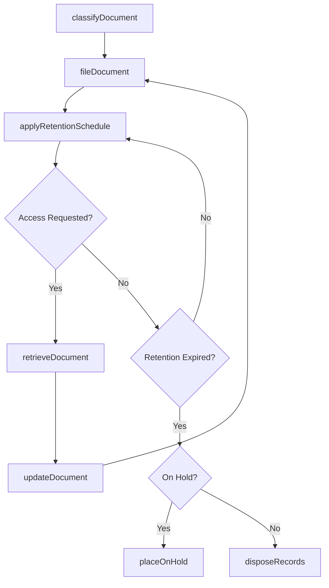
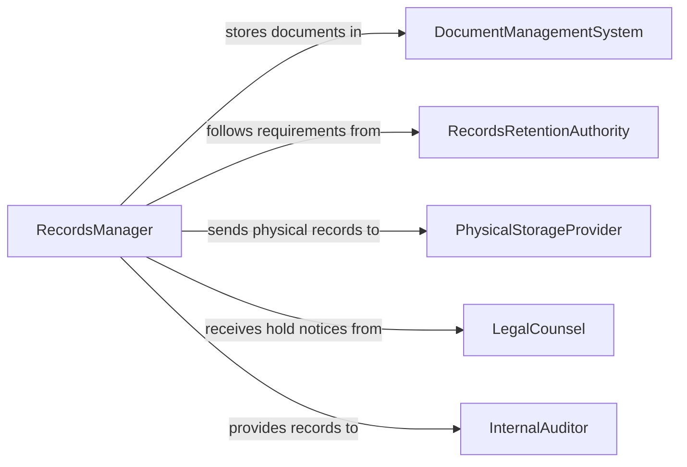

# Maintain Records, Documents, or Other Files

> Business-as-Code definition for general records and document management. Models the lifecycle from document creation through classification, storage, retrieval, retention scheduling, and disposal of organizational files.

## Overview

Maintaining records, documents, or other files involves organizing, classifying, storing, retrieving, and disposing of business documents across physical and digital repositories in accordance with retention schedules and regulatory requirements. This definition exposes actions for document lifecycle management and filing operations, events for retention monitoring and access tracking, and searches for document discovery and compliance auditing.

## Actors

| Actor | Description |
|-------|-------------|
| DocumentManagementSystem | Provides the platform for digital document storage, indexing, and retrieval |
| RecordsRetentionAuthority | Establishes legal and regulatory requirements for document retention periods |
| PhysicalStorageProvider | Manages offsite document storage facilities for physical records |
| LegalCounsel | Advises on litigation hold requirements and document preservation obligations |
| InternalAuditor | Reviews records management practices for compliance with policies |

## Roles

| Role | Description |
|------|-------------|
| RecordsManager | Oversees the classification, retention, and disposal of organizational files |
| FileClerk | Processes incoming documents and maintains filing systems |
| DocumentControlSpecialist | Manages version control and access permissions for controlled documents |
| RetentionCoordinator | Monitors retention schedules and coordinates authorized destruction |

## Entities

| Entity | Description |
|--------|-------------|
| DocumentRecord | A tracked file with metadata including classification, owner, and retention date |
| FileCategory | A classification scheme organizing documents by type, department, or function |
| RetentionSchedule | A policy defining how long each category of records must be preserved |
| LitigationHold | A directive suspending document destruction for potential legal proceedings |
| AccessLog | A record of who viewed, modified, or retrieved a specific document |
| DisposalCertificate | A confirmation that records have been destroyed in accordance with policy |
| FileIndex | A searchable catalog of all documents in a repository |

## Actions

| Action | Description |
|--------|-------------|
| classifyDocument | Assign a category, retention period, and access level to a document |
| fileDocument | Store a document in the appropriate repository with proper indexing |
| retrieveDocument | Locate and provide access to a requested document |
| updateDocument | Modify an existing document and maintain version history |
| applyRetentionSchedule | Assign or update the retention period for a set of records |
| placeOnHold | Suspend destruction of records subject to litigation or investigation |
| disposeRecords | Destroy or delete records that have exceeded their retention period |

## Events

| Event | Description |
|-------|-------------|
| documentClassified | A document has been assigned a category and retention period |
| documentFiled | A document has been stored and indexed in the repository |
| documentRetrieved | A document has been accessed from the repository |
| documentUpdated | An existing document has been modified with a new version |
| retentionScheduleApplied | Retention periods have been assigned to a set of records |
| holdPlaced | Document destruction has been suspended for legal reasons |
| recordsDisposed | Records past their retention period have been destroyed |
| retentionExpiring | A set of records is approaching its scheduled disposal date |

## Searches

| Search | Description |
|--------|-------------|
| findDocuments | Search records by title, category, date, or department |
| getRetentionStatus | List documents by their retention expiration date |
| findDocumentsOnHold | Identify records subject to active litigation holds |
| getAccessHistory | Retrieve the access log for a specific document |
| findExpiredRecords | List records eligible for disposal per retention schedules |

## Workflow



## Actor Relationships



## Usage

### Calling Actions

```typescript
import { maintainRecordsDocumentsFiles } from '@headlessly/maintain-records-documents-files'

const records = maintainRecordsDocumentsFiles()

// Classify and file a new document
const doc = await records.classifyDocument({
  title: 'Q1 2026 Board Minutes',
  category: 'corporate-governance',
  department: 'executive-office',
  accessLevel: 'confidential',
  author: 'corporate-secretary'
})

await records.fileDocument({
  documentId: doc.id,
  repository: 'digital-vault',
  file: 'governance/board-minutes-q1-2026.pdf',
  tags: ['board', 'minutes', 'quarterly']
})

// Apply retention and manage lifecycle
await records.applyRetentionSchedule({
  category: 'corporate-governance',
  retentionYears: 10,
  disposalMethod: 'secure-shred'
})
```

### Event-Driven Automation

```typescript
// Alert on approaching retention expiration
records.retentionExpiring(async ({ category, documentCount, expirationDate }) => {
  await notify({
    to: 'records-manager',
    message: `${documentCount} documents in ${category} expire on ${expirationDate}`
  })
})

// Notify legal on new hold placement
records.holdPlaced(async ({ holdId, reason, documentCount }) => {
  await notify({
    to: 'legal-counsel',
    message: `Litigation hold ${holdId} placed on ${documentCount} records: ${reason}`
  })
})
```
