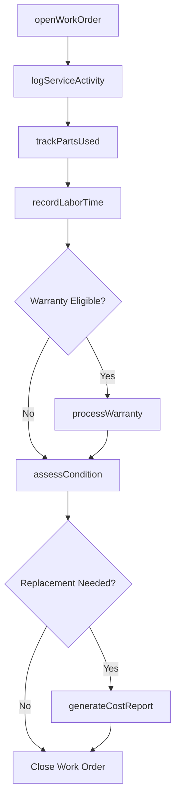
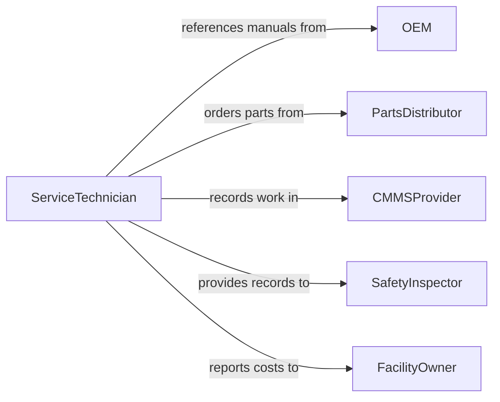

# Maintain Repair and Maintenance Records

> Business-as-Code definition for repair and maintenance record management. Models the lifecycle from work order initiation through service documentation, parts tracking, labor recording, warranty administration, and asset reliability reporting.

## Overview

Maintaining repair and maintenance records involves documenting corrective and preventive maintenance activities, tracking replacement parts and labor hours, managing work order lifecycles, recording equipment condition assessments, maintaining warranty documentation, and producing asset reliability and maintenance cost reports. This definition exposes actions for work order management and service logging, events for maintenance scheduling and cost threshold alerts, and searches for asset history and maintenance performance analytics.

## Actors

| Actor | Description |
|-------|-------------|
| OEM | Provides technical service manuals, recommended intervals, and warranty terms |
| PartsDistributor | Supplies replacement components and maintains part availability records |
| CMMSProvider | Delivers the computerized maintenance management system for documentation |
| SafetyInspector | Audits maintenance records for equipment safety compliance |
| FacilityOwner | Requires maintenance documentation for asset valuation and capital planning |

## Roles

| Role | Description |
|------|-------------|
| ServiceTechnician | Performs repairs and documents findings, actions, and parts consumed |
| MaintenanceManager | Oversees work order backlogs, approves records, and manages schedules |
| ReliabilityAnalyst | Reviews maintenance data to identify recurring failures and optimize programs |
| WarrantyAdministrator | Tracks warranty coverage and processes claims against manufacturers |

## Entities

| Entity | Description |
|--------|-------------|
| WorkOrder | A documented maintenance or repair request with scope, priority, and status |
| MaintenanceLog | A chronological record of all service activities performed on an asset |
| PartRecord | A log of replacement components used including part numbers and costs |
| LaborRecord | A documented account of technician hours spent on a service activity |
| WarrantyRecord | Documentation of manufacturer coverage terms and claim history |
| ConditionAssessment | A documented evaluation of asset health and remaining useful life |
| MaintenanceCostReport | A summary of labor, parts, and service expenses by asset or category |

## Actions

| Action | Description |
|--------|-------------|
| openWorkOrder | Create a maintenance or repair request with priority and description |
| logServiceActivity | Record completed repair or maintenance work with findings and actions |
| trackPartsUsed | Document replacement components consumed during a service activity |
| recordLaborTime | Log technician hours and skills applied to a work order |
| processWarranty | Submit and track a warranty claim for a covered component or asset |
| assessCondition | Document an equipment condition evaluation with ratings and recommendations |
| generateCostReport | Produce a summary of maintenance expenses by asset, type, or period |

## Events

| Event | Description |
|-------|-------------|
| workOrderOpened | A new maintenance request has been created |
| serviceActivityLogged | Completed maintenance or repair work has been documented |
| partsTracked | Replacement components have been recorded against a work order |
| laborTimeRecorded | Technician hours have been logged for a service activity |
| warrantyProcessed | A warranty claim has been submitted or resolved |
| conditionAssessed | An equipment evaluation has been documented |
| maintenanceCostThresholdExceeded | Cumulative maintenance costs for an asset have exceeded a defined limit |

## Searches

| Search | Description |
|--------|-------------|
| getMaintenanceHistory | Retrieve all service records for a specific asset |
| findOpenWorkOrders | List incomplete work orders by priority, age, or assignee |
| getPartsCost | Query parts expenses by asset, part category, or time period |
| findRecurringFailures | Identify assets with repeated corrective work orders |
| getWarrantyStatus | Check active warranty coverage and claim history for an asset |

## Workflow



## Actor Relationships



## Usage

### Calling Actions

```typescript
import { maintainRepairMaintenanceRecords } from '@headlessly/maintain-repair-maintenance-records'

const maintenance = maintainRepairMaintenanceRecords()

// Open a corrective work order
const wo = await maintenance.openWorkOrder({
  assetId: 'PUMP-CENT-014',
  assetName: 'Centrifugal Pump - Cooling Tower Loop',
  type: 'corrective',
  priority: 'urgent',
  description: 'Excessive vibration detected. Possible impeller imbalance or bearing failure.',
  requestedBy: 'plant-operator-rjones',
  date: '2026-02-05'
})

// Log completed service
await maintenance.logServiceActivity({
  workOrderId: wo.id,
  technician: 'mechanic-hchen',
  serviceDate: '2026-02-05',
  findings: 'Bearing race pitting confirmed. Impeller within tolerance.',
  actions: 'Replaced both motor bearings. Aligned coupling. Test run satisfactory.',
  equipmentStatus: 'operational'
})

// Track parts consumed
await maintenance.trackPartsUsed({
  workOrderId: wo.id,
  parts: [
    { partNumber: 'BRG-6308-2RS', description: 'Deep groove ball bearing 40mm', quantity: 2, cost: 42.50 }
  ]
})
```

### Event-Driven Automation

```typescript
// Alert on high maintenance cost assets
maintenance.maintenanceCostThresholdExceeded(async ({ assetId, assetName, totalCost, threshold }) => {
  await notify({
    to: 'maintenance-manager',
    message: `${assetName} (${assetId}) maintenance costs at $${totalCost} - exceeds $${threshold} threshold. Review for replacement.`
  })
})

// Auto-notify on recurring failures
maintenance.serviceActivityLogged(async ({ assetId, correctiveCount12Months }) => {
  if (correctiveCount12Months >= 4) {
    await notify({
      to: 'reliability-analyst',
      message: `Asset ${assetId} has ${correctiveCount12Months} corrective repairs in 12 months - root cause analysis needed`
    })
  }
})
```
