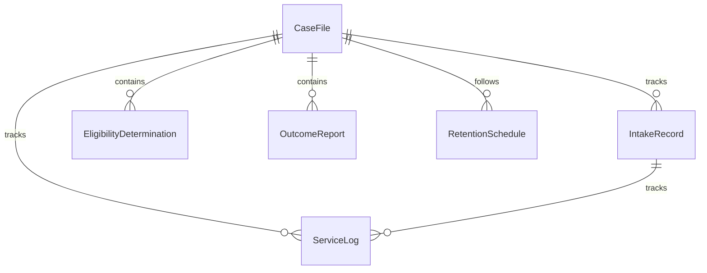
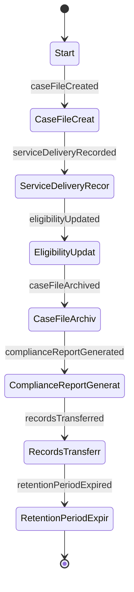
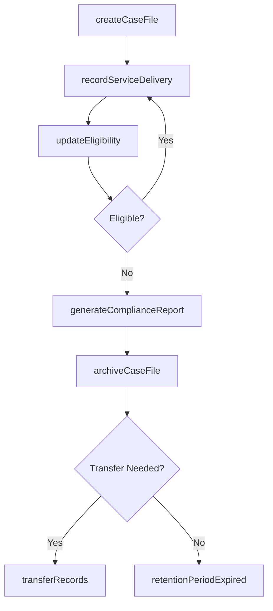
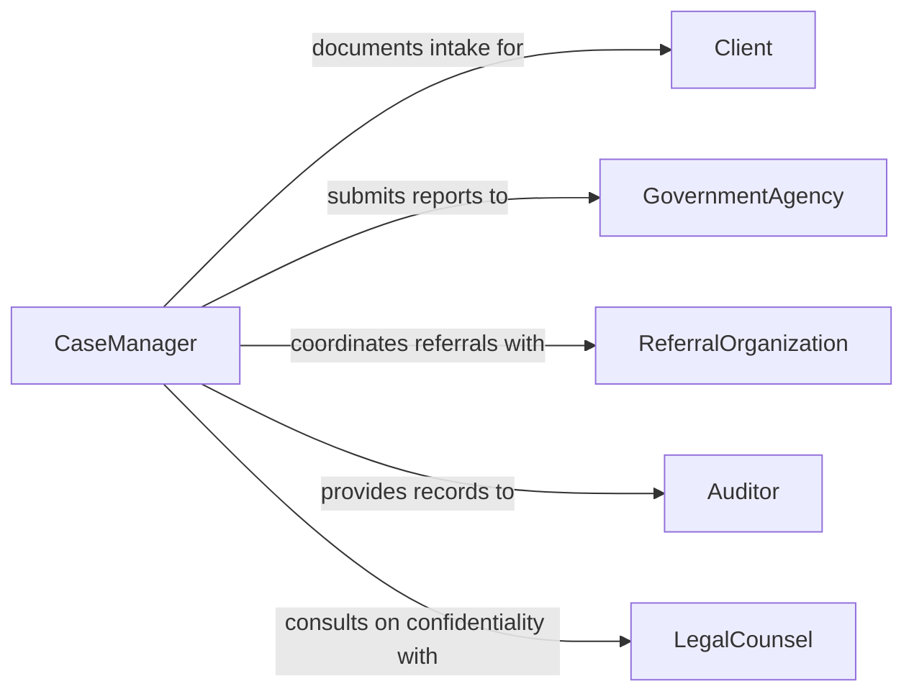

# Maintain Social Services Program Records

> Business-as-Code definition for social services program recordkeeping. Models the complete lifecycle of creating, updating, auditing, and archiving records related to social services programs and client case files.

## Overview

Maintaining social services program records involves documenting client intake information, tracking service delivery, and preserving case histories for government-funded and nonprofit social programs. This includes recording eligibility determinations, benefit disbursements, case notes, and outcome measurements to ensure regulatory compliance and continuity of care. Accurate recordkeeping supports program audits, funding renewals, and inter-agency coordination.

## Actors

| Actor | Description |
|-------|-------------|
| Client | Individual or family receiving social services |
| GovernmentAgency | Federal, state, or local body funding or overseeing programs |
| ReferralOrganization | External agency referring clients or receiving referrals |
| Auditor | Examines records for compliance with program regulations |
| LegalCounsel | Advises on confidentiality and records retention requirements |

## Roles

| Role | Description |
|------|-------------|
| CaseManager | Maintains client case files and documents service delivery |
| ProgramAdministrator | Oversees recordkeeping standards and compliance for the program |
| DataEntrySpecialist | Enters and updates client data in management information systems |
| ComplianceOfficer | Ensures records meet federal and state regulatory requirements |

## Entities

| Entity | Description |
|--------|-------------|
| CaseFile | Comprehensive record of a client's history, services, and outcomes |
| IntakeRecord | Initial documentation of client demographics and eligibility |
| ServiceLog | Chronological record of services delivered to a client |
| EligibilityDetermination | Documentation of whether a client qualifies for program benefits |
| OutcomeReport | Summary of client progress toward program goals |
| RetentionSchedule | Policy defining how long records must be preserved |

## Actions

| Action | Description |
|--------|-------------|
| createCaseFile | Initialize a new case file for an enrolled client |
| recordServiceDelivery | Log a service encounter or benefit disbursement |
| updateEligibility | Reassess and document a client's eligibility status |
| archiveCaseFile | Move a closed case to long-term storage per retention policy |
| generateComplianceReport | Produce audit-ready summaries of program recordkeeping |
| transferRecords | Send case records to another agency upon client referral |
| redactConfidentialInfo | Remove protected information before records disclosure |

## Events

| Event | Description |
|-------|-------------|
| caseFileCreated | A new client case file has been established |
| serviceDeliveryRecorded | A service encounter has been logged in the case file |
| eligibilityUpdated | A client's eligibility status has been reassessed |
| caseFileArchived | A closed case has been moved to long-term storage |
| complianceReportGenerated | An audit compliance report has been produced |
| recordsTransferred | Case records have been sent to another agency |
| retentionPeriodExpired | A case file has reached its retention schedule end date |

## Searches

| Search | Description |
|--------|-------------|
| findCaseFiles | Locate case files by client name, ID, program, or status |
| getServiceHistory | Retrieve chronological service delivery logs for a client |
| getEligibilityRecords | Find eligibility determinations by date or outcome |
| getPendingArchives | List case files eligible for archival based on retention schedule |

## Entity Relationships



## State Diagram



## Workflow



## Actor Relationships



## Usage

### Calling Actions

```typescript
import { maintainSocialServicesProgramRecords } from '@headlessly/maintain-social-services-program-records'

const records = maintainSocialServicesProgramRecords()

// Create a new case file for an enrolled client
const caseFile = await records.createCaseFile({
  clientId: 'CLT-2026-04821',
  program: 'Supplemental Nutrition Assistance',
  intakeDate: '2026-01-15',
  eligibilityStatus: 'approved'
})

// Log a service delivery encounter
await records.recordServiceDelivery({
  caseFileId: caseFile.id,
  serviceType: 'benefit-disbursement',
  date: '2026-02-01',
  notes: 'Monthly SNAP benefits issued to household'
})

// Generate a compliance report for audit
const report = await records.generateComplianceReport({
  program: 'Supplemental Nutrition Assistance',
  period: { start: '2026-01-01', end: '2026-03-31' }
})
```

### Event-Driven Automation

```typescript
// Notify compliance officer when retention period expires
records.retentionPeriodExpired(async ({ caseFileId, program }) => {
  await notify({
    to: 'compliance-team',
    message: `Case file ${caseFileId} in ${program} has reached retention end date`
  })
})

// Automatically generate compliance reports after eligibility updates
records.eligibilityUpdated(async ({ caseFileId, newStatus }) => {
  if (newStatus === 'denied') {
    await records.generateComplianceReport({ caseFileId })
  }
})
```
