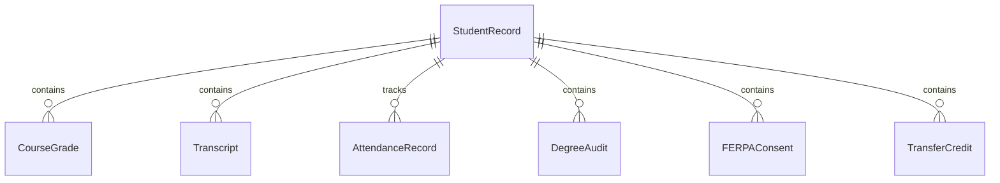
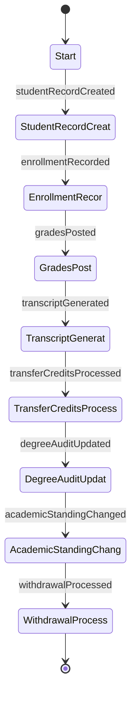
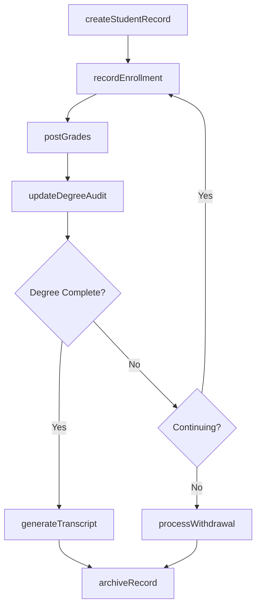
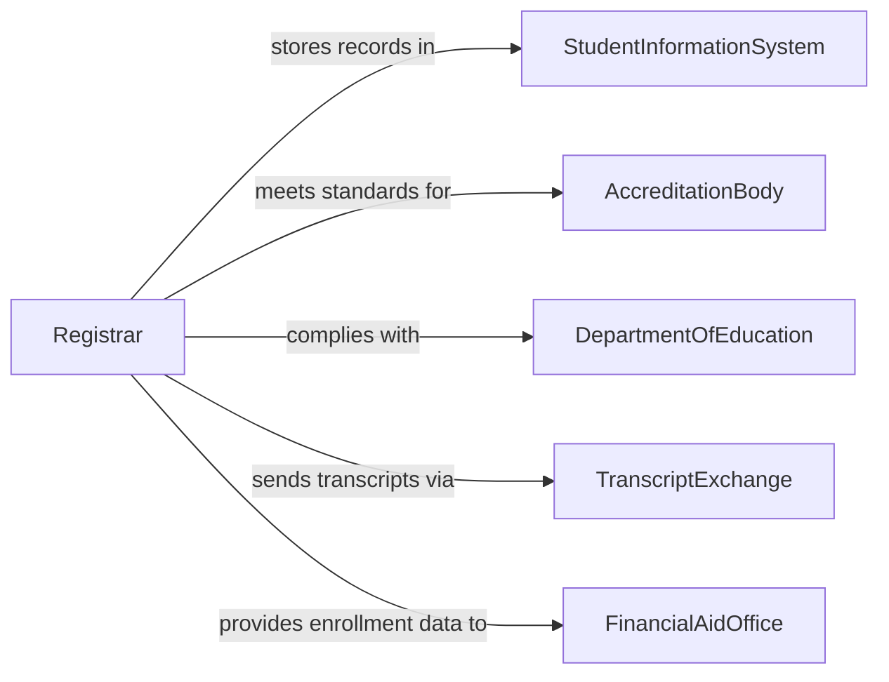

# Maintain Student Records

> Business-as-Code definition for student records management. Models the lifecycle from enrollment through academic tracking, transcript generation, FERPA compliance, and records retention for educational institutions.

## Overview

Maintaining student records involves creating enrollment files, recording grades and credits, tracking attendance, managing transcript requests, ensuring FERPA compliance, and archiving records upon graduation or withdrawal. This definition exposes actions for academic record management and compliance verification, events for enrollment milestones and grade posting, and searches for student data retrieval and academic analytics.

## Actors

| Actor | Description |
|-------|-------------|
| StudentInformationSystem | Provides the database platform for student record storage and retrieval |
| AccreditationBody | Mandates recordkeeping standards for institutional accreditation |
| DepartmentOfEducation | Enforces federal regulations including FERPA for student privacy |
| TranscriptExchange | Facilitates secure electronic transcript transmission between institutions |
| FinancialAidOffice | Requires enrollment and academic standing data for aid eligibility |

## Roles

| Role | Description |
|------|-------------|
| Registrar | Oversees the official academic records and transcript production |
| EnrollmentSpecialist | Manages student registration, course enrollment, and status changes |
| AcademicAdvisor | Reviews student progress and updates advising notes in student files |
| ComplianceOfficer | Ensures student records handling adheres to FERPA and state regulations |

## Entities

| Entity | Description |
|--------|-------------|
| StudentRecord | The comprehensive academic file for an enrolled or former student |
| EnrollmentEntry | A record of a student registering for a specific term and program |
| CourseGrade | A documented academic mark for a completed or attempted course |
| Transcript | An official document listing all courses, grades, and credits earned |
| AttendanceRecord | A log of student presence or absence for courses or required activities |
| DegreeAudit | A comparison of completed coursework against degree requirements |
| FERPAConsent | A documented authorization from a student to release their records |
| TransferCredit | Academic credit accepted from another institution |

## Actions

| Action | Description |
|--------|-------------|
| createStudentRecord | Initialize a new academic file upon admission or enrollment |
| recordEnrollment | Document a student's registration for courses in a given term |
| postGrades | Enter final course grades into the student's academic record |
| generateTranscript | Produce an official or unofficial transcript for a student |
| processTransferCredits | Evaluate and record academic credits from another institution |
| updateDegreeAudit | Recalculate progress toward degree requirements |
| processWithdrawal | Document a student's withdrawal and update their enrollment status |
| archiveRecord | Move a graduated or separated student's record to long-term storage |

## Events

| Event | Description |
|-------|-------------|
| studentRecordCreated | A new student academic file has been initialized |
| enrollmentRecorded | A student has been registered for courses in a term |
| gradesPosted | Final course grades have been entered into the academic record |
| transcriptGenerated | An official or unofficial transcript has been produced |
| transferCreditsProcessed | Credits from another institution have been evaluated and recorded |
| degreeAuditUpdated | Degree requirement progress has been recalculated |
| academicStandingChanged | A student's academic standing has changed due to GPA or progress |
| withdrawalProcessed | A student's withdrawal has been documented |

## Searches

| Search | Description |
|--------|-------------|
| findStudents | Search student records by name, ID, program, or enrollment status |
| getAcademicHistory | Retrieve all courses and grades for a specific student |
| getDegreeProgress | Query a student's completion status against degree requirements |
| findByAcademicStanding | List students by GPA range or academic standing classification |
| getEnrollmentByTerm | Retrieve enrollment counts and rosters for a specific term |

## Entity Relationships



## State Diagram



## Workflow



## Actor Relationships



## Usage

### Calling Actions

```typescript
import { maintainStudentRecords } from '@headlessly/maintain-student-records'

const students = maintainStudentRecords()

// Create a new student record upon admission
const record = await students.createStudentRecord({
  studentId: 'STU-2026-10482',
  name: 'Alex Rivera',
  program: 'BS Computer Science',
  admissionTerm: 'Fall 2026',
  advisor: 'Dr. Kim'
})

// Record course enrollment
await students.recordEnrollment({
  studentId: record.studentId,
  term: 'Fall 2026',
  courses: [
    { code: 'CS-201', title: 'Data Structures', credits: 3 },
    { code: 'MATH-301', title: 'Linear Algebra', credits: 3 },
    { code: 'CS-210', title: 'Computer Architecture', credits: 3 }
  ]
})

// Post final grades at end of term
await students.postGrades({
  studentId: record.studentId,
  term: 'Fall 2026',
  grades: [
    { course: 'CS-201', grade: 'A', credits: 3 },
    { course: 'MATH-301', grade: 'B+', credits: 3 },
    { course: 'CS-210', grade: 'A-', credits: 3 }
  ]
})
```

### Event-Driven Automation

```typescript
// Alert advisor on academic standing changes
students.academicStandingChanged(async ({ studentId, newStanding, gpa }) => {
  await notify({
    to: 'academic-advising',
    message: `Student ${studentId} standing changed to ${newStanding} (GPA: ${gpa})`
  })
})

// Auto-generate transcript on degree completion
students.degreeAuditUpdated(async ({ studentId, percentComplete, degreeRequirementsMet }) => {
  if (degreeRequirementsMet) {
    await students.generateTranscript({ studentId, type: 'official', reason: 'degree-completion' })
  }
})
```
