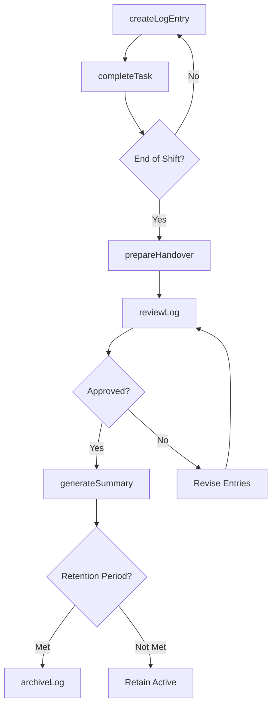
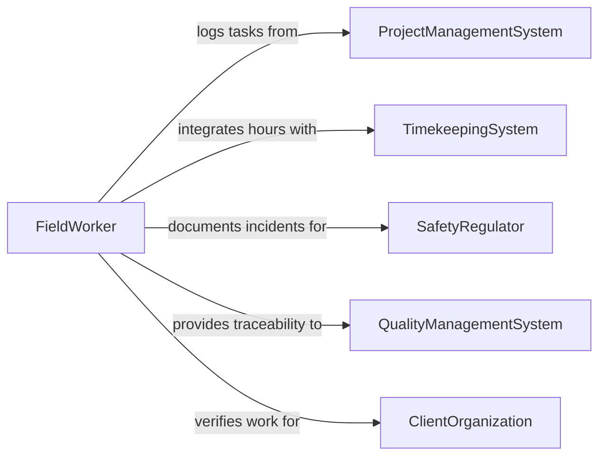

# Maintain Work Logs and Records

> Business-as-Code definition for work log and activity record maintenance. Models the lifecycle from daily activity logging through shift handover documentation, task completion tracking, incident notation, supervisor review, and long-term archival of operational work records.

## Overview

Maintaining work logs and records involves documenting daily operational activities, recording task completions and work progress, noting incidents or deviations from standard procedures, managing shift handover notes, tracking project milestones, and producing activity summaries for management review. This definition exposes actions for log entry and shift management, events for milestone tracking and anomaly detection, and searches for activity history and performance reporting.

## Actors

| Actor | Description |
|-------|-------------|
| ProjectManagementSystem | Provides task assignments and tracks work completion status |
| TimekeepingSystem | Integrates work log entries with payroll and attendance records |
| SafetyRegulator | Requires documented work logs for safety incident investigations |
| QualityManagementSystem | References work logs for traceability and process compliance |
| ClientOrganization | Reviews work logs for contracted service verification |

## Roles

| Role | Description |
|------|-------------|
| FieldWorker | Records daily activities, task completions, and observations |
| ShiftSupervisor | Reviews work logs, approves entries, and documents shift handovers |
| ProjectCoordinator | Tracks work progress against project schedules and milestones |
| RecordsKeeper | Manages work log archival and ensures retention compliance |

## Entities

| Entity | Description |
|--------|-------------|
| WorkLog | A chronological record of activities performed during a work period |
| LogEntry | An individual documented activity with timestamp, description, and status |
| ShiftHandover | A summary of work status, pending items, and notes for the incoming shift |
| IncidentNote | A documented observation of an unusual event or deviation during work |
| TaskCompletion | A record confirming that a specific assigned task has been finished |
| ActivitySummary | An aggregated report of work performed over a defined period |
| MilestoneRecord | A documented achievement of a significant project or operational target |

## Actions

| Action | Description |
|--------|-------------|
| createLogEntry | Record a specific activity with timestamp, description, and outcome |
| completeTask | Document the completion of an assigned work task |
| noteIncident | Record an unusual event, deviation, or safety observation |
| prepareHandover | Compile shift status, pending items, and notes for the incoming team |
| reviewLog | Supervisor review and approval of submitted work log entries |
| generateSummary | Produce an activity report covering a specified time period |
| archiveLog | Transfer completed work logs to long-term storage |

## Events

| Event | Description |
|-------|-------------|
| logEntryCreated | A new activity has been recorded in the work log |
| taskCompleted | An assigned work task has been documented as finished |
| incidentNoted | An unusual event or deviation has been recorded |
| handoverPrepared | Shift status and notes have been compiled for the incoming team |
| logReviewed | A supervisor has reviewed and approved submitted log entries |
| summaryGenerated | An activity report has been produced for the specified period |
| logArchived | Completed work logs have been transferred to long-term storage |

## Searches

| Search | Description |
|--------|-------------|
| getWorkLogs | Retrieve log entries by worker, date range, or project |
| findCompletedTasks | List task completions by assignment, worker, or time period |
| getIncidentNotes | Search incident records by type, severity, or date |
| findPendingReviews | List work logs awaiting supervisor approval |
| getActivitySummaries | Retrieve aggregated activity reports by team, project, or period |

## Workflow



## Actor Relationships



## Usage

### Calling Actions

```typescript
import { maintainWorkLogsRecords } from '@headlessly/maintain-work-logs-records'

const logs = maintainWorkLogsRecords()

// Create work log entries for the day
await logs.createLogEntry({
  workerId: 'FW-0187',
  date: '2026-02-05',
  project: 'PRJ-BRIDGE-041',
  entries: [
    { time: '07:00', activity: 'Pre-shift safety briefing and equipment check', duration: 30 },
    { time: '07:30', activity: 'Formwork assembly for pier cap section B', duration: 240 },
    { time: '12:00', activity: 'Concrete placement - pier cap section B', duration: 180 },
    { time: '15:30', activity: 'Cleanup and tool inventory', duration: 60 }
  ]
})

// Document task completion
await logs.completeTask({
  taskId: 'TASK-PIER-CAP-B-POUR',
  workerId: 'FW-0187',
  completedDate: '2026-02-05',
  notes: 'Concrete placed and vibrated per specification. Slump test passed at 4 inches.',
  quantityCompleted: 12.5,
  unit: 'cubic-yards'
})

// Prepare shift handover
await logs.prepareHandover({
  shift: 'day',
  date: '2026-02-05',
  preparedBy: 'supervisor-klee',
  status: 'Pier cap B pour complete. Curing compound applied.',
  pendingItems: ['Remove formwork pier cap A (72hr cure met)', 'Rebar delivery expected 06:00'],
  safetyNotes: 'Wet conditions expected overnight - check drainage before morning start'
})
```

### Event-Driven Automation

```typescript
// Notify project coordinator on milestone completions
logs.taskCompleted(async ({ taskId, project, quantityCompleted }) => {
  await notify({
    to: 'project-coordinator',
    message: `Task ${taskId} completed on ${project}: ${quantityCompleted} units finished`
  })
})

// Escalate safety incidents
logs.incidentNoted(async ({ workerId, project, severity, description }) => {
  if (severity === 'high') {
    await notify({
      to: 'safety-manager',
      message: `Safety incident on ${project} by ${workerId}: ${description}`
    })
  }
})
```
