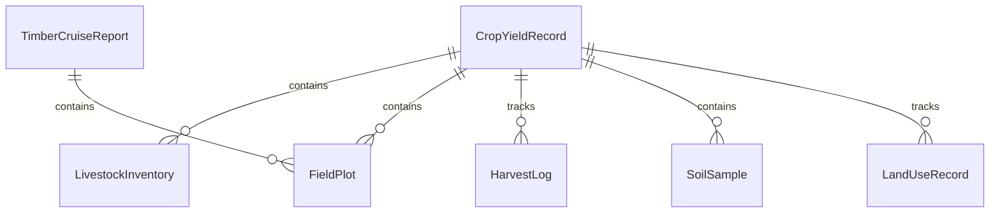
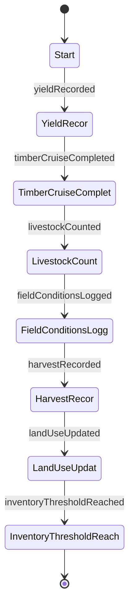
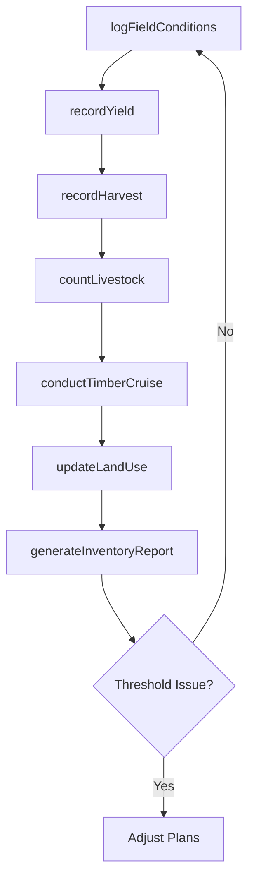
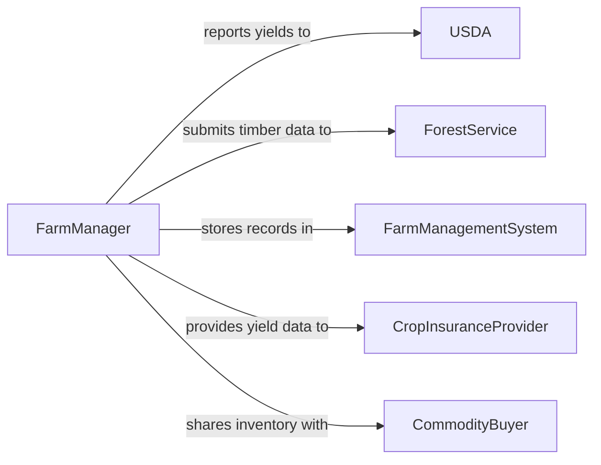

# Record Agricultural or Forestry Inventory Data

> Business-as-Code definition for agricultural and forestry inventory data recording. Models the lifecycle from field survey through crop yield documentation, timber volume measurement, livestock counting, and resource reporting for land management.

## Overview

Recording agricultural or forestry inventory data involves conducting field surveys, documenting crop yields, measuring timber volumes, counting livestock, tracking land use, and producing resource reports for farm management, forestry planning, and regulatory compliance. This definition exposes actions for field data capture and inventory calculation, events for harvest completion and resource threshold monitoring, and searches for inventory analytics and trend reporting.

## Actors

| Actor | Description |
|-------|-------------|
| USDA | Provides crop reporting requirements and agricultural census frameworks |
| ForestService | Mandates timber inventory standards and forest management plan data |
| FarmManagementSystem | Stores crop, livestock, and land data for agricultural operations |
| CropInsuranceProvider | Requires documented yield data for coverage and claims processing |
| CommodityBuyer | Receives inventory reports to plan procurement and pricing |

## Roles

| Role | Description |
|------|-------------|
| FarmManager | Oversees crop and livestock inventory data collection and reporting |
| ForestInventorySpecialist | Conducts timber cruises and records stand composition data |
| AgronomistTechnician | Collects field measurements including soil, plant health, and yield samples |
| LivestockRecordkeeper | Maintains herd counts, breeding records, and animal health documentation |

## Entities

| Entity | Description |
|--------|-------------|
| CropYieldRecord | A documented measurement of harvested output per acre for a crop |
| TimberCruiseReport | A survey of tree species, diameter, height, and volume in a forest stand |
| LivestockInventory | A count of animals by species, breed, age, and location |
| FieldPlot | A defined parcel of land with associated crop or forestry data |
| HarvestLog | A record of quantities harvested by date, field, and method |
| SoilSample | A documented soil test result including nutrients, pH, and organic matter |
| LandUseRecord | A classification of how a parcel is used such as cropland, pasture, or timber |

## Actions

| Action | Description |
|--------|-------------|
| recordYield | Document crop output quantities by field, variety, and harvest date |
| conductTimberCruise | Survey and measure tree volumes in a designated forest stand |
| countLivestock | Record animal numbers by species, breed, and location |
| logFieldConditions | Capture soil, weather, and crop health observations for a field |
| recordHarvest | Document the quantities and quality of products removed from the field |
| updateLandUse | Modify the classification or planned use of an agricultural parcel |
| generateInventoryReport | Produce a summary of agricultural or forestry assets by category |

## Events

| Event | Description |
|-------|-------------|
| yieldRecorded | Crop output data has been documented for a field |
| timberCruiseCompleted | A forest stand survey has been performed and recorded |
| livestockCounted | Animal inventories have been updated |
| fieldConditionsLogged | Soil and crop health observations have been captured |
| harvestRecorded | Product removal quantities have been documented |
| landUseUpdated | A parcel classification has been changed |
| inventoryThresholdReached | A crop or timber inventory has fallen below or exceeded planned levels |

## Searches

| Search | Description |
|--------|-------------|
| getYieldHistory | Retrieve crop yield records by field, variety, or growing season |
| getTimberVolumes | Query timber inventory by stand, species, or diameter class |
| getLivestockCounts | List animal inventories by location, species, or age group |
| findFieldsByCondition | Identify fields matching specific soil, crop health, or yield criteria |
| getInventorySummary | Retrieve total agricultural or forestry asset quantities by category |

## Entity Relationships



## State Diagram



## Workflow



## Actor Relationships



## Usage

### Calling Actions

```typescript
import { recordAgriculturalForestryInventoryData } from '@headlessly/record-agricultural-forestry-inventory-data'

const inventory = recordAgriculturalForestryInventoryData()

// Record crop yield after harvest
await inventory.recordYield({
  field: 'north-quarter-section-12',
  crop: 'winter-wheat',
  variety: 'hard-red',
  acres: 160,
  bushelsPerAcre: 52,
  totalBushels: 8320,
  harvestDate: '2026-07-15'
})

// Conduct a timber cruise
await inventory.conductTimberCruise({
  stand: 'pine-ridge-stand-04',
  species: [
    { name: 'ponderosa-pine', avgDbh: 14.2, treesPerAcre: 120, boardFeetPerAcre: 8500 },
    { name: 'douglas-fir', avgDbh: 16.8, treesPerAcre: 45, boardFeetPerAcre: 5200 }
  ],
  totalAcres: 80,
  surveyDate: '2026-02-05'
})

// Count livestock
await inventory.countLivestock({
  location: 'ranch-south-pasture',
  animals: [
    { species: 'cattle', breed: 'angus', count: 240, ageGroup: 'mature' },
    { species: 'cattle', breed: 'angus', count: 65, ageGroup: 'calves' }
  ],
  countDate: '2026-02-01'
})
```

### Event-Driven Automation

```typescript
// Alert on inventory threshold
inventory.inventoryThresholdReached(async ({ category, item, currentLevel, threshold }) => {
  await notify({
    to: 'farm-manager',
    message: `${category} inventory for ${item} at ${currentLevel} (threshold: ${threshold})`
  })
})

// Auto-report yields to USDA after harvest
inventory.harvestRecorded(async ({ field, crop, totalBushels }) => {
  await inventory.generateInventoryReport({
    type: 'crop-production',
    fields: [field],
    format: 'usda-nass'
  })
})
```
