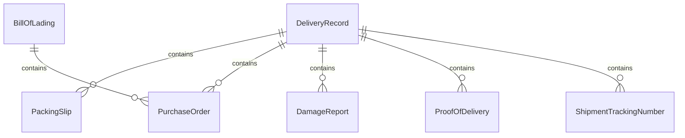
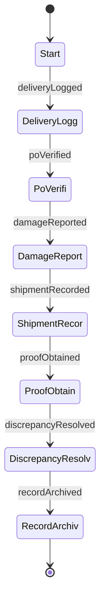
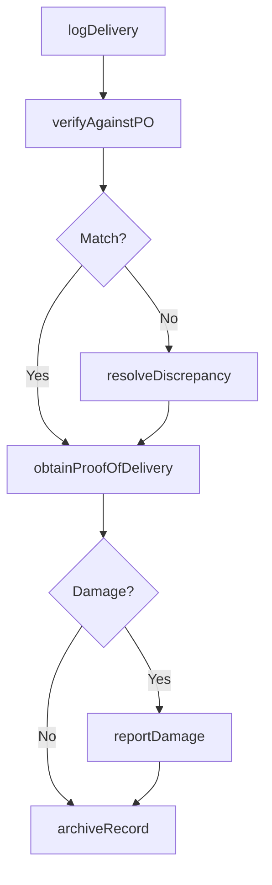
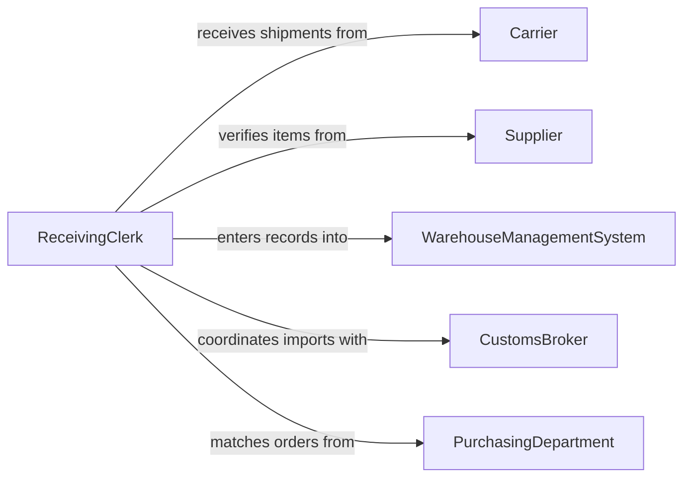

# Record Details of Deliveries or Shipments

> Business-as-Code definition for delivery and shipment documentation. Models the lifecycle from goods receipt through inspection, record creation, discrepancy resolution, and audit trail maintenance.

## Overview

Recording details of deliveries or shipments involves documenting receipt of goods, verifying quantities against purchase orders, noting condition and damages, and maintaining a complete audit trail of logistics transactions. This definition exposes actions for delivery logging and discrepancy management, events for receiving workflow automation, and searches for shipment history and carrier performance tracking.

## Actors

| Actor | Description |
|-------|-------------|
| Carrier | Transports goods and provides delivery documentation |
| Supplier | Ships materials and provides packing slips and bills of lading |
| WarehouseManagementSystem | Stores and retrieves inventory and delivery records |
| CustomsBroker | Facilitates import documentation for international shipments |
| PurchasingDepartment | Issues purchase orders against which deliveries are verified |

## Roles

| Role | Description |
|------|-------------|
| ReceivingClerk | Inspects deliveries and records receipt details |
| ShippingCoordinator | Manages outbound shipment documentation and tracking |
| LogisticsManager | Oversees delivery record accuracy and carrier relationships |
| InventorySpecialist | Reconciles delivery records with inventory system entries |

## Entities

| Entity | Description |
|--------|-------------|
| DeliveryRecord | A documented account of goods received or shipped |
| BillOfLading | A carrier-issued document detailing shipment contents and terms |
| PackingSlip | A supplier-provided list of items included in a shipment |
| PurchaseOrder | The order document against which deliveries are verified |
| DamageReport | A record of goods received in damaged or defective condition |
| ProofOfDelivery | A signed confirmation that goods were received by the consignee |
| ShipmentTrackingNumber | A unique identifier for tracking a shipment in transit |

## Actions

| Action | Description |
|--------|-------------|
| logDelivery | Record the receipt of an inbound shipment with quantities and condition |
| verifyAgainstPO | Compare delivered items to the purchase order for accuracy |
| reportDamage | Document goods received in damaged or defective condition |
| recordShipment | Log details of an outbound shipment including carrier and tracking |
| obtainProofOfDelivery | Capture the signed confirmation of goods receipt |
| resolveDiscrepancy | Investigate and document differences between expected and received items |
| archiveRecord | Store completed delivery records for retention compliance |

## Events

| Event | Description |
|-------|-------------|
| deliveryLogged | An inbound shipment has been recorded in the system |
| poVerified | Delivered items have been matched against the purchase order |
| damageReported | Goods received in poor condition have been documented |
| shipmentRecorded | An outbound shipment has been logged with tracking details |
| proofObtained | A signed delivery confirmation has been captured |
| discrepancyResolved | A delivery variance has been investigated and documented |
| recordArchived | A delivery record has been stored for long-term retention |

## Searches

| Search | Description |
|--------|-------------|
| findDeliveries | List delivery records by date, carrier, or supplier |
| getShipmentTracking | Retrieve tracking status for outbound shipments |
| findDiscrepancies | List deliveries with unresolved quantity or condition issues |
| getCarrierPerformance | Query on-time delivery rates and damage frequency by carrier |
| getDeliveryHistory | Retrieve all delivery records for a specific purchase order |

## Entity Relationships



## State Diagram



## Workflow



## Actor Relationships



## Usage

### Calling Actions

```typescript
import { recordDetailsDeliveriesShipments } from '@headlessly/record-details-deliveries-shipments'

const deliveries = recordDetailsDeliveriesShipments()

// Log an inbound delivery
const delivery = await deliveries.logDelivery({
  carrier: 'FedEx Freight',
  trackingNumber: 'FX-7742891',
  supplier: 'Apex Components',
  items: [
    { sku: 'AC-BOLT-M10', ordered: 500, received: 500, condition: 'good' },
    { sku: 'AC-NUT-M10', ordered: 500, received: 485, condition: 'good' }
  ],
  receivedBy: 'dock-3',
  date: '2026-02-05'
})

// Verify against purchase order
await deliveries.verifyAgainstPO({
  deliveryId: delivery.id,
  purchaseOrder: 'PO-2026-1847'
})

// Record outbound shipment
await deliveries.recordShipment({
  carrier: 'UPS Ground',
  destination: 'Customer Warehouse - Chicago',
  trackingNumber: 'UPS-1Z999AA10',
  items: [{ sku: 'PROD-A100', quantity: 24 }],
  shipDate: '2026-02-05'
})
```

### Event-Driven Automation

```typescript
// Alert purchasing on delivery discrepancies
deliveries.discrepancyResolved(async ({ deliveryId, purchaseOrder, shortage }) => {
  if (shortage > 0) {
    await notify({
      to: 'purchasing',
      message: `Shortage of ${shortage} units on PO ${purchaseOrder} - delivery ${deliveryId}`
    })
  }
})

// Notify warehouse on damage
deliveries.damageReported(async ({ deliveryId, carrier, items }) => {
  await notify({
    to: 'warehouse-manager',
    message: `Damaged goods from ${carrier}: ${items.length} items on delivery ${deliveryId}`
  })
})
```
