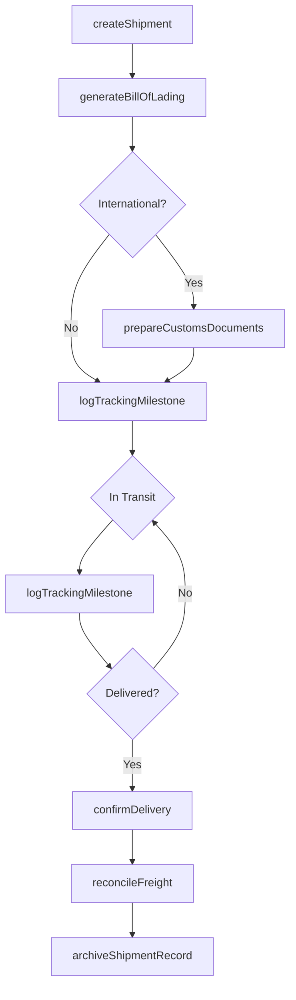
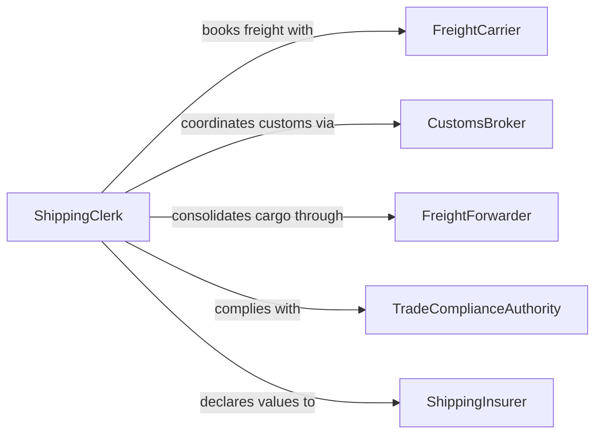

# Record Goods and Shipment Data

> Business-as-Code definition for goods and shipment data recording. Models the lifecycle from shipment creation through freight documentation, customs declaration, tracking updates, delivery confirmation, and freight cost reconciliation.

## Overview

Recording goods and shipment data involves documenting cargo details, generating shipping documentation such as bills of lading and commercial invoices, logging tracking milestones, managing customs declarations for international shipments, recording delivery confirmations, and reconciling freight charges against contracts. This definition exposes actions for shipment documentation and milestone logging, events for transit monitoring and delivery confirmation, and searches for shipment tracking and logistics analytics.

## Actors

| Actor | Description |
|-------|-------------|
| FreightCarrier | Transports goods and provides tracking updates and delivery confirmations |
| CustomsBroker | Prepares and submits customs documentation for cross-border shipments |
| FreightForwarder | Coordinates multimodal shipping and consolidates cargo documentation |
| TradeComplianceAuthority | Regulates export controls, tariffs, and trade documentation requirements |
| ShippingInsurer | Provides cargo coverage and requires shipment value documentation |

## Roles

| Role | Description |
|------|-------------|
| ShippingClerk | Creates shipment records and prepares shipping documentation |
| LogisticsCoordinator | Manages carrier selection, routing, and shipment milestone tracking |
| TradeComplianceSpecialist | Ensures customs documentation accuracy and export control compliance |
| FreightAuditor | Reconciles carrier invoices against contracted rates and shipment records |

## Entities

| Entity | Description |
|--------|-------------|
| ShipmentRecord | A comprehensive document detailing cargo, routing, and status |
| BillOfLading | A carrier-issued document serving as receipt, contract, and title |
| CommercialInvoice | A document declaring the value and description of goods for customs |
| TrackingMilestone | A logged transit event such as pickup, departure, arrival, or delivery |
| CustomsDeclaration | A submission to customs authorities declaring goods for import or export |
| FreightInvoice | A carrier billing document detailing transportation charges |
| PackingList | An itemized list of goods in a shipment with quantities and weights |

## Actions

| Action | Description |
|--------|-------------|
| createShipment | Initialize a shipment record with cargo details, origin, and destination |
| generateBillOfLading | Produce the carrier document for a shipment |
| prepareCustomsDocuments | Create customs declarations and commercial invoices for international freight |
| logTrackingMilestone | Record a transit event such as pickup, border crossing, or arrival |
| confirmDelivery | Document the successful receipt of goods at the destination |
| reconcileFreight | Compare carrier invoices against contracted rates and shipment records |
| archiveShipmentRecord | Store completed shipment documentation for retention compliance |

## Events

| Event | Description |
|-------|-------------|
| shipmentCreated | A new shipment record has been initialized |
| billOfLadingGenerated | Carrier documentation has been produced for a shipment |
| customsDocumentsPrepared | Import or export declarations have been created |
| milestoneLogged | A transit event has been recorded for a shipment |
| deliveryConfirmed | Goods have been verified as received at the destination |
| freightReconciled | Carrier charges have been verified against contracted rates |
| shipmentDelayed | A shipment has not met an expected milestone within tolerance |

## Searches

| Search | Description |
|--------|-------------|
| findShipments | Search shipments by origin, destination, carrier, status, or date |
| getTrackingHistory | Retrieve all milestones for a specific shipment |
| findInTransit | List shipments currently between origin and destination |
| getFreightCosts | Query transportation charges by carrier, lane, or period |
| findDelayedShipments | List shipments that have exceeded expected transit times |

## Workflow



## Actor Relationships



## Usage

### Calling Actions

```typescript
import { recordGoodsShipmentData } from '@headlessly/record-goods-shipment-data'

const shipping = recordGoodsShipmentData()

// Create a new international shipment
const shipment = await shipping.createShipment({
  origin: { facility: 'warehouse-houston', country: 'US' },
  destination: { facility: 'distribution-center-frankfurt', country: 'DE' },
  carrier: 'Maersk Line',
  mode: 'ocean-fcl',
  containerNumber: 'MAEU-7714220',
  cargo: [
    { description: 'Industrial valves', hsCode: '8481.80', quantity: 240, weight: 4800, unit: 'kg' },
    { description: 'Pipe fittings', hsCode: '7307.19', quantity: 500, weight: 2100, unit: 'kg' }
  ],
  bookingReference: 'BK-2026-08841',
  shipDate: '2026-02-10'
})

// Prepare customs documentation
await shipping.prepareCustomsDocuments({
  shipmentId: shipment.id,
  invoiceValue: 87500,
  currency: 'USD',
  incoterms: 'CIF Frankfurt',
  exportLicense: 'EAR-NLR',
  countryOfOrigin: 'US'
})

// Log tracking milestones
await shipping.logTrackingMilestone({
  shipmentId: shipment.id,
  event: 'vessel-departure',
  location: 'Port of Houston',
  timestamp: '2026-02-12T08:00:00Z',
  vessel: 'Maersk Eindhoven'
})
```

### Event-Driven Automation

```typescript
// Alert on shipment delays
shipping.shipmentDelayed(async ({ shipmentId, expectedMilestone, hoursOverdue }) => {
  await notify({
    to: 'logistics-coordinator',
    message: `Shipment ${shipmentId} delayed: ${expectedMilestone} overdue by ${hoursOverdue} hours`
  })
})

// Auto-trigger freight reconciliation on delivery
shipping.deliveryConfirmed(async ({ shipmentId, carrier }) => {
  await shipping.reconcileFreight({
    shipmentId,
    carrier,
    compareAgainst: 'contracted-rate'
  })
})
```
