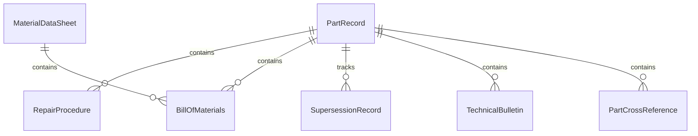
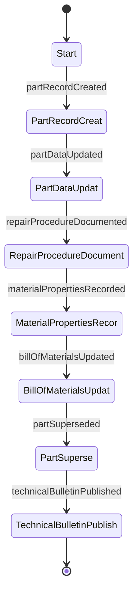
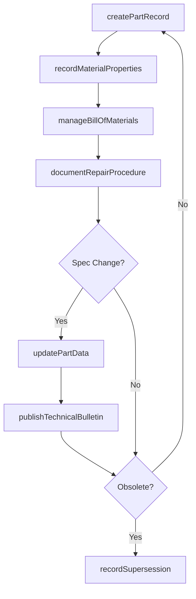
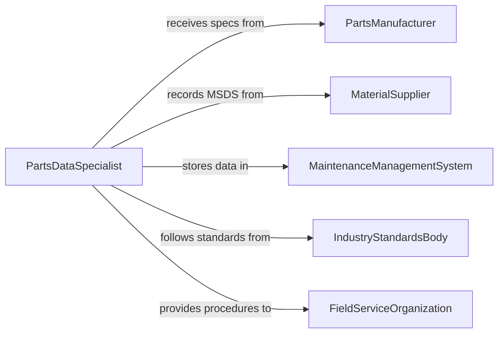

# Record Information About Parts, Materials, or Repair Procedures

> Business-as-Code definition for parts, materials, and repair procedure documentation. Models the lifecycle from part specification entry through material tracking, repair procedure authoring, bill of materials management, and technical reference maintenance.

## Overview

Recording information about parts, materials, or repair procedures involves documenting part specifications, tracking material properties, authoring step-by-step repair instructions, maintaining bills of materials, and building technical reference libraries that support manufacturing, maintenance, and field service operations. This definition exposes actions for part data entry and procedure documentation, events for specification updates and obsolescence notifications, and searches for part lookup and procedure retrieval.

## Actors

| Actor | Description |
|-------|-------------|
| PartsManufacturer | Provides technical specifications, datasheets, and supersession information |
| MaterialSupplier | Supplies material safety data sheets and composition documentation |
| MaintenanceManagementSystem | Stores part records and links them to equipment and work orders |
| IndustryStandardsBody | Publishes material and part classification standards such as NSN or MIL-SPEC |
| FieldServiceOrganization | Consumes repair procedures and part information for on-site maintenance |

## Roles

| Role | Description |
|------|-------------|
| PartsDataSpecialist | Enters and maintains technical specifications for parts and materials |
| TechnicalDocumentWriter | Authors repair procedures and maintenance instructions |
| MaterialsEngineer | Documents material properties, certifications, and compliance data |
| BillOfMaterialsAnalyst | Manages component hierarchies and assembly documentation |

## Entities

| Entity | Description |
|--------|-------------|
| PartRecord | A documented specification for a component including dimensions, materials, and tolerances |
| MaterialDataSheet | A record of material properties, safety information, and handling requirements |
| RepairProcedure | A step-by-step instruction set for repairing or replacing a specific component |
| BillOfMaterials | A hierarchical list of parts and materials required to build or repair an assembly |
| SupersessionRecord | A document linking an obsolete part number to its replacement |
| TechnicalBulletin | A notification of changes, updates, or corrections to part or procedure data |
| PartCrossReference | A mapping between equivalent part numbers from different manufacturers |

## Actions

| Action | Description |
|--------|-------------|
| createPartRecord | Enter specifications and attributes for a new part or component |
| updatePartData | Modify existing part information to reflect specification changes |
| documentRepairProcedure | Author step-by-step instructions for a repair or replacement task |
| recordMaterialProperties | Document composition, strength, and handling data for a material |
| manageBillOfMaterials | Create or update the component hierarchy for an assembly |
| recordSupersession | Document the replacement relationship between old and new part numbers |
| publishTechnicalBulletin | Issue a notification of changes to parts data or procedures |

## Events

| Event | Description |
|-------|-------------|
| partRecordCreated | A new part specification has been entered into the system |
| partDataUpdated | Existing part information has been modified |
| repairProcedureDocumented | A maintenance instruction set has been authored |
| materialPropertiesRecorded | Composition and handling data for a material have been logged |
| billOfMaterialsUpdated | An assembly component hierarchy has been modified |
| partSuperseded | A part number has been replaced by a new equivalent |
| technicalBulletinPublished | A change notification has been issued for parts or procedures |

## Searches

| Search | Description |
|--------|-------------|
| findParts | Search part records by number, description, material, or manufacturer |
| getRepairProcedures | Retrieve maintenance instructions by equipment, part, or task type |
| getCrossReferences | List equivalent part numbers across manufacturers |
| getBillOfMaterials | Retrieve the component hierarchy for a specific assembly |
| findObsoleteParts | Identify parts that have been superseded and their replacements |

## Entity Relationships



## State Diagram



## Workflow



## Actor Relationships



## Usage

### Calling Actions

```typescript
import { recordInformationAboutPartsMaterials } from '@headlessly/record-information-about-parts-materials'

const parts = recordInformationAboutPartsMaterials()

// Create a new part record
const part = await parts.createPartRecord({
  partNumber: 'BRG-6205-2RS',
  description: 'Deep groove ball bearing, sealed, 25x52x15mm',
  manufacturer: 'SKF',
  material: 'chrome-steel-52100',
  specifications: { innerDiameter: 25, outerDiameter: 52, width: 15, loadRating: 14800 },
  unitOfMeasure: 'each'
})

// Document a repair procedure
await parts.documentRepairProcedure({
  title: 'Replace Motor Drive Bearing',
  equipment: 'conveyor-drive-motor-3HP',
  steps: [
    { number: 1, instruction: 'Lockout/tagout motor and disconnect power', safety: true },
    { number: 2, instruction: 'Remove motor coupling and mounting bolts' },
    { number: 3, instruction: 'Extract old bearing using puller tool BT-205' },
    { number: 4, instruction: 'Press new bearing BRG-6205-2RS using arbor press' },
    { number: 5, instruction: 'Reassemble motor and test rotation' }
  ],
  partsRequired: [{ partNumber: 'BRG-6205-2RS', quantity: 1 }],
  estimatedTime: 1.5
})

// Record a supersession
await parts.recordSupersession({
  obsoletePart: 'BRG-6205-ZZ',
  replacementPart: 'BRG-6205-2RS',
  reason: 'Sealed design replaces shielded for improved contamination resistance',
  effectiveDate: '2026-02-01'
})
```

### Event-Driven Automation

```typescript
// Notify field teams of part supersessions
parts.partSuperseded(async ({ obsoletePart, replacementPart, reason }) => {
  await notify({
    to: 'field-service',
    message: `Part ${obsoletePart} replaced by ${replacementPart}: ${reason}`
  })
})

// Alert on technical bulletins
parts.technicalBulletinPublished(async ({ bulletinId, affectedParts, summary }) => {
  await notify({
    to: 'maintenance-teams',
    message: `Technical bulletin ${bulletinId}: ${summary} (affects ${affectedParts.length} parts)`
  })
})
```
