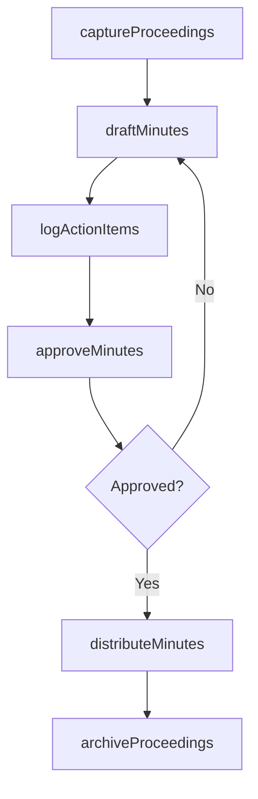
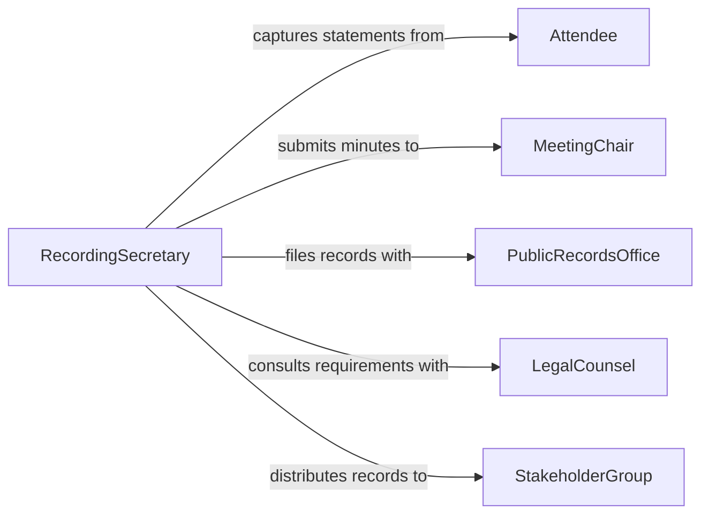

# Record Information Meetings Formal Proceedings

> Business-as-Code definition for recording information from meetings and formal proceedings. Models the capture, transcription, approval, and distribution of official meeting records, minutes, and hearing transcripts.

## Overview

Recording information from meetings and formal proceedings involves capturing discussions, decisions, motions, and action items during board meetings, legislative sessions, court hearings, and organizational conferences. This process ensures that an accurate, verifiable record exists for legal compliance, institutional memory, and stakeholder accountability. The resulting documents serve as official records that may be referenced in future proceedings or audits.

## Actors

| Actor | Description |
|-------|-------------|
| MeetingChair | Presides over the meeting and approves final minutes |
| Attendee | Participates in the meeting and provides statements or votes |
| LegalCounsel | Advises on recordkeeping requirements for formal proceedings |
| PublicRecordsOffice | Receives and archives official meeting records |
| StakeholderGroup | External parties who may request access to meeting records |

## Roles

| Role | Description |
|------|-------------|
| RecordingSecretary | Captures notes, transcribes proceedings, and drafts minutes |
| TranscriptionSpecialist | Produces verbatim transcripts from audio or stenographic records |
| RecordsManager | Oversees filing, retention, and distribution of official records |
| MinutesApprover | Reviews and certifies minutes as an accurate record |

## Entities

| Entity | Description |
|--------|-------------|
| MeetingMinutes | Official summary of discussions, decisions, and votes |
| Transcript | Verbatim record of spoken proceedings |
| Agenda | Ordered list of topics scheduled for discussion |
| ActionItem | Task assigned during the meeting with an owner and due date |
| Resolution | Formal decision or motion adopted during the proceeding |
| AttendanceRecord | Log of individuals present at the meeting |

## Actions

| Action | Description |
|--------|-------------|
| captureProceedings | Record notes or audio during a meeting or hearing |
| draftMinutes | Compile captured notes into a structured minutes document |
| transcribeRecording | Convert audio or stenographic notes into a verbatim transcript |
| approveMinutes | Submit minutes for review and formal certification |
| distributeMinutes | Send approved minutes to attendees and stakeholders |
| archiveProceedings | File finalized meeting records into the official repository |
| logActionItems | Extract and record assigned tasks with owners and deadlines |

## Events

| Event | Description |
|-------|-------------|
| proceedingsCaptured | Notes or audio from a meeting have been recorded |
| minutesDrafted | A structured minutes document has been compiled |
| recordingTranscribed | Audio or stenographic notes have been converted to text |
| minutesApproved | Minutes have been reviewed and formally certified |
| minutesDistributed | Approved minutes have been sent to relevant parties |
| proceedingsArchived | Finalized records have been filed in the official repository |
| actionItemsLogged | Tasks from the meeting have been extracted and assigned |

## Searches

| Search | Description |
|--------|-------------|
| findMeetingMinutes | Locate minutes by date, committee, or topic keyword |
| getActionItems | Retrieve outstanding action items by assignee or due date |
| getTranscripts | Find verbatim transcripts by proceeding type or date range |

## Workflow



## Actor Relationships



## Usage

### Calling Actions

```typescript
import { recordInformationMeetingsFormalProceedings } from '@headlessly/record-information-meetings-formal-proceedings'

const proceedings = recordInformationMeetingsFormalProceedings()

// Capture proceedings from a board meeting
const captured = await proceedings.captureProceedings({
  meetingType: 'board-of-directors',
  date: '2026-02-03',
  agenda: ['Q4 Financial Review', 'Strategic Plan Update', 'New Business'],
  attendees: ['chair-001', 'member-002', 'member-003', 'member-004']
})

// Draft minutes from captured notes
const minutes = await proceedings.draftMinutes({
  proceedingId: captured.id,
  format: 'action-minutes',
  includeVotes: true
})

// Log action items from the meeting
await proceedings.logActionItems({
  minutesId: minutes.id,
  items: [
    { task: 'Submit revised budget proposal', assignee: 'member-002', dueDate: '2026-02-15' },
    { task: 'Schedule vendor evaluation', assignee: 'member-003', dueDate: '2026-02-28' }
  ]
})
```

### Event-Driven Automation

```typescript
// Notify attendees when minutes are approved
proceedings.minutesApproved(async ({ minutesId, meetingDate }) => {
  await proceedings.distributeMinutes({
    minutesId,
    channels: ['email', 'document-portal']
  })
})

// Alert assignees about new action items
proceedings.actionItemsLogged(async ({ items }) => {
  for (const item of items) {
    await notify({
      to: item.assignee,
      message: `Action item assigned: ${item.task} (due ${item.dueDate})`
    })
  }
})
```
