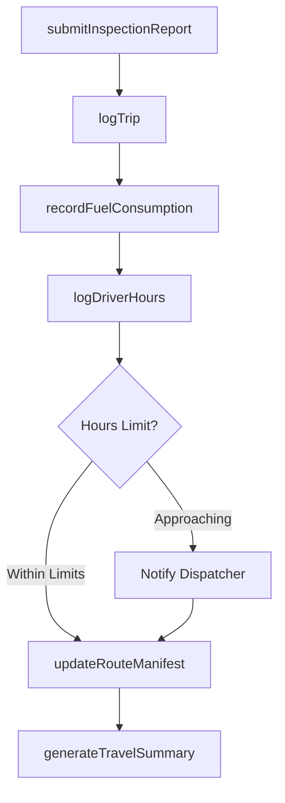
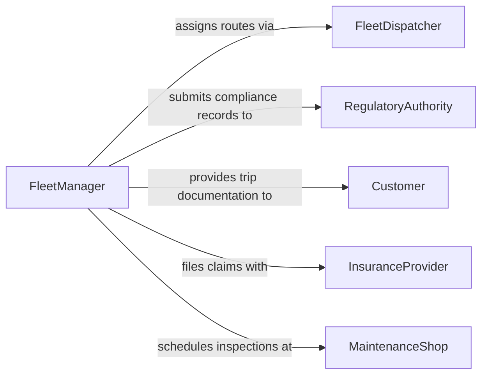

# Record Operational Details Travel

> Business-as-Code definition for recording operational details of travel. Models the documentation of trip logistics, mileage, routes, schedules, and compliance data for transportation and fleet operations.

## Overview

Recording operational details of travel involves documenting trip routes, distances, fuel consumption, departure and arrival times, cargo manifests, and driver hours for vehicles, aircraft, or vessels. This data supports regulatory compliance with hours-of-service rules, enables fleet optimization, and provides an auditable record of transportation operations. Accurate travel records are essential for cost accounting, insurance claims, and safety reporting.

## Actors

| Actor | Description |
|-------|-------------|
| RegulatoryAuthority | Government agency enforcing transportation safety and hours-of-service rules |
| Customer | Party whose goods or passengers are being transported |
| InsuranceProvider | Carrier underwriting coverage for vehicles and cargo |
| FuelSupplier | Vendor providing fuel and related consumption data |
| MaintenanceShop | Service provider performing vehicle inspections and repairs |

## Roles

| Role | Description |
|------|-------------|
| Driver | Operates the vehicle and logs trip details and hours |
| FleetDispatcher | Coordinates routes and schedules for fleet vehicles |
| ComplianceAnalyst | Reviews travel logs for regulatory adherence |
| FleetManager | Oversees overall fleet operations and cost management |

## Entities

| Entity | Description |
|--------|-------------|
| TripLog | Record of a single journey including route, times, and mileage |
| HoursOfServiceRecord | Documentation of driver work and rest periods |
| FuelRecord | Log of fuel purchases and consumption per trip or vehicle |
| RouteManifest | Cargo or passenger details associated with a route |
| VehicleInspectionReport | Pre-trip and post-trip safety inspection documentation |
| MileageEntry | Distance recorded for a specific segment or period |

## Actions

| Action | Description |
|--------|-------------|
| logTrip | Record departure, arrival, route, and mileage for a journey |
| recordFuelConsumption | Document fuel purchased and consumed during a trip |
| logDriverHours | Capture work, driving, and rest periods for compliance |
| submitInspectionReport | File a pre-trip or post-trip vehicle inspection record |
| updateRouteManifest | Add or modify cargo and passenger details for a route |
| generateTravelSummary | Produce a summary report of travel operations for a period |

## Events

| Event | Description |
|-------|-------------|
| tripLogged | A journey's operational details have been recorded |
| fuelConsumptionRecorded | Fuel usage for a trip has been documented |
| driverHoursLogged | Driver work and rest periods have been captured |
| inspectionReportSubmitted | A vehicle inspection report has been filed |
| hoursLimitApproaching | A driver is nearing the maximum allowable hours of service |
| travelSummaryGenerated | A period summary of travel operations has been produced |

## Searches

| Search | Description |
|--------|-------------|
| findTripLogs | Locate trip records by vehicle, driver, date, or route |
| getDriverHours | Retrieve hours-of-service records by driver and date range |
| getFuelRecords | Find fuel consumption entries by vehicle or trip |
| getInspectionReports | List vehicle inspection reports by status or date |

## Workflow



## Actor Relationships



## Usage

### Calling Actions

```typescript
import { recordOperationalDetailsTravel } from '@headlessly/record-operational-details-travel'

const travel = recordOperationalDetailsTravel()

// Log a completed trip
const trip = await travel.logTrip({
  vehicleId: 'TRK-4410',
  driverId: 'DRV-0087',
  route: { origin: 'Chicago, IL', destination: 'Indianapolis, IN' },
  departure: '2026-02-04T06:00:00Z',
  arrival: '2026-02-04T09:45:00Z',
  mileage: 184
})

// Record fuel consumption for the trip
await travel.recordFuelConsumption({
  tripId: trip.id,
  gallons: 28.5,
  cost: 98.32,
  station: 'Interstate Fuel Stop #412'
})

// Log driver hours of service
await travel.logDriverHours({
  driverId: 'DRV-0087',
  date: '2026-02-04',
  driving: 3.75,
  onDuty: 5.0,
  offDuty: 10.0,
  sleeper: 8.0
})
```

### Event-Driven Automation

```typescript
// Alert dispatcher when driver approaches hours limit
travel.hoursLimitApproaching(async ({ driverId, remainingHours }) => {
  await notify({
    to: 'dispatch-team',
    message: `Driver ${driverId} has ${remainingHours}h remaining before hours-of-service limit`
  })
})

// Auto-generate weekly travel summaries
travel.tripLogged(async ({ vehicleId, date }) => {
  if (isEndOfWeek(date)) {
    await travel.generateTravelSummary({
      vehicleId,
      period: 'weekly'
    })
  }
})
```
