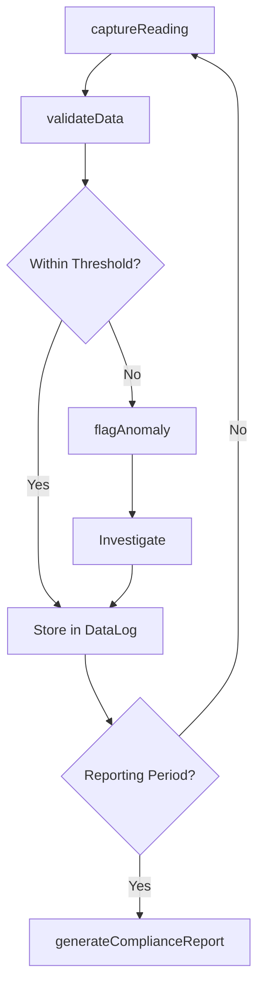
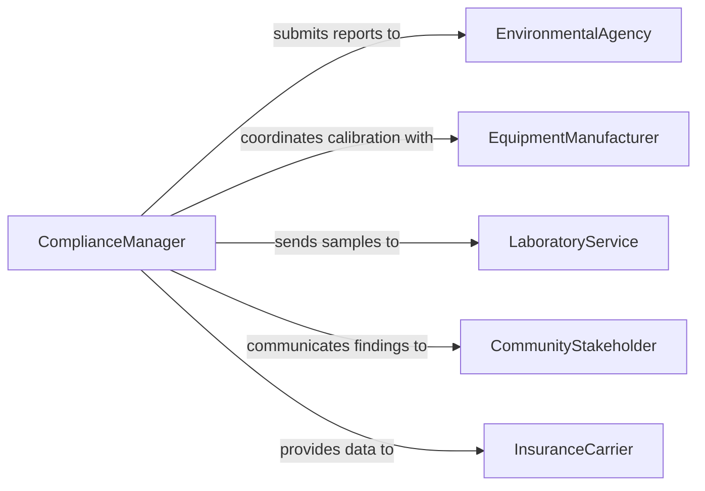

# Record Operational Environmental Data

> Business-as-Code definition for recording operational and environmental data. Models the capture, validation, and storage of measurements from equipment readings, environmental sensors, and operational monitoring systems.

## Overview

Recording operational and environmental data involves capturing instrument readings, sensor measurements, equipment performance metrics, and environmental conditions such as temperature, pressure, humidity, and emissions levels. This data is essential for process control, regulatory reporting, and predictive maintenance across manufacturing, energy, utilities, and environmental management operations. Systematic data recording ensures traceability and supports continuous improvement initiatives.

## Actors

| Actor | Description |
|-------|-------------|
| EnvironmentalAgency | Regulatory body requiring environmental monitoring and reporting |
| EquipmentManufacturer | Provides specifications and calibration standards for instruments |
| LaboratoryService | External lab performing sample analysis and validation |
| CommunityStakeholder | Local residents or groups concerned with environmental impact |
| InsuranceCarrier | Underwriter requiring operational data for risk assessment |

## Roles

| Role | Description |
|------|-------------|
| PlantOperator | Reads instruments and records operational measurements |
| EnvironmentalTechnician | Collects environmental samples and logs monitoring data |
| DataAnalyst | Validates, aggregates, and trends recorded data |
| ComplianceManager | Ensures data collection meets regulatory standards |

## Entities

| Entity | Description |
|--------|-------------|
| DataReading | A single measurement from a sensor or instrument at a point in time |
| MonitoringStation | Physical location where environmental sensors are deployed |
| CalibrationRecord | Documentation of instrument calibration and accuracy verification |
| ComplianceReport | Aggregated data report submitted to regulatory agencies |
| Threshold | Defined limit that triggers alerts when a reading exceeds bounds |
| DataLog | Chronological collection of readings for a specific parameter |

## Actions

| Action | Description |
|--------|-------------|
| captureReading | Record a single measurement from a sensor or instrument |
| batchImportReadings | Ingest a set of automated readings from monitoring systems |
| validateData | Check readings against expected ranges and calibration standards |
| flagAnomaly | Mark a data point that falls outside acceptable thresholds |
| generateComplianceReport | Compile readings into a regulatory submission format |
| calibrateInstrument | Document the calibration of a monitoring instrument |
| archiveDataLog | Move historical data logs to long-term storage |

## Events

| Event | Description |
|-------|-------------|
| readingCaptured | A new measurement has been recorded |
| readingsBatchImported | A set of automated readings has been ingested |
| dataValidated | Readings have been checked and confirmed within tolerance |
| anomalyFlagged | A reading has exceeded acceptable threshold limits |
| complianceReportGenerated | A regulatory data report has been compiled |
| instrumentCalibrated | A monitoring instrument has been recalibrated |
| dataLogArchived | Historical data has been moved to long-term storage |

## Searches

| Search | Description |
|--------|-------------|
| findReadings | Retrieve data readings by station, parameter, or date range |
| getAnomalies | List flagged anomalies by severity, type, or time period |
| getCalibrationRecords | Find calibration history for a specific instrument |
| getComplianceReports | Locate submitted compliance reports by period or agency |

## Workflow



## Actor Relationships



## Usage

### Calling Actions

```typescript
import { recordOperationalEnvironmentalData } from '@headlessly/record-operational-environmental-data'

const envData = recordOperationalEnvironmentalData()

// Capture a manual reading from a monitoring station
const reading = await envData.captureReading({
  stationId: 'STATION-NW-07',
  parameter: 'particulate-matter-2.5',
  value: 12.4,
  unit: 'ug/m3',
  timestamp: '2026-02-04T14:30:00Z',
  recordedBy: 'tech-042'
})

// Batch import automated sensor readings
await envData.batchImportReadings({
  stationId: 'STATION-NW-07',
  source: 'scada-export',
  readings: [
    { parameter: 'temperature', value: 22.1, unit: 'C', timestamp: '2026-02-04T14:00:00Z' },
    { parameter: 'humidity', value: 45.3, unit: '%', timestamp: '2026-02-04T14:00:00Z' },
    { parameter: 'pressure', value: 1013.2, unit: 'hPa', timestamp: '2026-02-04T14:00:00Z' }
  ]
})

// Generate a quarterly compliance report
const report = await envData.generateComplianceReport({
  stationIds: ['STATION-NW-07', 'STATION-NW-08'],
  period: { start: '2026-01-01', end: '2026-03-31' },
  agency: 'EPA'
})
```

### Event-Driven Automation

```typescript
// Alert operations when an anomaly is detected
envData.anomalyFlagged(async ({ stationId, parameter, value, threshold }) => {
  await notify({
    to: 'operations-team',
    message: `Anomaly at ${stationId}: ${parameter} reading ${value} exceeds threshold ${threshold}`
  })
})

// Auto-archive data logs older than the retention period
envData.complianceReportGenerated(async ({ period, stationIds }) => {
  for (const stationId of stationIds) {
    await envData.archiveDataLog({
      stationId,
      olderThan: period.start
    })
  }
})
```
