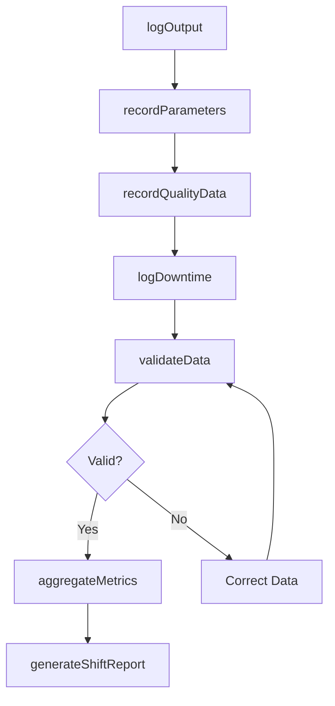
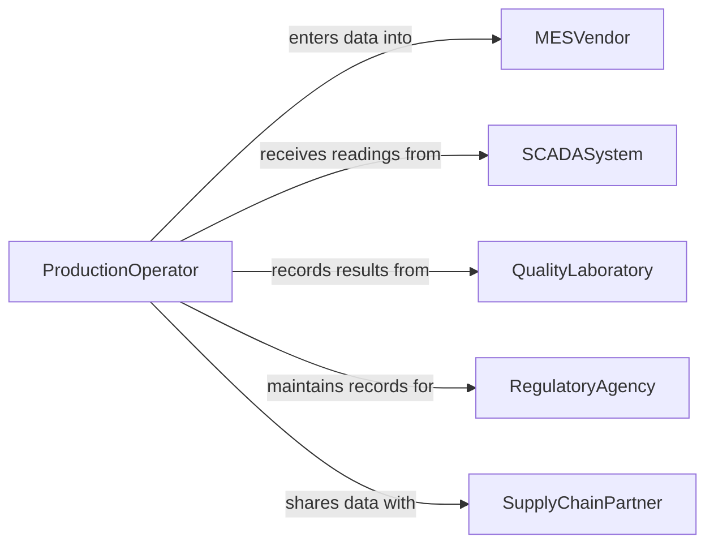

# Record Operational or Production Data

> Business-as-Code definition for operational and production data recording. Models the lifecycle from data capture through logging, validation, aggregation, and reporting of manufacturing and operational metrics.

## Overview

Recording operational or production data involves capturing output quantities, machine parameters, quality measurements, downtime events, and resource consumption during manufacturing or operational processes. This definition exposes actions for data capture and log management, events for threshold monitoring and shift reporting, and searches for production analytics and trend analysis.

## Actors

| Actor | Description |
|-------|-------------|
| MESVendor | Provides the manufacturing execution system for production tracking |
| SCADASystem | Collects real-time machine and process data from equipment |
| QualityLaboratory | Provides test results and quality measurements |
| RegulatoryAgency | Mandates specific production data recording for compliance |
| SupplyChainPartner | Receives production data for planning and coordination |

## Roles

| Role | Description |
|------|-------------|
| ProductionOperator | Records output, quality, and equipment data during shifts |
| ProductionSupervisor | Reviews and validates production data for accuracy |
| ProcessEngineer | Analyzes production data to identify optimization opportunities |
| QualityInspector | Records quality measurements and inspection results |

## Entities

| Entity | Description |
|--------|-------------|
| ProductionLog | A chronological record of output and activities during a shift |
| MachineParameter | A recorded operational setting or reading from production equipment |
| QualityMeasurement | A documented test result or inspection value for a production batch |
| DowntimeEvent | A record of equipment stoppage including cause and duration |
| BatchRecord | A comprehensive document tracking a production batch from start to finish |
| ShiftReport | A summary of production activities and output for a work shift |
| YieldMetric | A calculated measure of production efficiency and waste |

## Actions

| Action | Description |
|--------|-------------|
| logOutput | Record the quantity of units produced during a time period |
| recordParameters | Capture machine settings and operational readings |
| logDowntime | Document equipment stoppages with cause codes and duration |
| recordQualityData | Log inspection results and quality test measurements |
| generateShiftReport | Compile production data into an end-of-shift summary |
| validateData | Verify recorded data against expected ranges and formats |
| aggregateMetrics | Calculate yield, efficiency, and throughput from raw data |

## Events

| Event | Description |
|-------|-------------|
| outputLogged | Production quantities have been recorded |
| parametersRecorded | Machine operational readings have been captured |
| downtimeLogged | An equipment stoppage has been documented |
| qualityDataRecorded | Inspection or test results have been logged |
| shiftReportGenerated | An end-of-shift production summary has been compiled |
| dataValidated | Recorded data has been verified for accuracy |
| thresholdExceeded | A production metric has deviated beyond acceptable limits |

## Searches

| Search | Description |
|--------|-------------|
| getProductionLogs | Retrieve production records by shift, line, or date range |
| findDowntimeEvents | List equipment stoppages by cause, duration, or machine |
| getQualityHistory | Retrieve quality measurements for a product or batch |
| getYieldMetrics | Query production efficiency data by line, product, or period |
| findThresholdViolations | List instances where production data exceeded limits |

## Workflow



## Actor Relationships



## Usage

### Calling Actions

```typescript
import { recordOperationalProductionData } from '@headlessly/record-operational-production-data'

const production = recordOperationalProductionData()

// Log production output
await production.logOutput({
  line: 'assembly-line-3',
  product: 'WIDGET-A100',
  quantity: 450,
  shift: 'day-shift',
  date: '2026-02-05',
  operator: 'team-bravo'
})

// Record machine parameters
await production.recordParameters({
  machine: 'CNC-MILL-07',
  readings: {
    spindleSpeed: 8500,
    feedRate: 250,
    temperature: 68.2,
    vibration: 0.003
  },
  timestamp: '2026-02-05T14:30:00Z'
})

// Log a downtime event
await production.logDowntime({
  machine: 'CNC-MILL-07',
  startTime: '2026-02-05T15:12:00Z',
  endTime: '2026-02-05T15:47:00Z',
  causeCode: 'tool-breakage',
  description: 'End mill fracture during roughing pass'
})
```

### Event-Driven Automation

```typescript
// Alert on threshold violations
production.thresholdExceeded(async ({ metric, value, threshold, machine }) => {
  await notify({
    to: 'production-supervisor',
    message: `${metric} on ${machine} at ${value} (limit: ${threshold})`
  })
})

// Auto-generate shift reports
production.outputLogged(async ({ shift, date }) => {
  if (isShiftEnd(shift, date)) {
    await production.generateShiftReport({ shift, date })
  }
})
```
