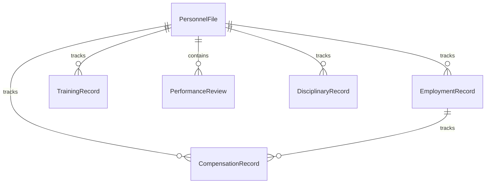
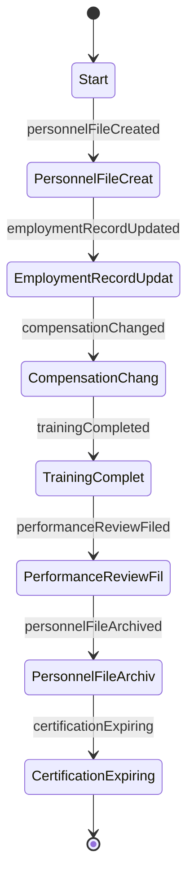
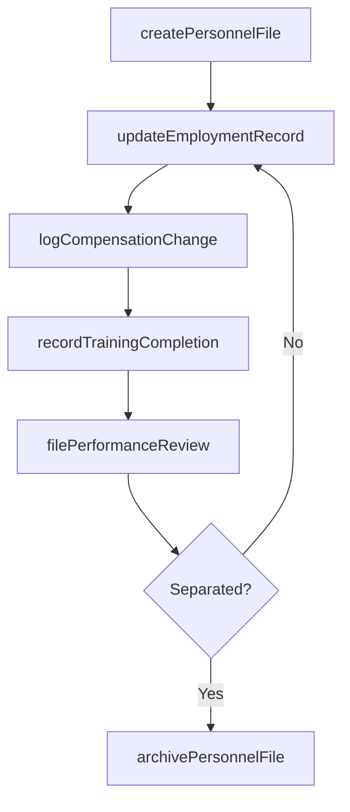
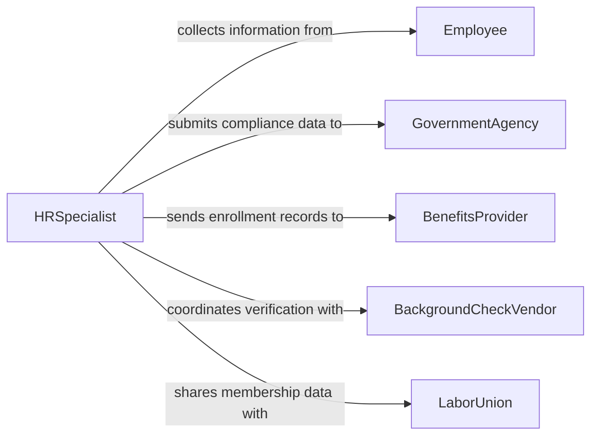

# Record Personnel Information

> Business-as-Code definition for recording personnel information. Models the creation, maintenance, and management of employee records including personal data, employment history, certifications, and performance documentation.

## Overview

Recording personnel information involves capturing and maintaining accurate records of employee demographics, hiring details, compensation, benefits enrollment, training completions, performance evaluations, and disciplinary actions. These records form the foundation of human resources operations, supporting payroll processing, compliance with labor regulations, and workforce planning. Proper personnel recordkeeping ensures data privacy and provides an auditable employment history for each individual.

## Actors

| Actor | Description |
|-------|-------------|
| Employee | Individual whose personal and employment information is recorded |
| GovernmentAgency | Regulatory body requiring employment and labor compliance data |
| BenefitsProvider | Insurance or retirement plan administrator requiring enrollment data |
| BackgroundCheckVendor | Third-party service verifying employment history and credentials |
| LaborUnion | Employee representative organization requiring membership records |

## Roles

| Role | Description |
|------|-------------|
| HRSpecialist | Creates and maintains employee personnel files |
| PayrollAdministrator | Processes compensation data and tax withholding records |
| HRManager | Oversees personnel recordkeeping policies and compliance |
| RecordsClerk | Handles filing, retrieval, and archival of personnel documents |

## Entities

| Entity | Description |
|--------|-------------|
| PersonnelFile | Comprehensive record of an employee's employment history |
| EmploymentRecord | Documentation of hire date, position, department, and status changes |
| CompensationRecord | Salary, wages, bonuses, and withholding documentation |
| TrainingRecord | Log of completed training courses and certifications |
| PerformanceReview | Documented evaluation of employee performance |
| DisciplinaryRecord | Formal documentation of workplace policy violations and actions taken |

## Actions

| Action | Description |
|--------|-------------|
| createPersonnelFile | Initialize a new employee record upon hire |
| updateEmploymentRecord | Record a position change, transfer, or status update |
| logCompensationChange | Document a salary adjustment, bonus, or withholding change |
| recordTrainingCompletion | Log a completed training course or certification |
| filePerformanceReview | Store a completed performance evaluation |
| archivePersonnelFile | Move a separated employee's records to long-term storage |
| generateHeadcountReport | Produce a workforce summary by department, location, or status |

## Events

| Event | Description |
|-------|-------------|
| personnelFileCreated | A new employee record has been established |
| employmentRecordUpdated | A position or status change has been documented |
| compensationChanged | A salary or withholding adjustment has been recorded |
| trainingCompleted | An employee training course or certification has been logged |
| performanceReviewFiled | A performance evaluation has been stored |
| personnelFileArchived | A separated employee's records have been moved to archive |
| certificationExpiring | An employee credential is approaching its expiration date |

## Searches

| Search | Description |
|--------|-------------|
| findPersonnelFiles | Locate employee records by name, ID, department, or status |
| getTrainingRecords | Retrieve training completions by employee or course |
| getCompensationHistory | Find salary and compensation changes for an employee |
| getExpiringCertifications | List certifications expiring within a given time window |

## Entity Relationships



## State Diagram



## Workflow



## Actor Relationships



## Usage

### Calling Actions

```typescript
import { recordPersonnelInformation } from '@headlessly/record-personnel-information'

const personnel = recordPersonnelInformation()

// Create a new personnel file for a new hire
const file = await personnel.createPersonnelFile({
  employeeId: 'EMP-2026-1147',
  firstName: 'Maria',
  lastName: 'Gonzalez',
  hireDate: '2026-02-10',
  department: 'Engineering',
  position: 'Software Developer'
})

// Record a completed training course
await personnel.recordTrainingCompletion({
  employeeId: 'EMP-2026-1147',
  course: 'Workplace Safety Fundamentals',
  completedDate: '2026-02-12',
  certificationExpiry: '2027-02-12'
})

// Log a compensation change
await personnel.logCompensationChange({
  employeeId: 'EMP-2026-1147',
  effectiveDate: '2026-07-01',
  previousSalary: 85000,
  newSalary: 92000,
  reason: 'annual-merit-increase'
})
```

### Event-Driven Automation

```typescript
// Notify HR when a certification is about to expire
personnel.certificationExpiring(async ({ employeeId, certification, expiryDate }) => {
  await notify({
    to: 'hr-team',
    message: `${certification} for employee ${employeeId} expires on ${expiryDate}`
  })
})

// Trigger benefits enrollment when a new personnel file is created
personnel.personnelFileCreated(async ({ employeeId, hireDate }) => {
  await triggerBenefitsEnrollment({
    employeeId,
    enrollmentDeadline: addDays(hireDate, 30)
  })
})
```
