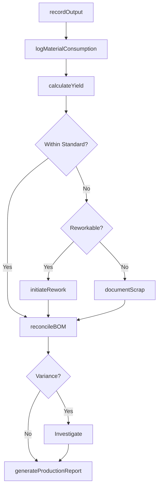
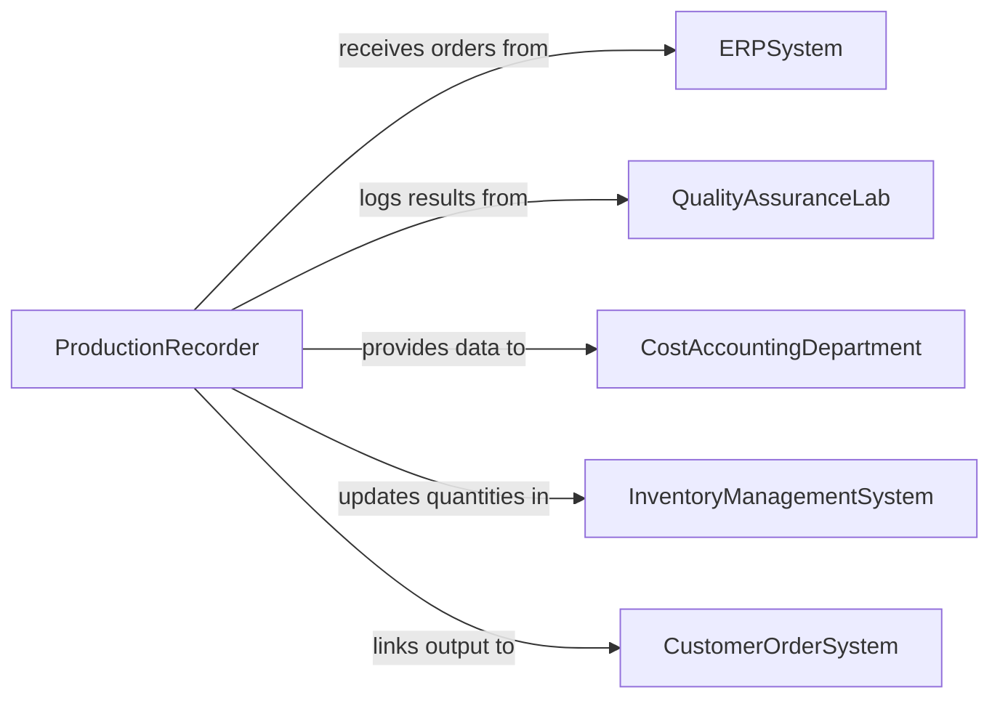

# Record Production Information

> Business-as-Code definition for recording production information. Models the lifecycle from production order documentation through output recording, material consumption tracking, yield calculation, waste logging, and production performance reporting.

## Overview

Recording production information involves documenting production orders, capturing output quantities and batch details, tracking raw material consumption against bill of materials, calculating yields and waste percentages, recording scrap and rework decisions, and producing production performance reports for operations and finance. This definition exposes actions for output documentation and yield tracking, events for variance detection and production milestone completion, and searches for production analytics and material traceability.

## Actors

| Actor | Description |
|-------|-------------|
| ERPSystem | Provides production orders, bill of materials, and cost data |
| QualityAssuranceLab | Provides test results that determine product acceptance or rejection |
| CostAccountingDepartment | Requires production data for standard cost variance analysis |
| InventoryManagementSystem | Tracks raw material availability and finished goods receipts |
| CustomerOrderSystem | Links production output to customer demand and delivery schedules |

## Roles

| Role | Description |
|------|-------------|
| ProductionRecorder | Documents output quantities, material usage, and production events |
| ShiftLeader | Validates production records and resolves data discrepancies |
| CostAnalyst | Analyzes production data for variance and efficiency reporting |
| MaterialController | Reconciles material consumption records against inventory movements |

## Entities

| Entity | Description |
|--------|-------------|
| ProductionOrder | A documented directive to manufacture a specific product in a given quantity |
| OutputRecord | A record of finished goods produced with quantities and batch identifiers |
| MaterialConsumption | A log of raw materials used during production with lot traceability |
| YieldCalculation | A computed measure of actual output versus theoretical output |
| ScrapRecord | A documented account of materials or products that failed quality standards |
| ReworkOrder | A directive to reprocess nonconforming product to meet specifications |
| ProductionReport | A summary of output, yield, waste, and efficiency for a production period |

## Actions

| Action | Description |
|--------|-------------|
| recordOutput | Document finished goods produced with batch number and quantity |
| logMaterialConsumption | Record raw materials consumed against the production order |
| calculateYield | Compute actual yield percentage against the theoretical standard |
| documentScrap | Record scrapped materials or products with reason codes |
| initiateRework | Create a rework order for nonconforming product |
| reconcileBOM | Compare actual material usage against the bill of materials |
| generateProductionReport | Produce a summary of output, efficiency, and variances for a period |

## Events

| Event | Description |
|-------|-------------|
| outputRecorded | Finished goods quantities have been documented |
| materialConsumptionLogged | Raw material usage has been recorded against a production order |
| yieldCalculated | Actual versus theoretical yield has been computed |
| scrapDocumented | Rejected materials or products have been recorded with reasons |
| reworkInitiated | A reprocessing order has been created for nonconforming product |
| bomVarianceDetected | Actual material usage deviates from bill of materials standards |
| productionReportGenerated | A period summary of production performance has been produced |

## Searches

| Search | Description |
|--------|-------------|
| findProductionOrders | Search orders by product, status, date range, or production line |
| getOutputHistory | Retrieve finished goods records by product, batch, or period |
| getMaterialUsage | Query raw material consumption by production order or material lot |
| getYieldTrends | Analyze yield percentages over time by product or line |
| findScrapRecords | List scrap events by reason code, product, or cost impact |

## Workflow



## Actor Relationships



## Usage

### Calling Actions

```typescript
import { recordProductionInformation } from '@headlessly/record-production-information'

const production = recordProductionInformation()

// Record finished goods output
await production.recordOutput({
  productionOrder: 'PO-2026-0448',
  product: 'WIDGET-PREMIUM-A',
  batchNumber: 'BN-0448-001',
  quantity: 2400,
  unitOfMeasure: 'each',
  productionLine: 'assembly-line-1',
  completedDate: '2026-02-05',
  recordedBy: 'recorder-mpark'
})

// Log material consumption
await production.logMaterialConsumption({
  productionOrder: 'PO-2026-0448',
  materials: [
    { sku: 'HOUSING-ALU-6061', lot: 'RM-2026-1102', consumed: 2420, unit: 'each' },
    { sku: 'CIRCUIT-BOARD-V3', lot: 'RM-2026-0988', consumed: 2405, unit: 'each' },
    { sku: 'FASTENER-KIT-M4', lot: 'RM-2026-1204', consumed: 2400, unit: 'kit' }
  ]
})

// Calculate and record yield
await production.calculateYield({
  productionOrder: 'PO-2026-0448',
  theoreticalOutput: 2500,
  actualOutput: 2400,
  scrapQuantity: 80,
  reworkQuantity: 20
})
```

### Event-Driven Automation

```typescript
// Alert on BOM variance
production.bomVarianceDetected(async ({ productionOrder, material, expected, actual, variancePercent }) => {
  await notify({
    to: 'material-controller',
    message: `BOM variance on ${productionOrder}: ${material} used ${actual} vs expected ${expected} (${variancePercent}% over)`
  })
})

// Trigger cost analysis on low yield
production.yieldCalculated(async ({ productionOrder, yieldPercent, threshold }) => {
  if (yieldPercent < threshold) {
    await notify({
      to: 'cost-analyst',
      message: `Low yield on ${productionOrder}: ${yieldPercent}% vs ${threshold}% standard - cost impact analysis needed`
    })
  }
})
```
