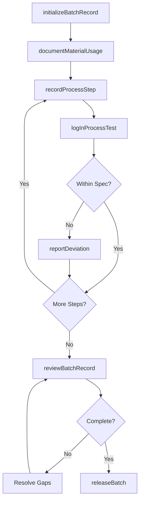
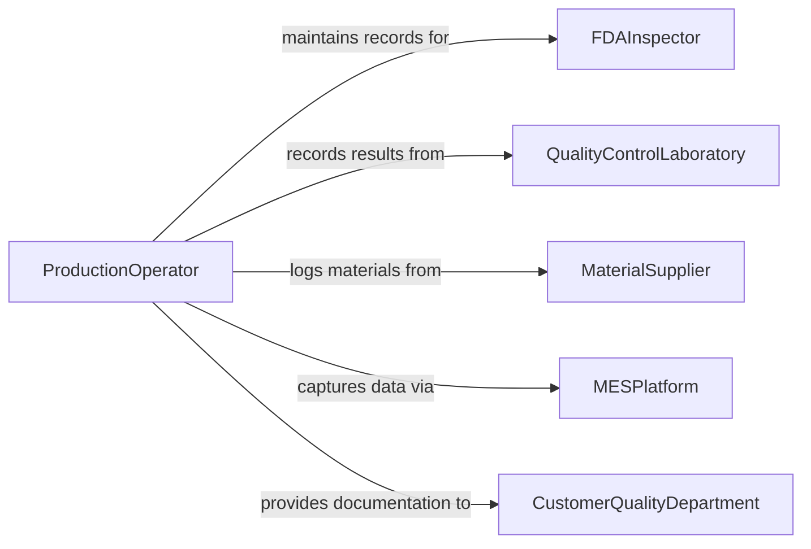

# Record Production, Testing, and Operational Data

> Business-as-Code definition for recording production, testing, and operational data. Models the lifecycle from raw data collection through batch documentation, in-process testing, quality hold management, lot traceability, and regulatory batch record completion.

## Overview

Recording production, testing, and operational data involves capturing manufacturing batch records, documenting in-process quality checks, logging equipment operating parameters, recording raw material consumption, tracking lot traceability through production stages, and completing regulatory batch documentation. This definition exposes actions for batch recording and quality documentation, events for deviation detection and batch release triggers, and searches for production history and lot traceability.

## Actors

| Actor | Description |
|-------|-------------|
| FDAInspector | Audits batch records for compliance with current Good Manufacturing Practice |
| QualityControlLaboratory | Provides in-process and finished-product testing results |
| MaterialSupplier | Provides certificates of analysis for raw materials used in production |
| MESPlatform | Collects automated production data from manufacturing equipment |
| CustomerQualityDepartment | Reviews batch documentation as part of supplier qualification |

## Roles

| Role | Description |
|------|-------------|
| ProductionOperator | Records batch activities, measurements, and process observations |
| QualityControlTechnician | Performs and documents in-process and finished-product testing |
| BatchRecordReviewer | Verifies batch documentation completeness and accuracy before release |
| ProductionManager | Approves batch records and authorizes product release decisions |

## Entities

| Entity | Description |
|--------|-------------|
| BatchRecord | A comprehensive document tracking a production run from start to finish |
| InProcessTest | A quality measurement taken during manufacturing to verify process control |
| RawMaterialLog | A record of ingredients or components consumed in a production batch |
| EquipmentReading | An operational parameter captured from manufacturing equipment |
| DeviationReport | A documented departure from the approved manufacturing procedure |
| LotTraceabilityRecord | A mapping linking raw material lots to finished product lots |
| BatchReleaseDecision | A formal determination that a batch meets all quality and regulatory criteria |

## Actions

| Action | Description |
|--------|-------------|
| initializeBatchRecord | Create a new batch record with product, quantity, and procedure reference |
| recordProcessStep | Document the completion of a manufacturing step with parameters and observations |
| logInProcessTest | Record an in-process quality measurement with result and specification |
| documentMaterialUsage | Log raw materials consumed with lot numbers and quantities |
| reportDeviation | Document a departure from the approved manufacturing procedure |
| reviewBatchRecord | Verify completeness and accuracy of all batch documentation |
| releaseBatch | Authorize a batch for distribution after quality review |

## Events

| Event | Description |
|-------|-------------|
| batchRecordInitialized | A new production batch record has been created |
| processStepRecorded | A manufacturing step has been documented with its parameters |
| inProcessTestLogged | A quality measurement has been recorded during production |
| materialUsageDocumented | Raw material consumption has been logged for a batch |
| deviationReported | A departure from the approved procedure has been documented |
| batchRecordReviewed | Batch documentation has been verified for completeness |
| batchReleased | A batch has been authorized for distribution |

## Searches

| Search | Description |
|--------|-------------|
| findBatchRecords | Search production records by product, date, lot number, or status |
| getInProcessResults | Retrieve test measurements by batch, test type, or specification |
| getLotTraceability | Trace raw material lots through to finished product lots |
| findDeviations | List deviations by batch, severity, or resolution status |
| getBatchesPendingRelease | Query batches awaiting quality review and release authorization |

## Workflow



## Actor Relationships



## Usage

### Calling Actions

```typescript
import { recordProductionTestingOperational } from '@headlessly/record-production-testing-operational'

const production = recordProductionTestingOperational()

// Initialize a new batch record
const batch = await production.initializeBatchRecord({
  product: 'TABLET-ACETAMINOPHEN-500MG',
  batchNumber: 'BN-2026-0221',
  batchSize: 500000,
  unit: 'tablets',
  masterBatchRecord: 'MBR-ACT500-R04',
  startDate: '2026-02-05',
  assignedLine: 'tablet-press-line-2'
})

// Document raw material usage
await production.documentMaterialUsage({
  batchId: batch.id,
  materials: [
    { name: 'Acetaminophen USP', lotNumber: 'RM-2026-0088', quantity: 250, unit: 'kg' },
    { name: 'Microcrystalline Cellulose NF', lotNumber: 'RM-2026-0112', quantity: 80, unit: 'kg' },
    { name: 'Stearic Acid NF', lotNumber: 'RM-2026-0094', quantity: 15, unit: 'kg' }
  ]
})

// Log an in-process quality test
await production.logInProcessTest({
  batchId: batch.id,
  testType: 'tablet-hardness',
  specification: { min: 8, max: 14, unit: 'kp' },
  result: 11.2,
  testedBy: 'qc-tech-amartinez',
  sampleId: 'IPC-0221-003',
  timestamp: '2026-02-05T14:30:00Z'
})
```

### Event-Driven Automation

```typescript
// Alert on production deviations
production.deviationReported(async ({ batchId, severity, description }) => {
  if (severity === 'critical') {
    await notify({
      to: 'production-manager',
      message: `Critical deviation on batch ${batchId}: ${description} - production hold required`
    })
  }
})

// Notify quality team when batch is ready for review
production.processStepRecorded(async ({ batchId, isLastStep }) => {
  if (isLastStep) {
    await notify({
      to: 'batch-record-reviewer',
      message: `Batch ${batchId} production complete - ready for documentation review and release`
    })
  }
})
```
