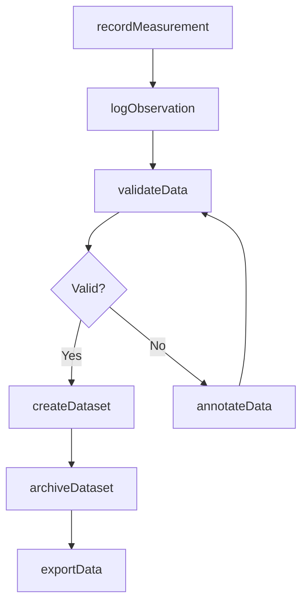
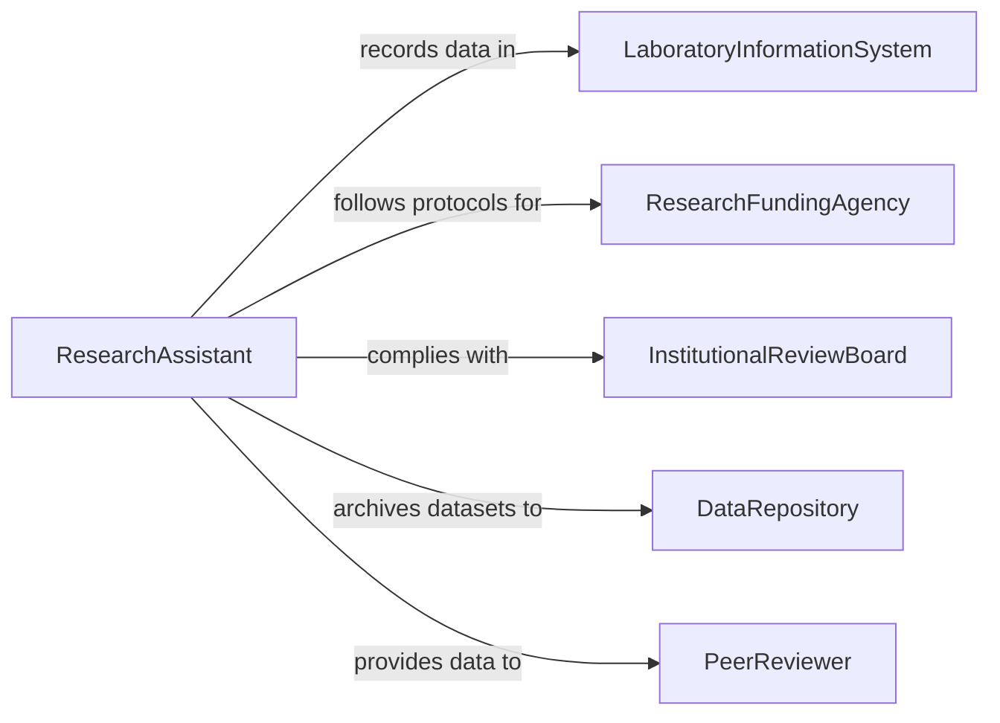

# Record Research or Operational Data

> Business-as-Code definition for research and operational data recording. Models the lifecycle from experiment execution through data capture, observation logging, dataset management, and research findings documentation.

## Overview

Recording research or operational data involves capturing experimental measurements, logging field observations, documenting laboratory results, managing research datasets, and maintaining chain-of-custody records for scientific and operational investigations. This definition exposes actions for data capture and dataset management, events for data collection milestones and anomaly detection, and searches for research data retrieval and analysis support.

## Actors

| Actor | Description |
|-------|-------------|
| LaboratoryInformationSystem | Provides the platform for recording experimental data and instrument readings |
| ResearchFundingAgency | Requires documented data management practices for grant compliance |
| InstitutionalReviewBoard | Mandates data handling protocols for human subjects research |
| DataRepository | Provides long-term storage and public access for completed research datasets |
| PeerReviewer | Evaluates research data quality and methodology during publication review |

## Roles

| Role | Description |
|------|-------------|
| ResearchAssistant | Captures experimental measurements and field observations |
| PrincipalInvestigator | Oversees data collection protocols and validates research findings |
| DataManager | Organizes datasets, applies metadata standards, and manages archives |
| LaboratoryTechnician | Records instrument readings and calibration data during experiments |

## Entities

| Entity | Description |
|--------|-------------|
| ExperimentRecord | A documented account of an experimental procedure and its conditions |
| DataPoint | A single measured value captured during an experiment or observation |
| FieldObservation | A recorded observation from a site visit or environmental survey |
| Dataset | An organized collection of data points with associated metadata |
| CalibrationLog | A record of instrument calibration settings and verification results |
| DataManagementPlan | A document describing how research data will be collected, stored, and shared |
| ResearchNotebook | A chronological log of all research activities and observations |

## Actions

| Action | Description |
|--------|-------------|
| recordMeasurement | Capture a data point from an experiment or instrument reading |
| logObservation | Document a field or laboratory observation with context and conditions |
| createDataset | Initialize an organized collection of research data with metadata |
| validateData | Check recorded values against expected ranges and quality criteria |
| annotateData | Add contextual notes, flags, or corrections to recorded data points |
| archiveDataset | Submit a completed dataset to a repository for long-term storage |
| exportData | Generate formatted data files for analysis, sharing, or publication |

## Events

| Event | Description |
|-------|-------------|
| measurementRecorded | A data point has been captured from an experiment or instrument |
| observationLogged | A field or laboratory observation has been documented |
| datasetCreated | A new organized data collection has been initialized |
| dataValidated | Recorded values have been checked against quality criteria |
| anomalyDetected | A data point has been flagged as outside expected parameters |
| datasetArchived | A completed dataset has been submitted to a repository |
| dataExported | Research data has been formatted and exported for analysis |

## Searches

| Search | Description |
|--------|-------------|
| findDatasets | Search research datasets by project, investigator, or date range |
| getMeasurements | Retrieve recorded data points by experiment, instrument, or parameter |
| findAnomalies | List data points flagged as outside expected ranges |
| getExperimentHistory | Retrieve all data records for a specific experiment or study |
| getCalibrationHistory | Query instrument calibration records by device and date |

## Workflow



## Actor Relationships



## Usage

### Calling Actions

```typescript
import { recordResearchOperationalData } from '@headlessly/record-research-operational-data'

const research = recordResearchOperationalData()

// Record experimental measurements
await research.recordMeasurement({
  experiment: 'TRIAL-2026-047',
  instrument: 'spectrophotometer-UV-3600',
  parameter: 'absorbance-at-450nm',
  value: 0.342,
  unit: 'AU',
  timestamp: '2026-02-05T09:15:00Z',
  conditions: { temperature: 22.1, humidity: 45 }
})

// Log a field observation
await research.logObservation({
  study: 'wetland-survey-2026',
  location: { lat: 38.9072, lng: -77.0369, site: 'potomac-reach-3' },
  observation: 'Water level 0.3m above seasonal average, turbidity elevated',
  category: 'hydrology',
  date: '2026-02-05'
})

// Create and archive a dataset
const dataset = await research.createDataset({
  project: 'TRIAL-2026-047',
  title: 'UV Absorbance Time Series - Phase II',
  format: 'csv',
  recordCount: 1440,
  metadata: { method: 'continuous-monitoring', interval: '1-minute' }
})
```

### Event-Driven Automation

```typescript
// Flag anomalous readings
research.anomalyDetected(async ({ experiment, parameter, value, expectedRange }) => {
  await notify({
    to: 'principal-investigator',
    message: `Anomaly in ${experiment}: ${parameter} = ${value} (expected: ${expectedRange})`
  })
})

// Auto-archive datasets on completion
research.dataValidated(async ({ datasetId, validationScore }) => {
  if (validationScore >= 0.95) {
    await research.archiveDataset({ datasetId, repository: 'institutional-data-archive' })
  }
})
```
