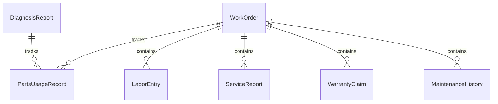
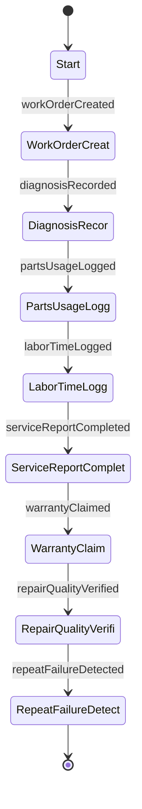
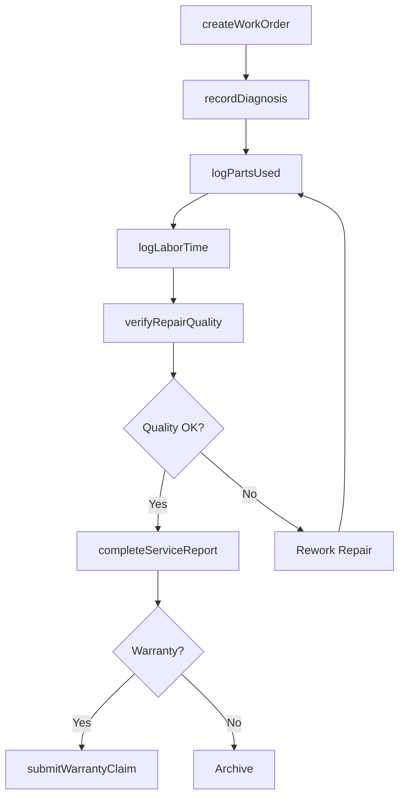
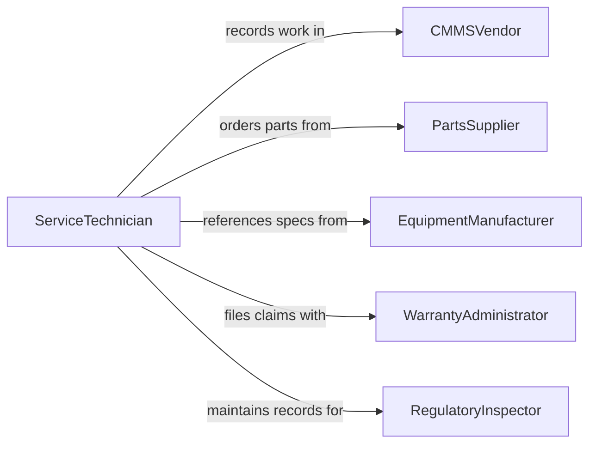

# Record Service or Repair Activities

> Business-as-Code definition for service and repair activity documentation. Models the lifecycle from work order creation through diagnosis, parts usage, labor tracking, quality verification, and service history archival.

## Overview

Recording service or repair activities involves documenting work orders, capturing diagnosis findings, tracking parts consumed and labor hours, logging corrective actions taken, and maintaining complete service histories for equipment and customer assets. This definition exposes actions for work order documentation and parts tracking, events for service completion and warranty monitoring, and searches for service history retrieval and maintenance analytics.

## Actors

| Actor | Description |
|-------|-------------|
| CMMSVendor | Provides the computerized maintenance management system for work order tracking |
| PartsSupplier | Delivers replacement components and materials for repair activities |
| EquipmentManufacturer | Provides technical specifications, service bulletins, and warranty terms |
| WarrantyAdministrator | Manages warranty claims and coverage verification |
| RegulatoryInspector | Requires documented service records for compliance with safety standards |

## Roles

| Role | Description |
|------|-------------|
| ServiceTechnician | Performs repairs and documents work performed and parts used |
| MaintenanceSupervisor | Reviews service records for completeness and quality |
| PartsCoordinator | Tracks parts consumption and availability for repair activities |
| ServiceDispatcher | Assigns work orders and schedules service appointments |

## Entities

| Entity | Description |
|--------|-------------|
| WorkOrder | A formal request and record of service or repair work to be performed |
| DiagnosisReport | A documented assessment of the fault or condition requiring repair |
| PartsUsageRecord | A log of replacement components consumed during a repair |
| LaborEntry | A record of technician time spent on a specific service task |
| ServiceReport | A comprehensive summary of all work performed on a service call |
| WarrantyClaim | A documented request for manufacturer coverage of repair costs |
| MaintenanceHistory | The chronological record of all service activities for an asset |

## Actions

| Action | Description |
|--------|-------------|
| createWorkOrder | Initialize a service request with asset details and reported symptoms |
| recordDiagnosis | Document the root cause analysis and fault identification findings |
| logPartsUsed | Record replacement parts and materials consumed during repair |
| logLaborTime | Document technician hours and task descriptions for a work order |
| completeServiceReport | Finalize the service record with outcomes and recommendations |
| submitWarrantyClaim | File a claim for warranty-covered repair costs |
| verifyRepairQuality | Confirm the repair meets operational standards before closing |

## Events

| Event | Description |
|-------|-------------|
| workOrderCreated | A new service request has been initialized |
| diagnosisRecorded | The fault analysis findings have been documented |
| partsUsageLogged | Replacement components consumed have been recorded |
| laborTimeLogged | Technician hours and tasks have been documented |
| serviceReportCompleted | A service activity summary has been finalized |
| warrantyClaimed | A warranty claim has been submitted to the manufacturer |
| repairQualityVerified | The completed repair has passed quality inspection |
| repeatFailureDetected | An asset has required repair for the same fault multiple times |

## Searches

| Search | Description |
|--------|-------------|
| findWorkOrders | Search service records by asset, technician, date, or status |
| getMaintenanceHistory | Retrieve the complete service history for a specific asset |
| getPartsConsumption | Query parts usage by type, supplier, or time period |
| findOpenWorkOrders | List service requests that have not yet been completed |
| findRecurringFailures | Identify assets with repeated service calls for the same issue |

## Entity Relationships



## State Diagram



## Workflow



## Actor Relationships



## Usage

### Calling Actions

```typescript
import { recordServiceRepairActivities } from '@headlessly/record-service-repair-activities'

const service = recordServiceRepairActivities()

// Create a work order
const workOrder = await service.createWorkOrder({
  asset: 'HVAC-UNIT-B12',
  location: 'building-3-floor-2',
  reportedBy: 'facilities-manager',
  symptoms: 'Unit not cooling, compressor cycling intermittently',
  priority: 'high'
})

// Record diagnosis findings
await service.recordDiagnosis({
  workOrderId: workOrder.id,
  rootCause: 'Compressor start capacitor failed',
  faultCode: 'HVAC-COMP-CAP-001',
  recommendation: 'Replace start capacitor and test run cycles'
})

// Log parts and labor
await service.logPartsUsed({
  workOrderId: workOrder.id,
  parts: [
    { partNumber: 'CAP-45-5-370', description: 'Start capacitor 45/5 MFD 370V', quantity: 1 }
  ]
})

await service.logLaborTime({
  workOrderId: workOrder.id,
  technician: 'tech-martinez',
  hours: 2.5,
  tasks: ['Diagnosis', 'Capacitor replacement', 'System test']
})
```

### Event-Driven Automation

```typescript
// Flag recurring failures
service.repeatFailureDetected(async ({ asset, faultCode, occurrences }) => {
  await notify({
    to: 'maintenance-supervisor',
    message: `Asset ${asset} has failed ${occurrences} times for ${faultCode} - consider replacement`
  })
})

// Auto-generate warranty claims for covered assets
service.serviceReportCompleted(async ({ workOrderId, asset, totalCost }) => {
  const warranty = await checkWarrantyStatus(asset)
  if (warranty.active) {
    await service.submitWarrantyClaim({ workOrderId, warrantyId: warranty.id })
  }
})
```
