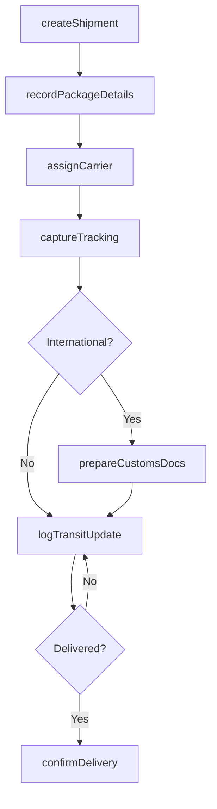
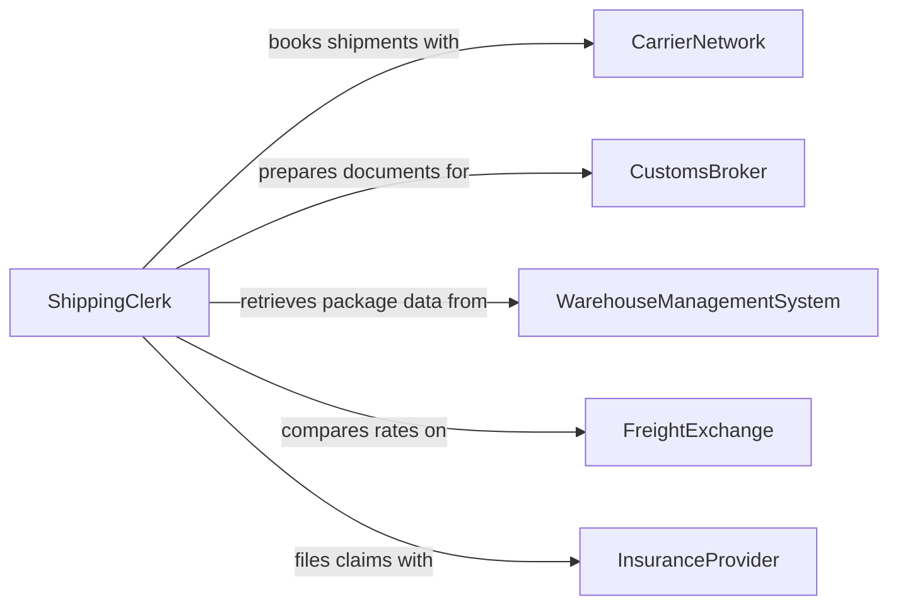

# Record Shipping Information

> Business-as-Code definition for shipping information recording. Models the lifecycle from shipment creation through carrier assignment, tracking number capture, weight and dimension logging, customs documentation, and delivery confirmation.

## Overview

Recording shipping information involves documenting package details, carrier selections, tracking numbers, weights, dimensions, customs declarations, and delivery confirmations for outbound and inbound shipments. This definition exposes actions for shipment documentation and tracking updates, events for transit milestone monitoring and exception handling, and searches for shipment history and logistics analytics.

## Actors

| Actor | Description |
|-------|-------------|
| CarrierNetwork | Provides freight and parcel shipping services with tracking capabilities |
| CustomsBroker | Facilitates international shipment clearance and documentation |
| WarehouseManagementSystem | Provides package details and inventory data for shipment recording |
| FreightExchange | Offers rate comparisons and carrier selection for shipping |
| InsuranceProvider | Covers shipments against loss, damage, or delay |

## Roles

| Role | Description |
|------|-------------|
| ShippingClerk | Records shipment details and generates shipping labels and documents |
| LogisticsCoordinator | Manages carrier selection and shipment routing decisions |
| CustomsSpecialist | Prepares international shipping documentation and declarations |
| WarehouseSupervisor | Verifies shipment accuracy before dispatch |

## Entities

| Entity | Description |
|--------|-------------|
| ShipmentRecord | A comprehensive document of a single outbound or inbound shipment |
| TrackingEntry | A timestamped update on the location or status of a shipment in transit |
| BillOfLading | A legal document between shipper and carrier detailing goods transported |
| PackingSlip | A list of items included in a specific shipment package |
| CustomsDeclaration | A form documenting the contents and value of an international shipment |
| FreightInvoice | A carrier billing document for shipping services rendered |
| ProofOfDelivery | A signed confirmation that a shipment has been received at its destination |

## Actions

| Action | Description |
|--------|-------------|
| createShipment | Initialize a new shipment record with origin, destination, and contents |
| recordPackageDetails | Log weight, dimensions, and handling instructions for each package |
| assignCarrier | Document the selected carrier and service level for a shipment |
| captureTracking | Record tracking numbers and carrier reference codes |
| prepareCustomsDocs | Generate customs declarations and export documentation |
| logTransitUpdate | Record a status change or location update during shipment transit |
| confirmDelivery | Document proof of delivery with signature and timestamp |

## Events

| Event | Description |
|-------|-------------|
| shipmentCreated | A new shipment record has been initialized |
| packageDetailsRecorded | Weight, dimensions, and contents have been logged |
| carrierAssigned | A carrier and service level have been selected and documented |
| trackingCaptured | Tracking numbers have been recorded for a shipment |
| customsDocsCompleted | International shipping documentation has been prepared |
| transitUpdateLogged | A shipment status or location change has been recorded |
| deliveryConfirmed | A shipment has been confirmed as delivered |
| shipmentException | A delay, damage, or routing issue has been detected |

## Searches

| Search | Description |
|--------|-------------|
| findShipments | Search shipment records by date, carrier, destination, or status |
| getTrackingHistory | Retrieve all transit updates for a specific shipment |
| findPendingDeliveries | List shipments that have not yet been confirmed as delivered |
| getShippingCosts | Query freight costs by carrier, lane, or time period |
| findExceptions | List shipments with delays, damages, or other transit issues |

## Workflow



## Actor Relationships



## Usage

### Calling Actions

```typescript
import { recordShippingInformation } from '@headlessly/record-shipping-information'

const shipping = recordShippingInformation()

// Create a new shipment
const shipment = await shipping.createShipment({
  origin: { warehouse: 'east-dc-01', city: 'Newark', state: 'NJ' },
  destination: { company: 'Midwest Parts Inc', city: 'Chicago', state: 'IL' },
  orderReference: 'SO-2026-04421',
  priority: 'standard'
})

// Record package details
await shipping.recordPackageDetails({
  shipmentId: shipment.id,
  packages: [
    { weight: 45.2, dimensions: { l: 24, w: 18, h: 12 }, contents: 'Precision bearings', hazmat: false },
    { weight: 12.8, dimensions: { l: 14, w: 10, h: 8 }, contents: 'Mounting hardware', hazmat: false }
  ]
})

// Assign carrier and capture tracking
await shipping.assignCarrier({
  shipmentId: shipment.id,
  carrier: 'fedex-freight',
  serviceLevel: 'economy',
  estimatedDelivery: '2026-02-10'
})
```

### Event-Driven Automation

```typescript
// Alert on shipment exceptions
shipping.shipmentException(async ({ shipmentId, type, description, carrier }) => {
  await notify({
    to: 'logistics-team',
    message: `Shipment ${shipmentId} via ${carrier}: ${type} - ${description}`
  })
})

// Auto-close orders on delivery confirmation
shipping.deliveryConfirmed(async ({ shipmentId, orderReference, deliveredAt }) => {
  await notify({
    to: 'order-fulfillment',
    message: `Order ${orderReference} delivered at ${deliveredAt}`
  })
})
```
