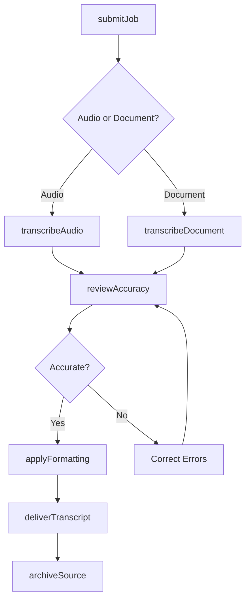
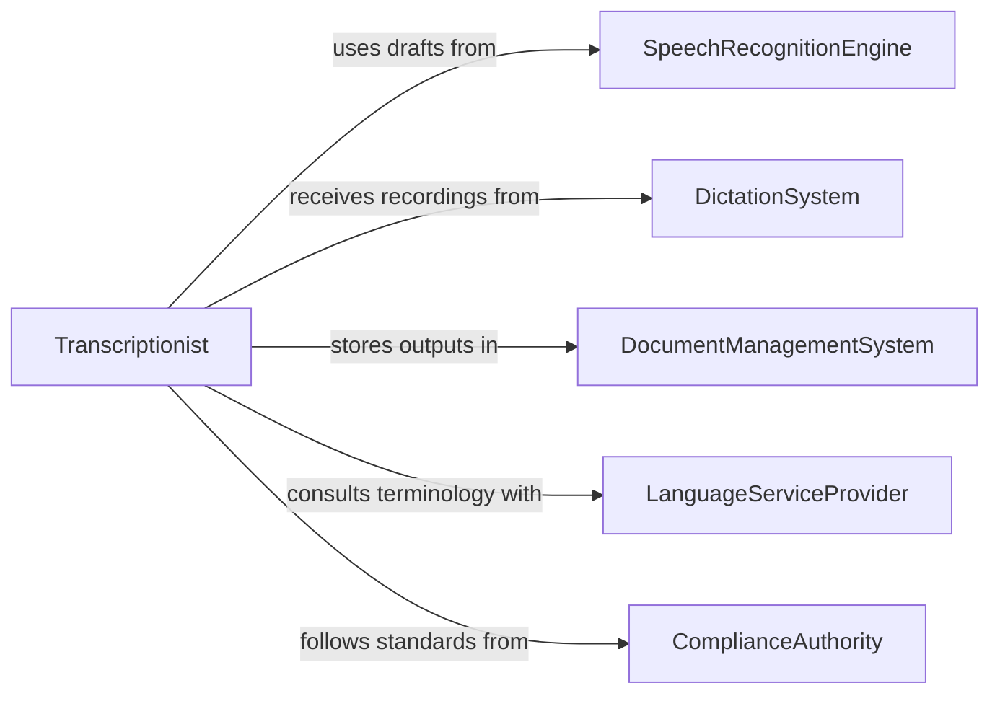

# Transcribe Spoken or Written Information

> Business-as-Code definition for transcription of spoken and written information. Models the lifecycle from audio or document capture through transcription, formatting, quality review, and distribution of finalized records.

## Overview

Transcribing spoken or written information involves converting audio recordings, dictation, handwritten notes, and source documents into formatted, searchable text records used for legal proceedings, medical documentation, meeting minutes, and business correspondence. This definition exposes actions for transcription workflow and quality assurance, events for job tracking and delivery monitoring, and searches for transcript retrieval and turnaround analytics.

## Actors

| Actor | Description |
|-------|-------------|
| SpeechRecognitionEngine | Provides automated speech-to-text conversion for initial drafts |
| DictationSystem | Captures audio recordings from professionals for transcription |
| DocumentManagementSystem | Stores and indexes completed transcriptions for retrieval |
| LanguageServiceProvider | Supplies translation and specialized terminology expertise |
| ComplianceAuthority | Mandates accuracy and format standards for official transcripts |

## Roles

| Role | Description |
|------|-------------|
| Transcriptionist | Converts audio recordings and source materials into formatted text |
| ProofReader | Reviews transcriptions for accuracy, grammar, and formatting |
| TranscriptionSupervisor | Manages workload distribution and quality standards |
| SubjectMatterExpert | Provides domain-specific terminology verification for specialized content |

## Entities

| Entity | Description |
|--------|-------------|
| TranscriptionJob | A queued request to convert source material into formatted text |
| AudioRecording | A captured spoken record to be transcribed |
| SourceDocument | A handwritten or printed document to be converted to digital text |
| Transcript | The completed text output of a transcription job |
| StyleGuide | The formatting and terminology standards for a specific transcription type |
| QualityReport | A documented assessment of transcription accuracy and adherence to standards |
| Glossary | A reference list of domain-specific terms and abbreviations |

## Actions

| Action | Description |
|--------|-------------|
| submitJob | Create a transcription request with source material and delivery requirements |
| transcribeAudio | Convert an audio recording into formatted text |
| transcribeDocument | Convert a handwritten or printed source into digital text |
| reviewAccuracy | Verify the transcription against the source material for errors |
| applyFormatting | Apply style guide standards and formatting to the completed transcript |
| deliverTranscript | Distribute the finalized transcription to the requesting party |
| archiveSource | Store the original source material alongside the completed transcript |

## Events

| Event | Description |
|-------|-------------|
| jobSubmitted | A new transcription request has been queued |
| transcriptionCompleted | Source material has been converted to text |
| accuracyReviewed | The transcription has been checked against the original source |
| formattingApplied | Style guide standards have been applied to the transcript |
| transcriptDelivered | The finalized transcription has been sent to the requester |
| revisionRequested | The requester has asked for corrections to a delivered transcript |
| turnaroundExceeded | A transcription job has missed its delivery deadline |

## Searches

| Search | Description |
|--------|-------------|
| findJobs | Search transcription requests by status, type, priority, or requester |
| getTranscript | Retrieve a completed transcription by job ID or source reference |
| findPendingReviews | List transcriptions awaiting quality review or proofreading |
| getTurnaroundMetrics | Query average completion times by type, priority, or transcriptionist |
| searchTranscriptContent | Full-text search across completed transcriptions |

## Workflow



## Actor Relationships



## Usage

### Calling Actions

```typescript
import { transcribeSpokenWrittenInformation } from '@headlessly/transcribe-spoken-written-information'

const transcription = transcribeSpokenWrittenInformation()

// Submit an audio transcription job
const job = await transcription.submitJob({
  type: 'audio',
  source: 'recordings/board-meeting-2026-02-05.wav',
  duration: 92,
  priority: 'standard',
  styleGuide: 'corporate-minutes',
  requestedBy: 'executive-assistant',
  deadline: '2026-02-07'
})

// Transcribe the audio recording
await transcription.transcribeAudio({
  jobId: job.id,
  speakers: ['CEO', 'CFO', 'CTO', 'General Counsel'],
  timestamps: true,
  verbatim: false
})

// Review and deliver
await transcription.reviewAccuracy({ jobId: job.id, reviewer: 'senior-transcriptionist' })
await transcription.applyFormatting({ jobId: job.id, styleGuide: 'corporate-minutes' })
await transcription.deliverTranscript({
  jobId: job.id,
  format: 'pdf',
  recipients: ['board-secretary', 'corporate-records']
})
```

### Event-Driven Automation

```typescript
// Alert on missed deadlines
transcription.turnaroundExceeded(async ({ jobId, deadline, hoursOverdue }) => {
  await notify({
    to: 'transcription-supervisor',
    message: `Job ${jobId} is ${hoursOverdue} hours past deadline (due: ${deadline})`
  })
})

// Auto-archive after delivery
transcription.transcriptDelivered(async ({ jobId, sourceRef }) => {
  await transcription.archiveSource({ jobId, retentionYears: 7 })
})
```
