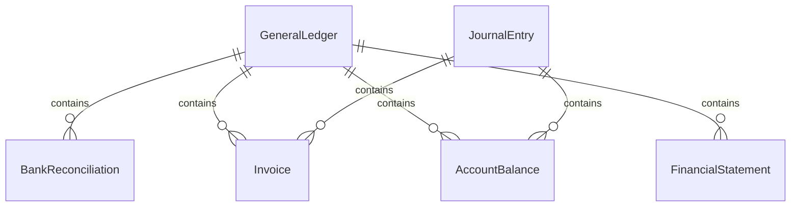
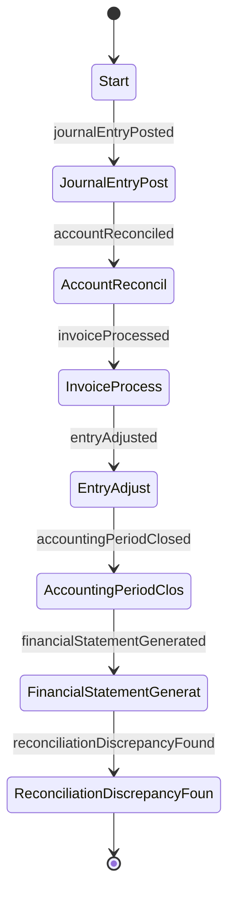
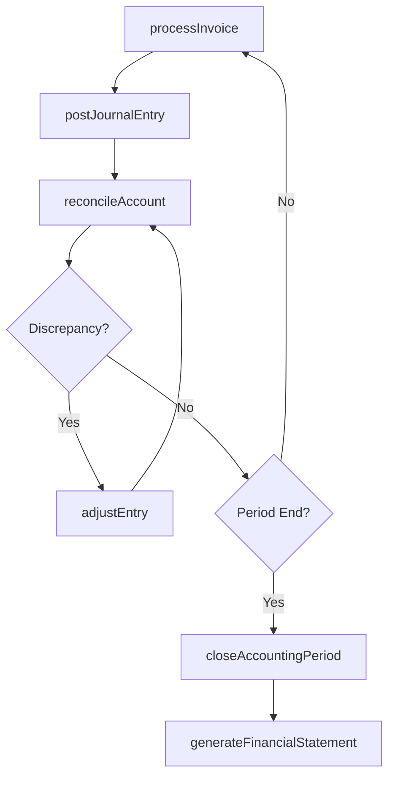
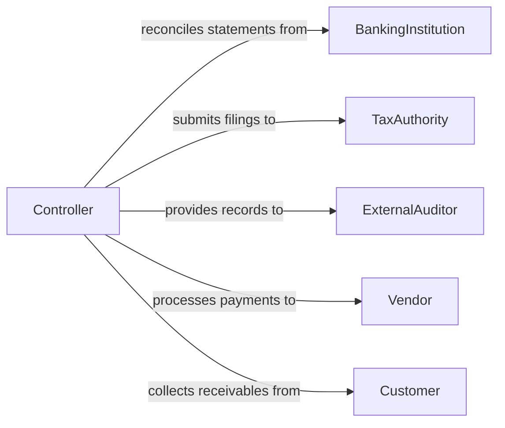

# Maintain Financial Account Records

> Business-as-Code definition for maintaining financial and account records. Models the complete lifecycle of recording, reconciling, and reporting financial transactions across general ledger accounts, accounts payable, and accounts receivable.

## Overview

Maintaining financial account records involves recording journal entries, posting transactions to the general ledger, reconciling bank statements, and managing accounts payable and receivable balances. This process ensures that an organization's financial position is accurately reflected and that all transactions are traceable for audit and tax purposes. Proper account maintenance supports financial reporting, cash flow management, and regulatory compliance with accounting standards.

## Actors

| Actor | Description |
|-------|-------------|
| BankingInstitution | Financial institution providing account statements and transaction data |
| TaxAuthority | Government body requiring financial reporting and tax filings |
| ExternalAuditor | Independent party reviewing financial records for accuracy |
| Vendor | Supplier submitting invoices for payment |
| Customer | Party owing payment on outstanding receivables |

## Roles

| Role | Description |
|------|-------------|
| Bookkeeper | Records daily transactions and maintains the general ledger |
| AccountsPayableClerk | Processes vendor invoices and manages payment schedules |
| AccountsReceivableClerk | Tracks customer payments and manages collections |
| Controller | Oversees financial recordkeeping and ensures reporting accuracy |

## Entities

| Entity | Description |
|--------|-------------|
| GeneralLedger | Master record of all financial transactions by account |
| JournalEntry | A recorded debit and credit transaction pair |
| BankReconciliation | Comparison of internal records against bank statements |
| Invoice | Bill issued to or received from an external party |
| AccountBalance | Current balance of a specific financial account |
| FinancialStatement | Periodic summary of financial position and performance |

## Actions

| Action | Description |
|--------|-------------|
| postJournalEntry | Record a debit and credit transaction to the general ledger |
| reconcileAccount | Compare internal records with external statements and resolve differences |
| processInvoice | Record a vendor invoice or customer billing in the ledger |
| adjustEntry | Correct or reclassify a previously posted transaction |
| closeAccountingPeriod | Finalize all entries for a fiscal period and lock the ledger |
| generateFinancialStatement | Produce balance sheets, income statements, or cash flow reports |
| archiveRecords | Move closed-period financial records to long-term storage |

## Events

| Event | Description |
|-------|-------------|
| journalEntryPosted | A debit and credit transaction has been recorded |
| accountReconciled | Internal records have been matched with external statements |
| invoiceProcessed | A vendor or customer invoice has been recorded |
| entryAdjusted | A previously posted transaction has been corrected |
| accountingPeriodClosed | All entries for a fiscal period have been finalized |
| financialStatementGenerated | A periodic financial report has been produced |
| reconciliationDiscrepancyFound | A mismatch between internal records and bank data was detected |

## Searches

| Search | Description |
|--------|-------------|
| findJournalEntries | Locate transactions by account, date, amount, or reference |
| getAccountBalances | Retrieve current balances for specified accounts |
| getOutstandingInvoices | List unpaid invoices by vendor, customer, or aging bucket |
| getReconciliationStatus | Check reconciliation progress for accounts in a period |

## Entity Relationships



## State Diagram



## Workflow



## Actor Relationships



## Usage

### Calling Actions

```typescript
import { maintainFinancialAccountRecords } from '@headlessly/maintain-financial-account-records'

const accounts = maintainFinancialAccountRecords()

// Post a journal entry for a vendor payment
const entry = await accounts.postJournalEntry({
  date: '2026-02-04',
  description: 'Office supplies purchase',
  debits: [{ account: '6100-Office-Supplies', amount: 450.00 }],
  credits: [{ account: '1010-Checking', amount: 450.00 }],
  reference: 'INV-2026-0312'
})

// Reconcile the checking account
const reconciliation = await accounts.reconcileAccount({
  account: '1010-Checking',
  statementDate: '2026-01-31',
  statementBalance: 284350.75
})

// Generate monthly financial statements
const statements = await accounts.generateFinancialStatement({
  type: 'balance-sheet',
  period: { start: '2026-01-01', end: '2026-01-31' }
})
```

### Event-Driven Automation

```typescript
// Alert controller when reconciliation discrepancies are found
accounts.reconciliationDiscrepancyFound(async ({ account, difference }) => {
  await notify({
    to: 'finance-controller',
    message: `Reconciliation discrepancy of $${difference} found in account ${account}`
  })
})

// Auto-generate financial statements when period is closed
accounts.accountingPeriodClosed(async ({ period }) => {
  await accounts.generateFinancialStatement({
    type: 'income-statement',
    period
  })
  await accounts.generateFinancialStatement({
    type: 'balance-sheet',
    period
  })
})
```
