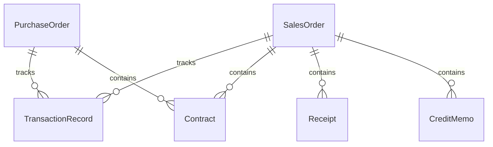
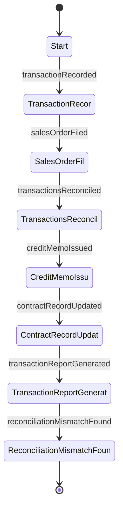
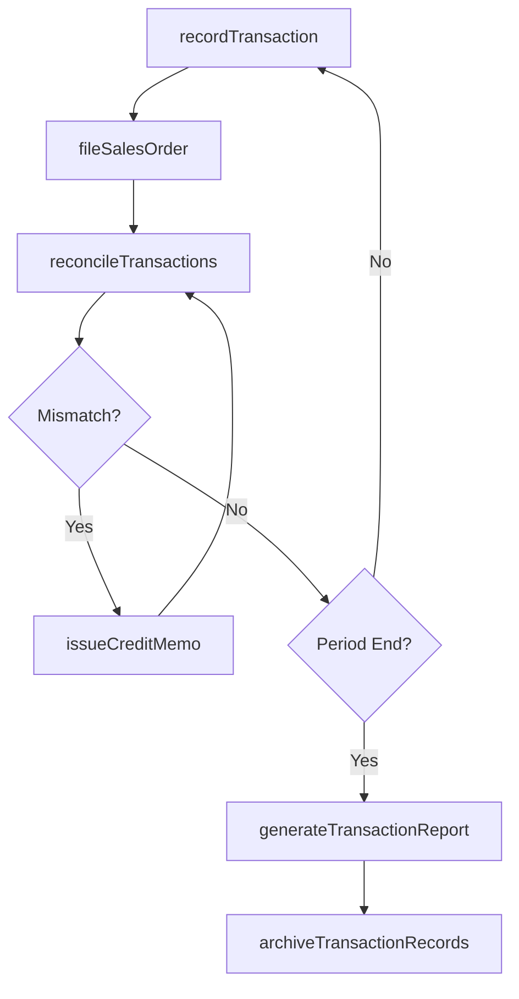
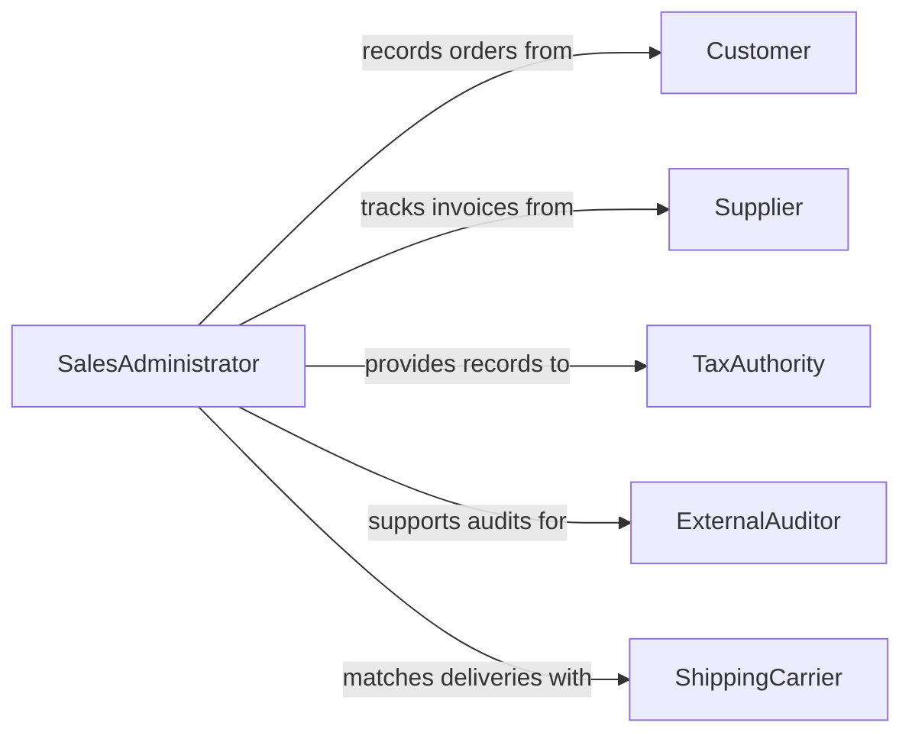

# Maintain Records Sales Business Transactions

> Business-as-Code definition for maintaining records of sales and business transactions. Models the documentation, tracking, and reconciliation of purchase orders, contracts, invoices, and commercial agreements.

## Overview

Maintaining records of sales and business transactions involves systematically documenting purchase orders, contracts, invoices, receipts, and shipping records to create a complete audit trail of commercial activity. This process ensures that all revenue-generating and procurement transactions are accurately captured, properly categorized, and readily accessible for financial reporting and dispute resolution. Comprehensive transaction records support tax compliance, revenue recognition, and business intelligence analysis.

## Actors

| Actor | Description |
|-------|-------------|
| Customer | Buyer of goods or services whose transactions are recorded |
| Supplier | Seller of goods or materials whose invoices are tracked |
| TaxAuthority | Government body requiring transaction records for tax compliance |
| ExternalAuditor | Independent reviewer verifying transaction accuracy |
| ShippingCarrier | Logistics provider supplying delivery confirmation records |

## Roles

| Role | Description |
|------|-------------|
| SalesAdministrator | Records and maintains sales transaction documentation |
| ProcurementClerk | Documents purchase orders and supplier transactions |
| RevenueAccountant | Reconciles sales records with financial statements |
| ComplianceOfficer | Ensures transaction records meet regulatory requirements |

## Entities

| Entity | Description |
|--------|-------------|
| SalesOrder | Customer order documenting items, quantities, and agreed pricing |
| PurchaseOrder | Formal request to a supplier for goods or services |
| TransactionRecord | Logged entry of a completed business exchange |
| Contract | Binding agreement defining terms of a business relationship |
| Receipt | Proof of payment or delivery for a completed transaction |
| CreditMemo | Adjustment document for returns, refunds, or billing corrections |

## Actions

| Action | Description |
|--------|-------------|
| recordTransaction | Log a completed sale, purchase, or business exchange |
| fileSalesOrder | Archive a customer order with all supporting documentation |
| reconcileTransactions | Match sales records against payments and delivery confirmations |
| issueCreditMemo | Create an adjustment record for returns or billing corrections |
| updateContractRecord | Amend or annotate a contract with new terms or status changes |
| generateTransactionReport | Produce summaries of transaction volume, revenue, or procurement |
| archiveTransactionRecords | Move closed transaction records to long-term storage |

## Events

| Event | Description |
|-------|-------------|
| transactionRecorded | A business exchange has been logged in the system |
| salesOrderFiled | A customer order has been archived with documentation |
| transactionsReconciled | Sales records have been matched against payments |
| creditMemoIssued | A billing adjustment has been created |
| contractRecordUpdated | A contract's terms or status have been amended |
| transactionReportGenerated | A summary of transaction activity has been produced |
| reconciliationMismatchFound | A discrepancy between sales records and payments was detected |

## Searches

| Search | Description |
|--------|-------------|
| findTransactions | Locate transaction records by customer, date, amount, or type |
| getSalesOrders | Retrieve sales orders by status, customer, or date range |
| getOutstandingReconciliations | List transactions pending payment or delivery confirmation |
| getContractRecords | Find contracts by party, status, or expiration date |

## Entity Relationships



## State Diagram



## Workflow



## Actor Relationships



## Usage

### Calling Actions

```typescript
import { maintainRecordsSalesBusinessTransactions } from '@headlessly/maintain-records-sales-business-transactions'

const transactions = maintainRecordsSalesBusinessTransactions()

// Record a completed sales transaction
const txn = await transactions.recordTransaction({
  type: 'sale',
  customerId: 'CUST-8834',
  orderId: 'SO-2026-04221',
  amount: 12500.00,
  paymentMethod: 'net-30',
  date: '2026-02-04'
})

// Reconcile transactions for the month
const reconciliation = await transactions.reconcileTransactions({
  period: { start: '2026-01-01', end: '2026-01-31' },
  matchCriteria: ['payment-received', 'delivery-confirmed']
})

// Generate a monthly transaction report
const report = await transactions.generateTransactionReport({
  type: 'revenue-summary',
  period: { start: '2026-01-01', end: '2026-01-31' },
  groupBy: 'customer'
})
```

### Event-Driven Automation

```typescript
// Alert accounting when reconciliation mismatches are found
transactions.reconciliationMismatchFound(async ({ transactionId, expectedAmount, actualAmount }) => {
  await notify({
    to: 'accounting-team',
    message: `Mismatch on transaction ${transactionId}: expected $${expectedAmount}, received $${actualAmount}`
  })
})

// Auto-archive records after period-end reports are generated
transactions.transactionReportGenerated(async ({ period }) => {
  await transactions.archiveTransactionRecords({
    olderThan: period.start,
    retentionPolicy: '7-years'
  })
})
```
