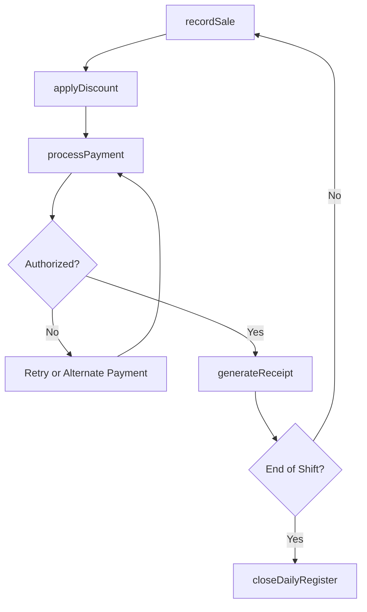
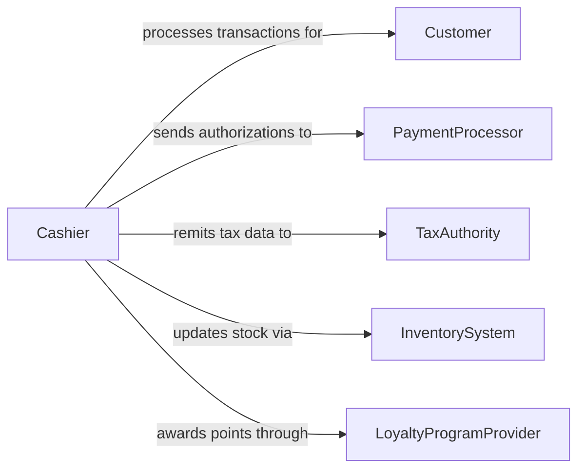

# Record Sales Transactions Data

> Business-as-Code definition for recording sales and transaction data. Models the real-time capture of point-of-sale transactions, order entries, payment processing, and receipt generation.

## Overview

Recording sales and transaction data involves capturing the details of each sale at the point of transaction, including items sold, quantities, prices, discounts, taxes, and payment methods. This process is the foundation of retail and commercial operations, feeding inventory management, revenue reporting, and customer relationship tracking. Accurate and timely transaction recording enables real-time sales visibility, fraud detection, and compliance with tax remittance requirements.

## Actors

| Actor | Description |
|-------|-------------|
| Customer | Buyer completing a purchase transaction |
| PaymentProcessor | Service handling credit card and electronic payment authorization |
| TaxAuthority | Government body collecting sales tax and requiring transaction records |
| InventorySystem | Downstream system consuming sales data to update stock levels |
| LoyaltyProgramProvider | Service tracking customer purchases for rewards and incentives |

## Roles

| Role | Description |
|------|-------------|
| Cashier | Processes transactions and captures sale details at the point of sale |
| SalesAssociate | Assists customers and enters orders into the sales system |
| StoreManager | Oversees daily sales operations and reviews transaction summaries |
| SalesAuditor | Reviews transaction records for accuracy and fraud indicators |

## Entities

| Entity | Description |
|--------|-------------|
| Transaction | A completed sale or exchange with itemized line details |
| LineItem | Individual product or service entry within a transaction |
| Payment | Record of how a transaction was tendered (cash, card, digital) |
| Receipt | Customer-facing document confirming the completed transaction |
| Discount | Price reduction applied to a transaction or line item |
| TaxEntry | Calculated tax amount associated with a transaction |

## Actions

| Action | Description |
|--------|-------------|
| recordSale | Capture a completed point-of-sale transaction with all line items |
| processPayment | Record the payment method and authorization for a transaction |
| applyDiscount | Apply a promotional or loyalty discount to a transaction |
| generateReceipt | Create a receipt document for the completed transaction |
| voidTransaction | Cancel a recorded transaction before settlement |
| processReturn | Record a return and generate a refund or store credit |
| closeDailyRegister | Reconcile and finalize all transactions for a register or shift |

## Events

| Event | Description |
|-------|-------------|
| saleRecorded | A point-of-sale transaction has been captured |
| paymentProcessed | Payment authorization has been completed |
| discountApplied | A promotional or loyalty discount has been recorded |
| receiptGenerated | A transaction receipt has been created |
| transactionVoided | A transaction has been cancelled before settlement |
| returnProcessed | A return and refund have been recorded |
| dailyRegisterClosed | All transactions for a register shift have been reconciled |

## Searches

| Search | Description |
|--------|-------------|
| findTransactions | Locate sales transactions by date, register, cashier, or amount |
| getDailySalesSummary | Retrieve aggregated sales totals for a specific day or shift |
| getReturnHistory | Find return and refund records by customer or transaction |
| getPaymentBreakdown | Retrieve transactions grouped by payment method |

## Workflow



## Actor Relationships



## Usage

### Calling Actions

```typescript
import { recordSalesTransactionsData } from '@headlessly/record-sales-transactions-data'

const sales = recordSalesTransactionsData()

// Record a point-of-sale transaction
const sale = await sales.recordSale({
  registerId: 'POS-03',
  cashierId: 'EMP-1122',
  lineItems: [
    { sku: 'PROD-4401', name: 'Wireless Mouse', quantity: 1, unitPrice: 29.99 },
    { sku: 'PROD-4520', name: 'USB-C Cable', quantity: 2, unitPrice: 12.99 }
  ],
  tax: 4.62
})

// Process payment for the transaction
await sales.processPayment({
  transactionId: sale.id,
  method: 'credit-card',
  amount: 60.59,
  authorization: 'AUTH-88421'
})

// Generate a receipt
await sales.generateReceipt({
  transactionId: sale.id,
  format: 'thermal-print',
  includeReturnPolicy: true
})
```

### Event-Driven Automation

```typescript
// Update inventory when a sale is recorded
sales.saleRecorded(async ({ lineItems }) => {
  for (const item of lineItems) {
    await updateInventory({
      sku: item.sku,
      quantityChange: -item.quantity
    })
  }
})

// Send daily sales summary when register is closed
sales.dailyRegisterClosed(async ({ registerId, date, totalSales }) => {
  await notify({
    to: 'store-manager',
    message: `Register ${registerId} closed for ${date}: $${totalSales} in total sales`
  })
})
```
